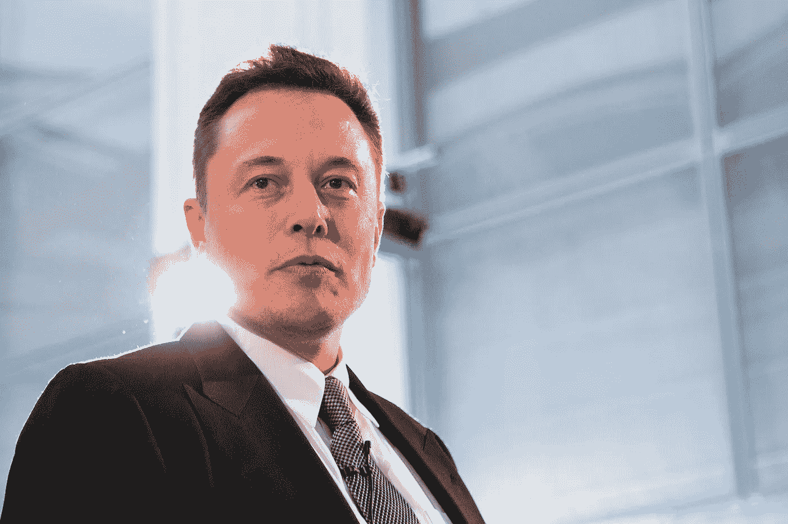

# 埃隆·马斯克促成了加密热潮

> 原文：<https://medium.datadriveninvestor.com/elon-musk-contributes-to-the-crypto-craze-d13aede086f9?source=collection_archive---------24----------------------->

## 并且有一个麻烦的 Twitter Feed

Image source: Fortune.

当今最著名、最成功的企业家之一埃隆·马斯克(Elon Musk)一直在评论加密货币的本质。这位特斯拉首席执行官兼 PayPal 联合创始人在某些场合公开谈论过加密的价值。但在其他时候，他避免采用加密技术或将其纳入一些商业交易中。

马斯克在 ARK Invest 播客中表示:“比特币的结构非常出色，但我不认为这会是对特斯拉资源的良好利用。”他还直言不讳地指出，“对于价值转移来说，加密比纸张好得多，但它有利弊”，但“在这一点上创造比特币是相当耗费能源的。”

这位 SpaceX 公司的首席执行官在 Twitter 上有一些麻烦，有时很有趣的互动。(他经常通过社交媒体平台发表个人和职业观点。)本月早些时候，这位企业家似乎正在浪漫地登陆火星，或者至少是登陆所谓的 Twitter 账号。

最近，媒体一直在给马斯克一些关于特斯拉明年拟议产量和预期的推文。一些分析师认为这是有问题的，因为马斯克在推特上发表了评论，修改了他最初的说法。

即使是这种轻微的失误也是很重要的。由于在他的推文中不够精确，马斯克冒着严重的金融波动的风险。正如[美国消费者新闻与商业频道报道的](https://www.cnbc.com/2019/02/20/elon-musk-tweeted-then-revised-tesla-financial-guidance.html)，“马斯克的推文已经被证明在某些情况下可以让股票上涨 10%。”

马斯克最大的推文事故之一发生在 2018 年 10 月，[它与加密货币](https://bitcoinist.com/elon-musk-bitcoin-brilliant-tesla/)直接相关。马斯克使用了一个展示比特币徽章的动漫人物形象，并发出了一条附带信息，上面写道:“想买些比特币吗？，”后面跟着一个链接。

这条[推文](https://twitter.com/elonmusk/status/1054520588734058496?ref_src=twsrc%5Etfw%7Ctwcamp%5Etweetembed%7Ctwterm%5E1054520588734058496&ref_url=https%3A%2F%2Fbitcoinist.com%2Felon-musk-bitcoin-brilliant-tesla%2F)变得臭名昭著，也是马斯克的推特账户被暂停一段时间的主要原因。这是由于 Twitter 对在其平台上销售比特币的监管。

根据去年 9 月的一项法律和解，特斯拉被指示开发一个监控马斯克通过推特或其他媒体所说内容的流程。

截至 2018 年 12 月，埃隆·马斯克在接受采访时承认，在他的社交媒体个人资料上线之前，没有人会阅读他的推文。