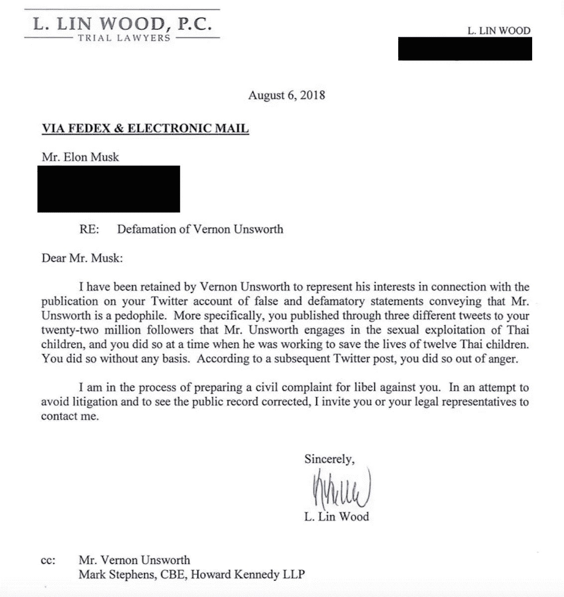

# 埃隆·马斯克，从一个谦逊的行善者变成了十足的“自大狂”。

> 原文：<https://medium.datadriveninvestor.com/elon-musk-from-a-humble-do-gooder-to-full-blown-megalomaniac-3c278008006e?source=collection_archive---------2----------------------->

> “给他系上皮带”，正如我想象的大多数投资者对马斯克的感觉。

“photo of short-coated black puppies” by [Tucker Good](https://unsplash.com/@tuckergood?utm_source=medium&utm_medium=referral) on [Unsplash](https://unsplash.com?utm_source=medium&utm_medium=referral)

这个曾经被认为是《钢铁侠》灵感来源的人，现在成了托尼·斯塔克彻底疯了的化身。

从儿童电话到讨论他的阴茎大小；这个人已经向世人表明，他根本不在乎自己的公众形象。

是时候让马斯克先生接受现实检查了吗？

毫无疑问，埃隆·马斯克不仅是童年神童和学术才华的化身；他是一个有远见的人，成为努力工作的典型代表。比如超硬。就像他的阴茎被格兰姆斯讨论过一样。

哪里出了这么大的问题？

我们会为此受到责备吗？

从发射火箭到令人心痛的推文马拉松，这些都有可能成为总统。唐纳德·特朗普缩在内衣里，让我们来看看一个绅士的毁灭。

我们从 1999 年开始。埃隆·马斯克证明了时间旅行确实是可能的。

这不仅是埃隆·马斯克能够逆转衰老过程的活生生的证据；他还成功预测到特斯拉会崩溃，就像他的迈凯轮不久后发生的那样。

曾经，一个我们需要的英雄，但对一个爱哭的婴儿来说，他配不上一个花更多时间与巨魔战斗而不是内心恶魔的英雄。

除...之外..嗯。事实核查，马斯克先生？

Source: [https://techcrunch.com/2018/08/29/diver-attacked-by-elon-musk-as-pedo-guy-is-prepping-a-libel-suit/](https://techcrunch.com/2018/08/29/diver-attacked-by-elon-musk-as-pedo-guy-is-prepping-a-libel-suit/)

从和你能想象到的每个超级模特约会到和每个人离婚；埃隆·马斯克向全世界的书呆子们证明了，金钱真的买不到礼貌。现在可以了吗，马斯克先生？

说到这里；我有这个很棒的麝香，我一直在用，伙计，你真的应该看看。

抛开所有麝香的抨击；我真的很尊重这个人，或者至少曾经是。

现在看来，他似乎有点越轨了？

埃隆·马斯克是不是真的想体现托尼·斯塔克；或者，这是一个非常简单的例子，一个沮丧的男孩过度疲惫，受安眠药驱使而胡言乱语？

> **“如果一个人已经做了一段时间的行为，通常很难改变。我认为一个 CEO 不应该上 Twitter 我本希望这是一个教训。显然不是。”——特拉华大学金融学教授查尔斯·埃尔森(专攻公司治理)说。**

如果这还不足以让事情变得更糟的话，马斯克接着揭穿了他实际上能够抑制人类基本情感的说法。

看吧！他的声音嘶哑了。蝙蝠侠经常这么做。这没什么不好。

Meshuggah 的主唱 Jens Kidman 对声乐训练以及如何防止未来变声有很好的见解。

从支持世界各地的瘾君子到被沙特人扔石头——这个男人什么都做过。

 [## 埃隆·马斯克解释了奇怪的“420”推文:归咎于沙特阿拉伯

### 当他不在为无聊的公司品牌喷火器做模特时，埃隆·马斯克会用他的社交媒体账户参与…

www.vanityfair.com](https://www.vanityfair.com/news/2018/08/elon-musk-funding-secured-tweet-saudi-wealth-fund) 

所以亲爱的马斯克先生，

我恳求你花点时间，承认承认你只是一个普通人绝对没有错。

因为我可以向你保证，曾经有一段时间，人们视你为我们真正需要的英雄。

从你们在气候变化问题上近乎勇敢的立场，以及你们为扩大人类对外层空间的了解所做的不懈努力。

你真的是一代敬仰你的人的楷模。

虽然你真正的韧性可能会持续；也许是时候和老前辈坐下来，就设定你的优先事项进行一次真正的讨论了。

希望你早日康复。

曾经的崇拜者。
目前苦苦挣扎的作家，
纳比尔·塔希尔。