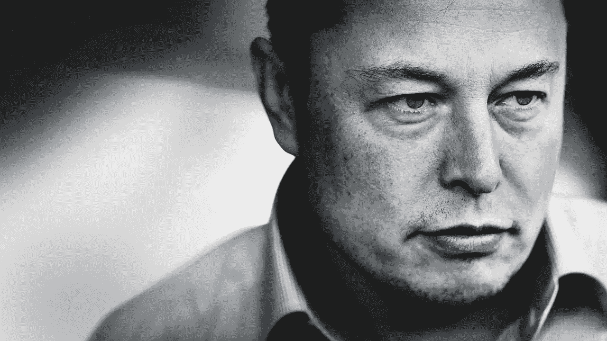

# 埃隆·马斯克——世界上最有创造力的连环杀手。

> 原文：<https://medium.datadriveninvestor.com/elon-musk-the-worlds-most-creative-serial-killer-62f88022823?source=collection_archive---------3----------------------->

从自动驾驶汽车，非喷火器喷火器，占领火星——这个人都想好了。

Elon Musk planning his next kill.

埃隆·马斯克找到了气候变化的解决方案；灭绝人性。

他的天才在于他坚信世界会变得更好的创新；我必须说这是一个真正忠诚的精神病患者的标志。

他知道；消灭人性的唯一方法就是让他们相信这样做是*【酷】**【时髦】*。

想象一下；成千上万的人驾驶无人驾驶的人工智能控制的电动汽车，被随机地从道路上抹去。没有嫌疑人。只是随机的机器故障；远远超出了我们正常人的理解和调查能力。

让潮人买一个喷火器，看着他们烧毁自己的房子，这对埃隆·马斯克来说是最精彩的创意大屠杀展示。

也是最大的计划。让人们相信火星是适宜居住的，然后让这些白痴飞向灭绝。

离开地球，一个更加干净和安全的地方。

随着气候变化和世界主导权最终掌握在埃隆·马斯克先生手中。