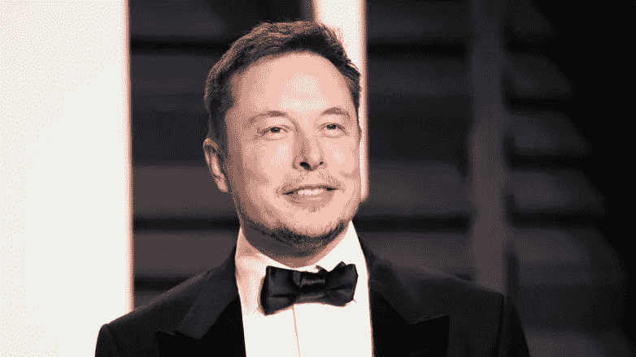
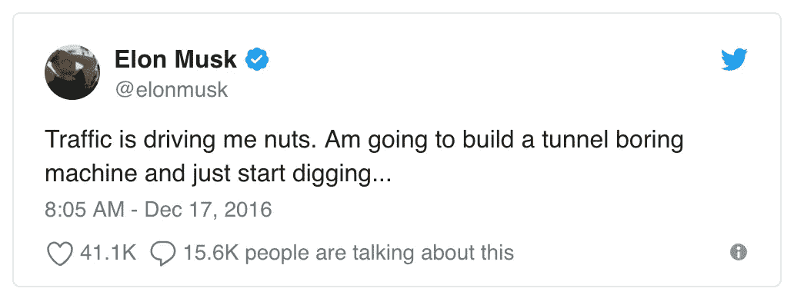
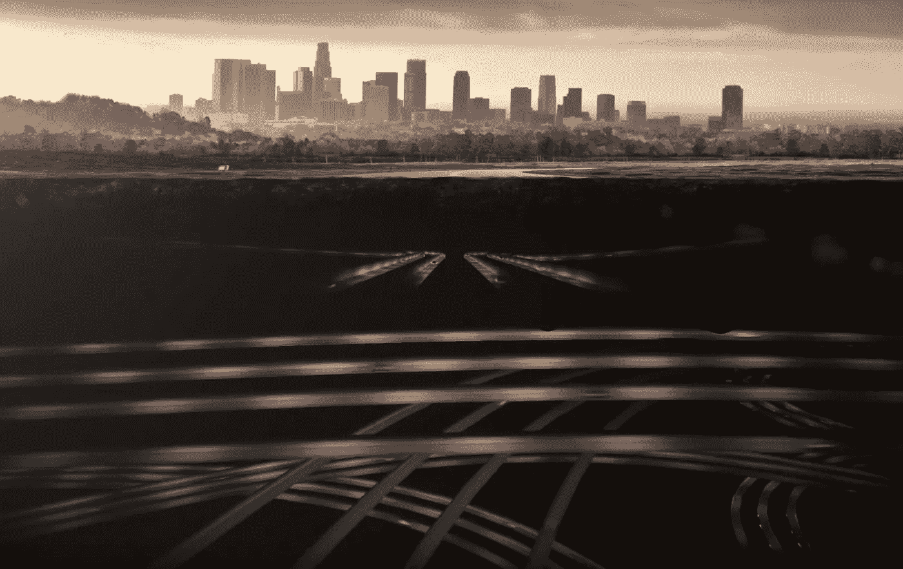
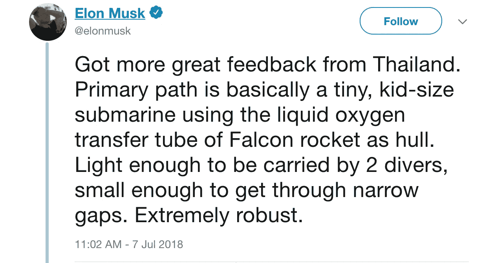

# 埃隆·马斯克:强大的力量伴随着巨大的(后勤)责任

> 原文：<https://medium.datadriveninvestor.com/elon-musk-with-great-power-comes-great-logistical-responsibility-84f7bfb444f0?source=collection_archive---------20----------------------->

**原载于 2018 年 8 月 7 日 BillySon.com*

他是下一个史蒂夫·乔布斯，这一代的达芬奇，爱迪生，亨利·福特，真正的钢铁侠……这样的比较没完没了，这也是理所应当的。他是一个挑战可能性概念的异常天才。他倾向于通过剖析基本面来改变整个行业，有时通过激进的新方法来引入最大效率，并取得成功，这简直令人震惊。

说真的，谁会想到通过让超音速火箭轻轻地返回地球来重复使用它们呢？如果这还不够令人印象深刻，那么让 41 米高的建筑降落在海洋中央的一个小型移动平台上怎么样？！*(空格 X)*

电动车…香草和慢？好吧，让我们做一辆比法拉利更快，同时能舒适地坐四个人的车。还有半挂卡车……谁需要多个卡车司机拖着多个拖车呢？让一个司机像火车一样控制多辆拖车。哦，为什么要让我们的顾客一直承担开车的责任呢？…让我们让车辆实现自动驾驶！*(特斯拉)*

厌倦了交通？让我们开始挖掘，以每小时 150 英里的速度把人扔过管道！*(无聊公司)*

想更环保，避免支付高额电费？用我们的屋顶板替换你的屋顶板，你将拥有你自己的干净的小型发电厂！*(太阳能城)*

让我们不要让人工智能接管世界，终结者风格…让我们自己成为半个终结者，保持领先…皮尤皮尤！*(开放 AI)*

**总而言之……埃隆·马斯克对摩尔定律进行了多次猛烈抨击。相对于历史进步来说，他正在完成如此惊人的壮举。**

这是最高层次的灵感，但对投资者来说，这种多行业参与的模式(本质上是好奇)应该是一种值得考虑的风险。你看，他的超自然能力和决心使他能够完成任何他想做的事情(自学火箭科学的内部工作)。对埃隆来说，没有什么是遥不可及的。因为市场上有如此多的“世界难题”和低效率，他超大的好奇心和解决问题的倾向迫使他参与其中。

这可能会导致自己过于分散。埃隆弥补这一赤字的唯一方法是在他的所有公司里建立一支极其能干的员工队伍。问题是，他试图完成的许多壮举是如此前卫，如此远离摩尔定律曲线，以至于他的公司仍然需要他的不断指导。他从怪异的角度解决问题的能力，打破行业规范和应用新流程的意愿，影响他人模仿他狂热的职业道德，这些都是他需要出席的事情。

最近的一个例子就是特斯拉 Model 3 的生产问题:

> 盖尔:你没有预料到这种生产地狱，是吗？埃隆:比我想象的还要糟糕。
> 
> “我们对一些我们认为是核心技术的东西沾沾自喜……我们一下子在 Model 3 上投入了太多新技术。”-埃隆
> 
> “在这一点上，我对走出地狱的道路有一个清晰的认识，直到最近，我也没有一个清晰的认识。”-埃隆

**问题在于:人们不像埃隆那样以极其高效/逻辑的方式看待问题和解决方案。他和其他人之间的天资差异是巨大的。在他职业生涯的早期*(今天在某种程度上依然如此)*，他严重低估了这种差距；他只是假设他的团队会“得到它”。他们没有这样做，结果造成了长时间的延误。**

在埃隆的指导下，从 4 月份开始的短短四个月内，工厂从每周大约生产 2000 台增加到超过 5000 台；预计本月将有 6000 套。直到他全情投入，全身心投入(甚至在工厂睡觉)，生产问题才得以解决。我确信他在特斯拉的员工非常聪明能干，但是**需要不同的人来解决“无法解决的问题”**。

如果埃隆专注于一家公司……一项使命……那么作为一名投资者，我会睡得像一个喂得很好的婴儿。为什么？因为我知道他无所不能。不幸的是，时间这个变量是存在的，即使对于像埃隆这样的人来说，它也限制了他所能完成的事情。

当你听说他计划和 Boring 公司一起建造一个复杂的隧道网络时…他的野心不仅仅是把人送上火星，而是在那里建立一个可持续发展的城市…他的计划是发送一个由 12000 颗卫星组成的“星座”来提供廉价的全球互联网接入…他的计划是开发人工智能使其对人类有用…

等等，这是什么..他只是抽出时间为被困在山洞里的泰国男孩造了一艘迷你潜艇？

你明白了…他参与了许多不同的计划。我认为 Model 3 的生产问题(需要他全神贯注)与他未来需要克服的一些障碍相比并不重要。再说一次，如果他专注于几件事，我会对他的执行能力充满信心…他就是那么棒。但是当你把自己分散在无数的努力中，许多努力本身就是不朽的壮举，你开始问自己，“他在每项任务上花了多少时间？”

我从来不想和伊隆打赌，因为他似乎总能获胜，但即使是钢铁侠先生本人也无法消除宇宙对优先顺序的命令。