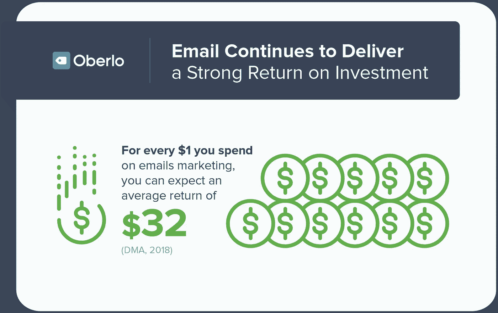

# 电子邮件营销:如何合乎道德地窃取人们的钱

> 原文：<https://medium.datadriveninvestor.com/email-marketing-how-to-ethically-steal-peoples-money-145a38dfb91?source=collection_archive---------37----------------------->

## 哦，你知道你喜欢它，小子

如果你有一家企业，而且你没有收集人们的电子邮件地址，那你就活该被加里·哈尔伯特的幽灵所困扰。

你们中的一些人有一个合适的网站，一尘不染的社交媒体，一堆你并不真正需要的渠道…然而结果并不是你所期望的。

你被营销诱惑了。

让我给你画一幅画，你可以告诉我它听起来是否熟悉:

*   你有一个在网上卖垃圾的商店
*   你使用 FB 广告、Instagram 宣传和社交媒体营销
*   人们来到你的商店，四处看看
*   你有 3%-5%的转化率。每 100 名访客中，就有 3-5 人购买产品

到目前为止，你做的一切都是对的。这就是变得泥泞的地方

*   有人买你的产品…
*   ….

**你再也见不到他了！想知道为什么吗？因为你没收他妈的邮件！**

那个人会使用你的产品一次，然后他会忘记你的商店和你的品牌。*“拜拜强尼，谢谢你的惠顾，另一边见”。*

## 你本可以做些什么

1.  一封自动回复的电子邮件，你可以给他一张下次购买的优惠券
2.  一个简单的弹出窗口，他可以选择他的电子邮件地址
3.  即使是一个懒惰的“加入我们的特别优惠时事通讯”也足以吸引一群未来的买家

我听到很多人说电子邮件营销行不通。哦，我有消息告诉你…

[Source](https://www.oberlo.com/blog/email-marketing-statistics)

看看这个。再读一遍。

这意味着你通过付费广告获得的每一个人，都有可能让你赚到 32 美元……而你什么都不用做！

如果你连最起码的电子邮件营销都不做，你就是在浪费钱。

**还不服气？现在怎么样:**

[Source](https://www.oberlo.com/blog/email-marketing-statistics)

**推进您的电子邮件战略可以增加 1.5 倍的收入。**

以上是最低要求。没什么复杂的。

如果你真的想利用电子邮件营销，用最少的努力增加你的收入…

## 你应该在邮件中使用直接回复文案。

这样想吧。注册你的电子邮件列表的人已经对你的产品感兴趣了。他们正在寻找证明购买合理的方法。

他们信任你和你的品牌。你有一个已经从你这里买过东西的电子邮件列表(对你的企业来说最好的人)。

**化繁为简。**

每天有 100 人购买你的产品。

*30 选择加入您的电子邮件列表*

*5%–7%点击链接再次购买。*

那是 2 到 4 个人。

(我用的是平均数)

总体来说是 3%-6%……这就是你的转化率！

你刚刚把你的 revenus 提高了 100%，就这样！

很神奇，对吧？

当然，如果你理解直接回应文案的基本原则，所有这些都是真的。

但是不要害怕！我在这里等你！

你可以在 Twitter 上找到我，我在那里分享关于文案和营销的每日见解(还有咆哮…好吧，我主要是咆哮)

和

加入[文案邪教](http://eepurl.com/dF5Alr)向业内文案师学习。

-G.K

*另外——如果这篇文章让你感到刺痛，击碎那个拍手按钮，分享给每一个可能发现它有用的企业主。干杯！*