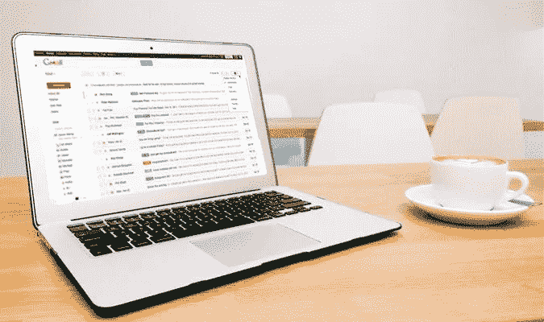

# 电子邮件不会消亡，原因如下

> 原文：<https://medium.datadriveninvestor.com/emails-are-not-dying-and-heres-why-77c2f24d5511?source=collection_archive---------7----------------------->

我不时会遇到一位营销“大师”或数字机构，他们大胆宣称电子邮件即将过时。他们说，人们越来越少使用电子邮件，这使得电子邮件成为一种不太可靠的营销方式。

今天，我想彻底驳斥这种疯狂的说法，并解释为什么我不同意这种说法。这完全是我自己的观点，但我知道在营销领域有更多的人不同意。

在我深入探讨为什么我认为电子邮件不会消亡之前，我想先看看为什么会有人提出这种观点。政客、企业和其他人纯粹为了推动他们自己的议程而发表的疯狂言论并不少见。

 [## 社交媒体收听让您随时了解|数据驱动型投资者

### 虽然社交媒体倾听是一种顶级趋势，但它应该是每个现代营销策略的一部分。保持和谐…

www.datadriveninvestor.com](https://www.datadriveninvestor.com/2019/02/26/social-media-listening-keeps-you-plugged-in/) 

这种情况下也不例外。提出这一主张的大师和机构并不是出于好心。哦，不，虽然他们可能会警告他们的客户和观众即将发生的事情，以便他们能够做好准备，但这根本不是慈善行为。

你看，这些大师们在宣称的同时，还宣称某些其他的替代方式(在这种情况下是一个松散的术语)正在慢慢取代电子邮件。再说一次，他们说这些不是为了帮忙。因为他们接着会“友好地”帮助他们的客户和观众了解如何学习使用这些替代品。

最大的例子是聊天机器人，特别是 Facebooks Messenger 提供的聊天机器人。简而言之，这些允许企业在他们的 Messenger 聊天机器人上建立一个人的名单，在那里他们可以自动发送大量私人信息，就像电子邮件一样。只需点击一个按钮，就可以发送成千上万条信息。

但是他们声称聊天机器人是更好的方法，它的打开率比电子邮件高得多。我使用过聊天机器人和电子邮件，的确，通过聊天机器人发送信息的打开率远远高于电子邮件。

但是，这并不意味着它是电子邮件的可行替代品。让我告诉你为什么…

聊天机器人仅限于相关平台上的用户，在这种情况下，Facebook Messenger。当然，脸书及其私人信息服务 Messenger 拥有数十亿用户，但它并不拥有所有人。当然，并不是这个星球上的每个人都有电子邮件，但一个无可争议的事实是，拥有电子邮件的人比拥有脸书个人资料的人多。

另外，名单的质量也有问题。由于近年来监管力度的加大，例如欧洲的 GDPR，企业越来越难以合法获取某人的电子邮件地址，并且更难继续使用该电子邮件进行营销。

另一方面，聊天机器人是相当新的，所以现在控制力要小得多。这意味着人们更容易进入聊天机器人列表，他们所要做的就是点击脸书上的一个小链接。营销不再仅仅是单纯的数字。

通常你的名单上有 1000 个高质量的人比 10000 个人更好。我所说的质量，是指他们从你这里购买或与你互动的可能性，以及他们对你的了解程度。严格地说，为获得列表中的附加内容所做的工作越少，质量就越差。然而，这不是一门精确的科学。

那么，除了聊天机器人，还有什么能扼杀电子邮件呢？毕竟，电子邮件不会简单地自行消亡，需要出现更好地满足人们需求的东西。

有一些竞争者，但没有一个真正脱颖而出:

*   短信——这正在慢慢增加，就像聊天机器人一样，它们的打开率远远高于电子邮件。但是，与聊天机器人不同，它们比电子邮件地址更难获取。这听起来可能与我前几段写的“少即是多”相矛盾。但是你需要在不太多也不太少之间找到适当的平衡。
*   直邮——这是一个有趣的问题，我将在未来几周内写一整篇关于直邮的回归和兴起的博客。在许多方面，直邮已经开始增加，尽管速度很慢。大约二十年前，它真的开始衰落，但是面对非个人化和隐私破坏的选择，它又回来了！
*   PPC 广告——在我看来，这是 2019 年电子邮件的唯一真正竞争者。脸书、Linkedin、谷歌、Youtube 等按点击付费广告提供的定位能力允许这种精准广告。此外，你可以上传你的受众数据，只向他们投放广告。因此，你可以向他们投放广告，而不是跨多个平台，而不是通过电子邮件发送你的 20，000 个数据库。我知道你在想什么。我之前不是说过聊天机器人和社交媒体的一个缺点是不是每个人都在上面吗？是真的，绝对是！但是，如果你在多个平台上投放广告，你就能瞄准 95%以上的用户。即使他们不在脸书、推特或 Linkedin 上。大多数人会在某个时候出现在 Youtube 上，或者在谷歌上搜索某些关键词。

但是，点击付费广告仍然是一个延伸。在 2019 年，除了电子邮件，没有其他可行的选择。也许有一天，会发明出一种可以普遍超越电子邮件的东西——但那是很遥远的事情。即使有挑战者诞生，也需要数年时间才能击败电子邮件——它们被如此依赖。

让我说清楚，电子邮件远非免疫和完美。近年来，电子邮件的打开率直线下降，因为现在有太多的公司使用电子邮件向人们推销。如果你的开盘价达到 20%或以上，那你今天过得很好！

但它仍然是一种高效的营销方法，还会持续很多年。所以不要惊慌，而是通过测试和衡量来优化你的电子邮件，同时结合使用其他方法，如 PPC 广告，甚至直邮。

最重要的是，不要被一种惊人的新营销方法所欺骗，这种方法将“在 5 年内消灭电子邮件”，因为现在，这种方法还不存在。正如每一种营销方式一样，电子邮件总有一天会消亡。有一天…