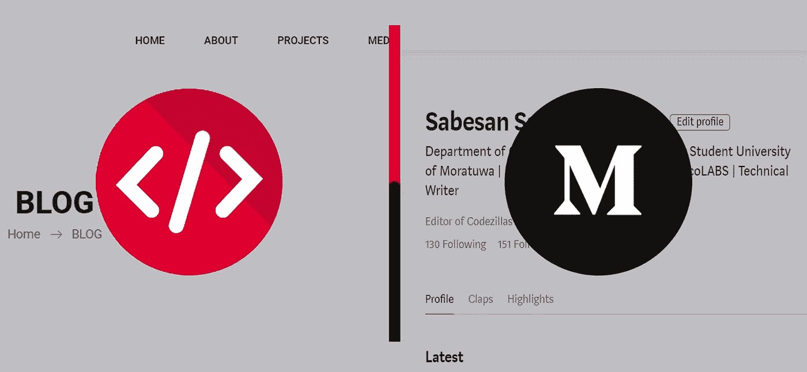
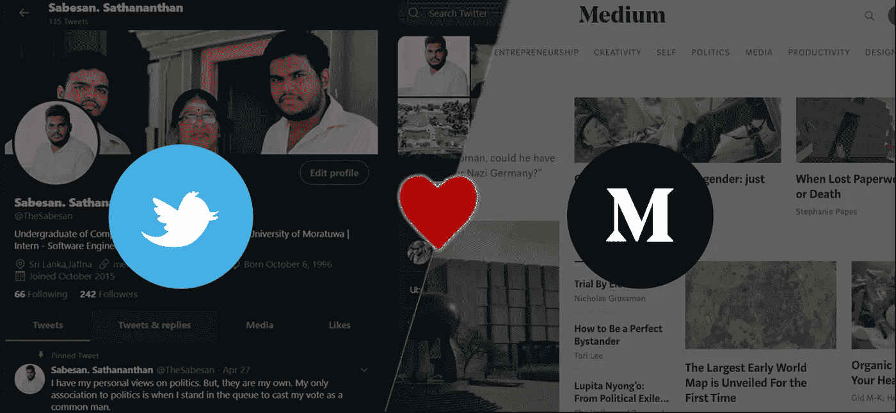
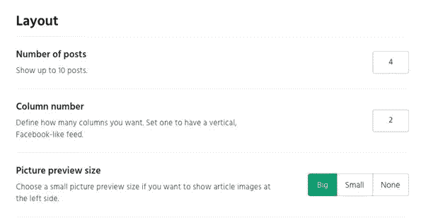
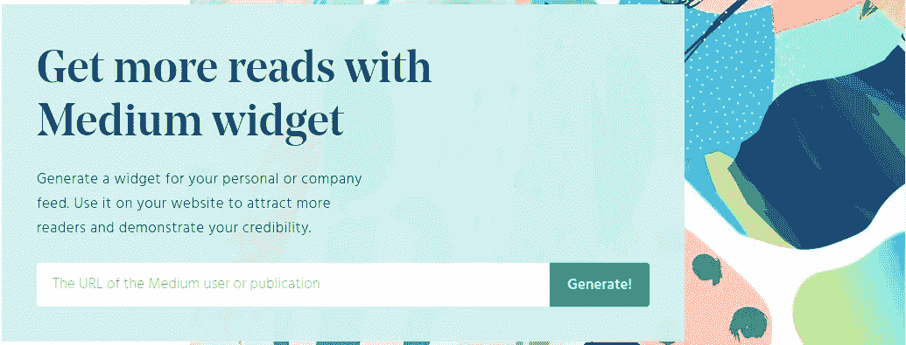
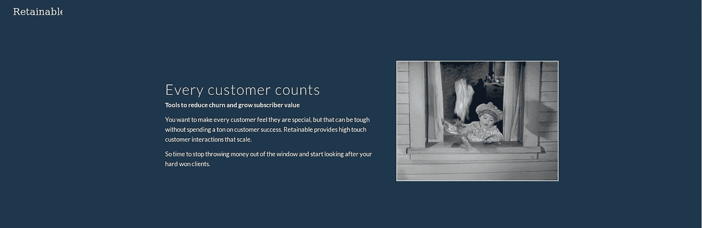
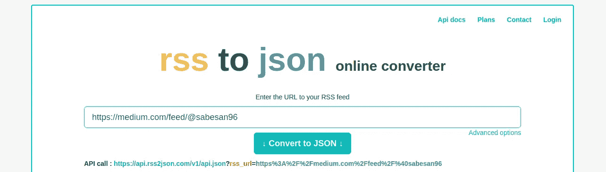
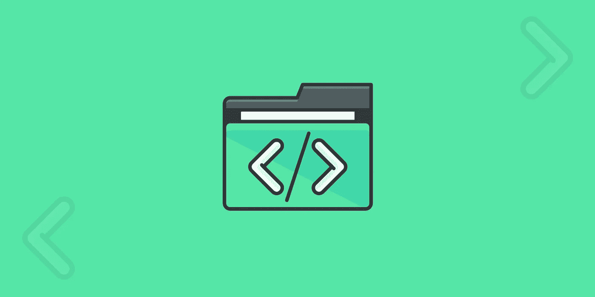
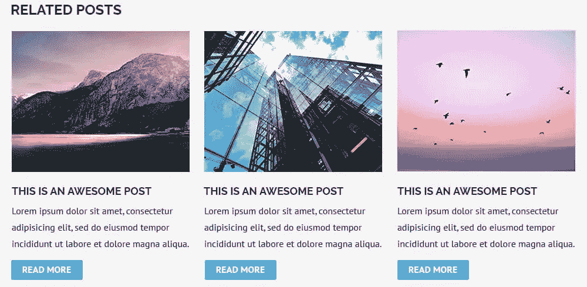

# 在你的网站上嵌入媒体作为博客…

> 原文：<https://medium.datadriveninvestor.com/embed-medium-as-a-blog-on-your-site-54a1b49cbe16?source=collection_archive---------0----------------------->

## 前端



Medium 是一个很好的博客平台。中帮助很多人到达你的岗位。你们中的许多人在 Medium 上维护一个帐户，同时在自己的站点上处理一个单独的博客页面。当你在 Medium 上发布一个新故事时，你需要 ***复制并粘贴*** 那个故事到你的博客页面上。这种方法对你很不方便。如果你把 medium 嵌入到你的网站，你就不用担心更新你网站上的博客页面。上周我设计自己的网站时也遇到了同样的问题。在这里，我想介绍几种在你的博客中嵌入媒体的方法。这是我在 Medium 的第 21 篇文章。

# 方法 01:推特

首先，你需要创建一个单独的*Twitter 账户，并将该账户与你的媒体账户相连接。一旦你在 medium 上发布了你的文章，转到发布的版本，向下滚动到文章的底部。在这里，您应该可以看到一个 twitter 图标。一旦你点击 twitter 图标，一个新的窗口就会打开，里面有一条预先输入的推文。那条推文有你文章的标题和文章的链接。发一条预先打好的微博。当你发微博时，确保你是用你的新账号发的。我假设你们都知道上面的步骤。*

**

*现在，我们将在博客页面上嵌入 Twitter feed。要做到这一点，请访问[publish.twitter.com](https://publish.twitter.com/)并输入你的新 twitter 个人资料的网址。那么有两个选择；“嵌入式时间轴”和“Twitter 按钮”。单击嵌入的时间轴按钮并复制嵌入代码。将嵌入代码粘贴到您的博客中。*

# *方法 02:像素点. io*

*PixelPoint 是一家由一组自由软件开发人员组成的公司，他们一起开发应用程序。他们创造了一些公共用途的应用程序。要在您的博客页面上嵌入 Medium widget，请先访问[Medium-widget . pixel point . io](https://medium-widget.pixelpoint.io/)。当你点击链接时，一个新的窗口打开，你被分配了一个盒子。该框要求您输入概要文件的 URL。在该框中输入您的媒体简介链接。您的个人资料链接类似于*https://medium.com/@yourusername*。复制前面的链接，用您的真实用户名替换“您的用户名”。现在点击生成按钮。然后按照您想要的方式配置中等窗口小部件，使其一目了然。它将要求您选择一系列设置。*

*   *您希望在 widget feed 中显示的帖子数量可以从 1 到 10 个中选择。*
*   *可以选择提要中需要的列数。如果你想要一个类似于脸书或 Twitter 时间轴的垂直嵌入式提要，请选择一个。如果您想要更像网格的东西，请选择两个或更多。*
*   *要显示的帖子预览图像的大小；您可以选择大图像、小图像或不选择图像。*
*   *封面照片的长宽比；您可以选择图像的原始比例、横向或正方形。*
*   *要显示的媒体元素。您可以打开或关闭描述、作者信用、鼓掌次数、粉丝数量和出版日期。*

**

*一旦选择了所有的设置，复制代码并粘贴到你的博客页面。小部件是一个脚本，不使用 iframes 相反，它完全可以使用 CSS 进行配置。要编辑 CSS 类，检查它们的[文档](https://pixelpoint.io/projects/medium-widget)。该 widget 会自动占据它在您网站上所在容器的 100%宽度。在您的博客页面上配置容器大小。每小时检索一次新数据。当你用这种方法在媒体上发表文章时，请记住上面的问题。*

**

# *方法 03: Retainable.io*

*这个方法很简单。只需复制粘贴几行代码并进行编辑即可。在您希望看到文章滑块或网格的页面上输入以下代码。*

```
*<div id="retainable-rss-embed" 
data-rss="https://medium.com/feed/***@username***"
data-maxcols="3" 
data-layout="***grid***" 
data-poststyle="inline" 
data-readmore="Read the rest" 
data-buttonclass="btn btn-primary" 
data-offset="-100"></div>*
```

*在上面的代码中，用您的实际用户名替换 ***用户名*** 。你可以在 ***滑块*** 或 ***网格*** 之间进行选择，让人们直接在你的网站上阅读完整的帖子。复制下面的代码，粘贴到 *< /body >* 标签上面。*

```
*<script src="https://www.retainable.io/assets/retainable/rss-embed/retainable-rss-embed.js"></script>*
```

*要了解更多细节，请浏览[文档页面](https://www.retainable.io/embed-your-medium-blog)，您可以在这个[演示页面](https://www.retainable.io/vue-news)上看到它的运行。*

**

# *方法 04:自定义代码*

*我很幸运拥有编码技能🙂，所以我写了一个自定义代码。我想解释一下。首先，你需要获得你的 RSS 提要。获取您的订阅源(详情请点击[此处！](https://help.medium.com/hc/en-us/articles/214874118-RSS-feeds))复制链接*https://medium.com/feed/@****用户名*** ，用你实际的用户名替换用户名。然后你必须使用[rss2json.com](https://rss2json.com/)将你的 RSS 提要转换成 JSON。我假设你在你的博客页面中包含 JQuery，如果你没有复制下面的代码并粘贴到 HTML 页面的结束标签 *< /body >* 之前。*

```
*<script src="[https://ajax.googleapis.com/ajax/libs/jquery/3.3.1/jquery.min.js](https://ajax.googleapis.com/ajax/libs/jquery/3.3.1/jquery.min.js)"></script>*
```

*如果你没有包含 Bootstrap 4 CSS 库，复制下面的链接并粘贴到你的博客页面的*<head></head>*标签中。*

```
*<link rel="stylesheet" href="[https://stackpath.bootstrapcdn.com/bootstrap/4.1.3/css/bootstrap.min.css](https://stackpath.bootstrapcdn.com/bootstrap/4.1.3/css/bootstrap.min.css)" integrity="sha384-MCw98/SFnGE8fJT3GXwEOngsV7Zt27NXFoaoApmYm81iuXoPkFOJwJ8ERdknLPMO" crossorigin="anonymous">*
```

*以上两个例子，我都用过 Google CDN ( ***内容交付网*** )。无论如何，你可以使用其他你喜欢的方式来包含 JQuery 和 Bootstrap 4 CSS 库。*

**

*我用的是 *$。get()* 方法，它是一个 AJAX ( ***异步 JavaScript 和 XML*** )。让我们来理解代码。下面的代码是我的回调函数。将当前 RSS 源(`https://medium.com/feed/@username`)替换为包含您实际用户名的 RSS 源。替换当前 URL ( `https://api.rss2json.com/v1/api.json?rss_url=https%3A%2F%2Fmedium.com%2Ffeed%2F%40username`)中的 *$。在[rss2json.com](https://rss2json.com/)中使用 JSON 转换后的 URL 获取()*方法。*

```
*var data = {rss: "https://medium.com/feed/@username"}
$.get(https://api.rss2json.com/v1/api.json?rss_url=https%3A%2F%2Fmedium.com%2Ffeed%2F%40username, data, funciton(response){
//Checking Response Status
if (response.status == 'ok') {
   //Define a variable
   var output = '';
   //Response
  }
});*
```

**

*然后我迭代得到多个帖子。为了迭代，我使用了 JQuery *$。*方法各()。*

```
*var data = {rss: "https://medium.com/feed/@username"}
$.get(https://api.rss2json.com/v1/api.json?rss_url=https%3A%2F%2Fmedium.com%2Ffeed%2F%40username, data, funciton(response){
//Checking Response Status
if (response.status == 'ok') {
   //Define a variable
   var output = '';
   //Response
   $.each(response.items, function (k, item) {
      //Code to be Iterated
      return k < 10;
   });
 }
});*
```

*不要和返回值 k <10\. Here, I indicate the iterator to stop the loop at index (k) becomes 9 (index starts from 0). Unfortunately, Medium provides RSS feed only for the user’s last 10 stories. That’s why I choose the value 10\. After I got medium posts I added dynamic pagination to make it more attractive ([混淆，了解更多细节](https://www.w3schools.com/bootstrap/bootstrap_pagination.asp)。复制下面的代码并粘贴到你的文本编辑器中，保存为任何名称。这里我用的是 script.js。*

*保存上述代码后，将 script.js 文件和您的博客页面 HTML 文件保存在同一个文件夹中。然后将下面的代码添加到 HTML 页面中，正好在结束 *< /body >* 标签之前。*

```
*<script src="[s](https://ajax.googleapis.com/ajax/libs/jquery/3.3.1/jquery.min.js)cript.js"></script>*
```

*我把它保存为 script.js，这就是我用它作为 src 的原因。如果您使用了不同的名称，请用“脚本”替换该名称。现在我要实现前端。我使用 bootstrap 4 来快速部署，而不是创建自定义 CSS。*

*我还用 ***JsonContent*** 定义了 div，因为我要将我的 JSON 数据输入到那个 div 中。*

*[](https://medium.com/datadriveninvestor/embedded-medium-as-a-blog-on-your-react-website-f01be289e151) [## 在 React 网站上嵌入媒体作为博客

### 使用 React 在你的网站上嵌入媒体可以提供更好的用户界面

medium.com](https://medium.com/datadriveninvestor/embedded-medium-as-a-blog-on-your-react-website-f01be289e151) [](https://medium.com/@sabesan96/embed-medium-as-a-blog-on-your-react-website-part-2-187db2b60a59) [## 将媒体作为博客嵌入到 React 网站上——第 2 部分

### 使用 Material-UI 在你的网站上嵌入媒体可以提供更好的用户界面

medium.com](https://medium.com/@sabesan96/embed-medium-as-a-blog-on-your-react-website-part-2-187db2b60a59) 

# 结论

在这里，我展示了四种在你的博客中嵌入媒体的方法。如果你使用这些方法，你就不会花钱去嵌入媒体。但是有一些嵌入媒体的方法，如果你遵循这些方法，你将不得不花钱。这样的方法有 [embed.ly](https://embed.ly/code) 、[sociale kit](https://www.sociablekit.com/demos/medium-publication-feed)。然而，当你遵循这些方法时，你将无法在你的博客中显示你的相关文章。不幸的是，你不能在演示页面上看到它的运行，因为我正在为我的网站实现夜间模式，请继续关注我的更多更新。



***感谢您阅读至此。如果你喜欢这篇文章，请分享、评论并发表👏几次(最多 50 次)。。。也许会对某个人有帮助。***

***关注我的***[***Twitter***](https://twitter.com/TheSabesan)***和 Medium 如果你将来对这些更深入、更翔实的文章感兴趣的话！****