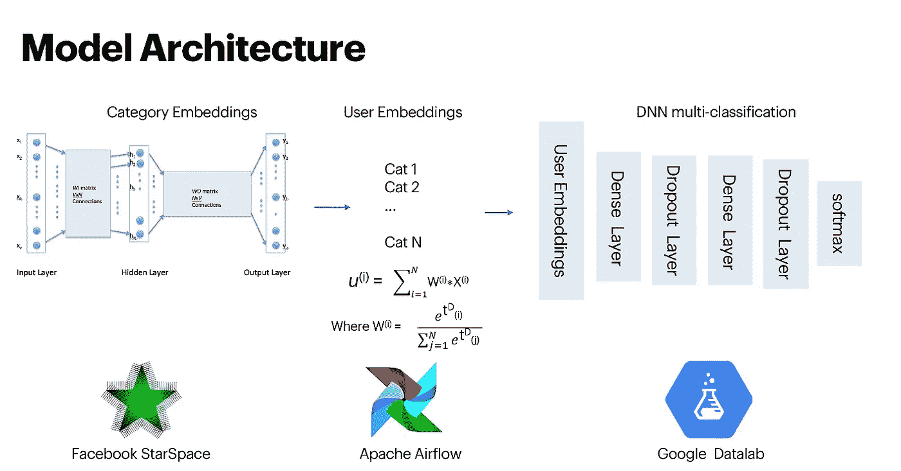
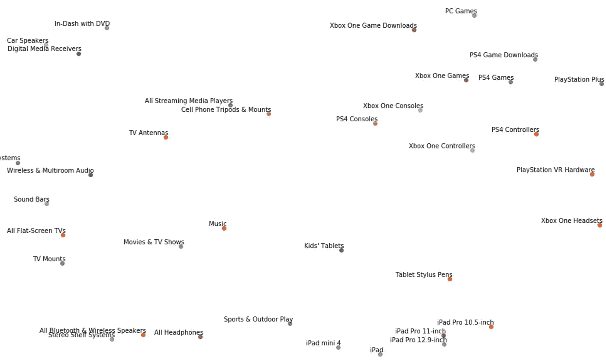
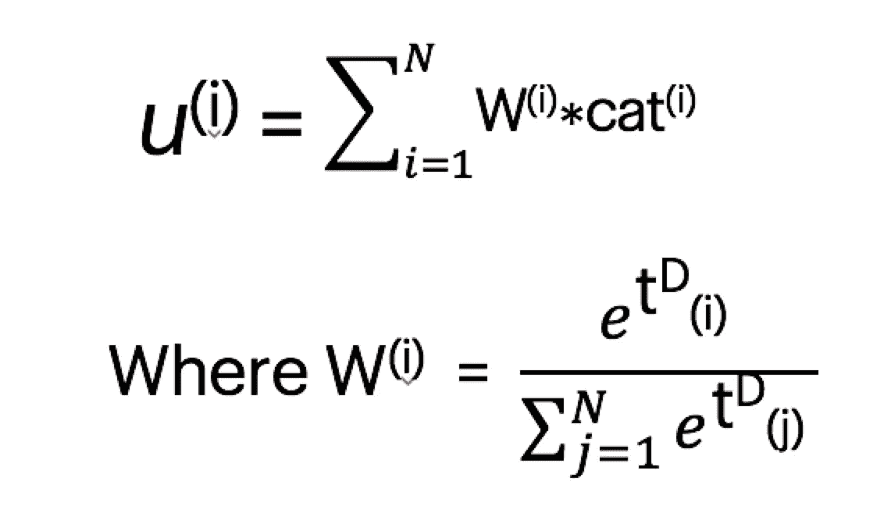
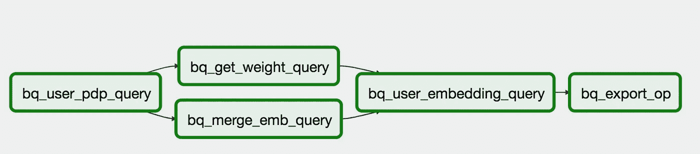

# 电子商务中的嵌入

> 原文：<https://medium.datadriveninvestor.com/embeddings-at-best-buy-fc081efa374f?source=collection_archive---------0----------------------->

# 通过深度学习和预先训练的产品嵌入实现强大的个性化

# 背景

近年来，深度学习已经成为一个热门话题，它在零售、电子商务、金融等不同行业中受益匪浅。我在一家拥有数百万产品和客户的全球零售和电子商务公司工作。在我的日常工作中，我利用数据和深度学习的力量为我们的客户提供个性化的推荐，最近我尝试了基于嵌入的方法，与我们目前的算法相比，这种方法的性能非常好。

在这篇博客中，我将描述我开发的嵌入技术，以及如何在大规模机器学习系统中实现它。基本上，我从客户的购物序列中训练产品嵌入，使用时间衰减来区分短期和长期兴趣，并将它们输入神经网络以获得个性化推荐。整个过程在 Google 云平台和 Apache Airflow 内部实现。

 [## 金融中的机器学习——数据驱动的投资者

### 在我们讲述一些机器学习金融应用之前，我们先来了解一下什么是机器学习。机器…

www.datadriveninvestor.com](https://www.datadriveninvestor.com/2019/02/08/machine-learning-in-finance/) 

# 什么是嵌入

2013 年，谷歌发布了 [*word2vec*](https://code.google.com/archive/p/word2vec/) 项目，该项目为计算单词的矢量表示提供了连续词袋和 skip-gram 架构的高效实现。之后，词嵌入在 NLP 领域得到了广泛的应用，而过去人们使用的是像 one-hot 编码这样的高维稀疏向量。与此同时，研究人员发现，嵌入还可以用于搜索和推荐等其他领域，我们可以将潜在的含义放入产品中，通过使用神经网络来训练机器学习任务。

source:[https://blog.acolyer.org/2016/04/21/the-amazing-power-of-word-vectors/](https://blog.acolyer.org/2016/04/21/the-amazing-power-of-word-vectors/)

# 为什么嵌入

我们获得单词嵌入的方法是通过单词与其相邻单词的共现来实现的，假设一起出现的单词比那些距离远的单词更可能相关。

根据我们如何获得单词嵌入的类似想法，我们可以这样打个比方:一个单词就像一个产品；一句话就像一个客户购物序列的序列；一篇文章就像所有顾客购物序列的一个序列。这种嵌入技术允许我们将产品或用户表示为低维连续向量，而一次性编码方法将导致机器学习模型的维数灾难。

# 培训产品嵌入

假设我们有 N 个用户的点击流数据，每个用户有一个(p1，p2，… pm) ∈ P 的序列乘积，它是用户点击的乘积的并集。给定这个数据集，目的是学习每个唯一乘积 Pi 的 d 维实值表示 v(Pi) ∈ Rd。为了选择正确的“d”，需要在模型性能和矢量计算的内存之间进行权衡。经过多次离线实验，我选择 d=50 作为向量长度。

首先，准备购物顺序。为了使序列与真实句子相似，我排除了只与少于五个产品交互的用户。然后，我为每个用户按时间升序列出产品。

model overview

## word2vec vs StarSpace

现在我们已经有了准备在神经网络中训练的序列数据，在神经网络中我们可以获得产品嵌入。在实践中，我尝试了两种方法:一种方法是修改 Google 的 word2vec TensorFlow 代码。说到细节，我使用带有[负采样](https://papers.nips.cc/paper/5021-distributed-representations-of-words-and-phrases-and-their-compositionality.pdf)的 skip-gram 模型，并用随机梯度下降更新权重。第二种方法是 [StarSpace](https://arxiv.org/pdf/1709.03856.pdf) ，由脸书人工智能研究所开发的通用神经嵌入模型，可以解决各种各样的问题。

有了这个，我就可以使用一周的点击流数据为我们 98%的产品嵌入产品，从而产生高质量的低维表示。

# 验证嵌入

我使用两种方法来验证产品嵌入是有意义的。第一个是来自 d 维向量对的余弦相似性。举个例子，我们知道，一个 iPhone X 和三星 galaxy 的相似度应该高于一个 iPhone X 和一把椅子的相似度。

第二种方法是使用 [t-SNE](https://en.wikipedia.org/wiki/T-distributed_stochastic_neighbor_embedding) 来可视化嵌入。我们可以期待的是，类似的产品在嵌入空间应该更接近。正如我们所看到的，这显然是真的。因此，我们可以得出结论，嵌入可以用来有效地计算产品之间的相似性，我们可以使用它们作为我们神经网络的输入(不是我们获得嵌入的神经网络，而是个性化输出的神经网络)。)

part of product embeddings visualization

# 使用嵌入来增强个性化

我们应该将客户信息放入模型中以获得个性化推荐，我们可以通过对 d 维产品嵌入进行时间衰减加权平均来聚合用户的浏览历史，假设最近的产品比客户很久以前查看的产品对客户的最终决策起着更重要的作用。

这里的权重是根据左边的公式计算的软最大时间概率。d 是控制最近事件有多重要的参数，t 是当前时间和过去事件时间之间的时间段的函数。

Airflow for user embeddings

我使用 Apache Airflow 从原始点击流数据和预先训练的产品嵌入中获取用户嵌入。在四个 BigQueryOperator 任务之后，我将处理过的嵌入导出到 Google 云存储中用于建模部分。

有了用户嵌入之后，我们可以将它们输入神经网络进行推荐。目标是每个用户最近的产品，特征是从除了这个用户最近的产品嵌入之外的任何产品嵌入中获得的用户嵌入。我用的是带有 ReLu 激活函数的密集层，后面是 Dropout 层和 BatchNormalization 层。最后一层是具有 M 级分类的 softmax，其中 M 是我们训练的嵌入中的许多独特产品。

我用几个指标进行了离线实验，比如下一次添加到购物车的命中率、平均倒数排名，与当前模型相比，该模型有显著的改进。

# 后续步骤

更多嵌入:在当前基于嵌入的模型中，我只使用点击数据。但是说到序列，任何事件都可以构成一个客户序列:搜索、添加到购物车、购买。除了事件类型，我还可以从产品信息中获得嵌入，比如产品描述、产品图片和特性。然而，需要考虑延迟(模型复杂性)和性能之间的折衷。

全球正面样本:受 Airbnb 2018 年 KDD 最佳论文的启发:[使用 Airbnb 搜索排名嵌入的实时个性化](http://delivery.acm.org/10.1145/3220000/3219885/p311-grbovic.pdf?ip=67.4.208.148&id=3219885&acc=OPENTOC&key=4D4702B0C3E38B35%2E4D4702B0C3E38B35%2E4D4702B0C3E38B35%2E054E54E275136550&__acm__=1556665861_c991ed63c0911e5c7fa7657d61d4fc59)，我将考虑在会话中添加最终购买的商品作为全球正面样本。背后的原因是，有很多因素可能会影响一个客户的最终购物决定，我认为购买的产品会与其他点击但未购买的产品有一些潜在的关系。