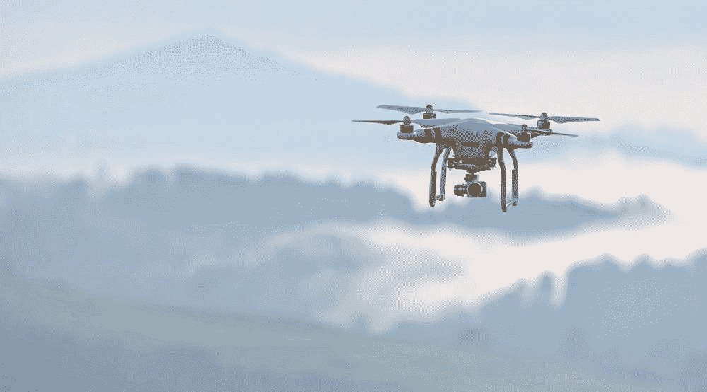

# 2018 年五大新兴产业

> 原文：<https://medium.datadriveninvestor.com/emerging-industries-in-2018-28373239f990?source=collection_archive---------11----------------------->

## 从科技到医药的新兴产业在 2018 年席卷了投资空间

Photo by [rawpixel](https://unsplash.com/photos/WLDtOWLuSgA?utm_source=unsplash&utm_medium=referral&utm_content=creditCopyText) on [Unsplash](https://unsplash.com/search/photos/investing?utm_source=unsplash&utm_medium=referral&utm_content=creditCopyText)

每个人都想在下一个脸书开始的时候投资，正因如此，新兴产业在过去几年的投资领域风靡一时。随着[监管众筹](https://www.sec.gov/smallbusiness/exemptofferings/regcrowdfunding)的到来，投资早期初创企业不再仅限于硅谷风险投资家和 Y Combinator 天使投资人。更具体地说，投资这些初创企业不再仅仅是合格投资者的机会。因此，早期初创企业更容易获得融资，新兴产业也成为比标准的“安全”蓝筹股更受欢迎的投资选择。以下是我认为的 2018 年最大的五个新兴行业。

## 行业#1:区块链

Photo by [Hitesh Choudhary](https://unsplash.com/photos/JNxTZzpHmsI?utm_source=unsplash&utm_medium=referral&utm_content=creditCopyText) on [Unsplash](https://unsplash.com/search/photos/blockchain?utm_source=unsplash&utm_medium=referral&utm_content=creditCopyText)

区块链在 2017 年底登上了各大新闻聚合的头条。从那以后，加密货币不仅引起了标准爱好者的兴趣。很快，每个父母都开始恳求他们的孩子帮助他们购买一些加密货币。即使是正在进行的区块链和加密货币活动，如 Consensus，去年也有[创纪录的出席人数](https://www.coindesk.com/events/consensus-2017/)。随着区块链的出现，这一领域的公司有了一个新的融资选择，即首次公开募股。截至 2017 年底，ICO 今年已经筹集了近 70 亿美元。2018 年，这一数字几乎已经翻了一番——截至 7 月初[达到 137 亿美元](https://www.businessinsider.com/global-ico-activity-spikes-2018-7)。Telegram 是一家已经成立的执行 ICO 的公司，它自己从捐助者那里筹集了总共 17 亿美元。尽管比特币目前只有历史最高水平的三分之一左右，但流入区块链 ICO 的资金似乎不会很快枯竭。

## 行业#2:无人机

在过去的几年里，我们看到无人机飞行员的数量激增。无论是出于爱好还是商业用途，成为无人机所有者的门槛都大大降低了。起初，这一行业爆炸带来了许多关于无人机及其飞行员的[法规的问题。然而，最近，围绕无人机形成商业业务变得更加容易。相应地，像](https://www.businessinsider.com/the-global-drone-regulation-landscape-2018-3) [AegisFlow](https://www.aegisflow.com/) 和 [Skydio](https://www.skydio.com/) 这样的初创公司已经迅速起飞。事实上，整个无人机行业在 2018 年 1 月至 7 月期间[筹集了近 2 亿美元](https://uavcoach.com/fundraising-2018/)。根据高盛的[报告，无人机行业呈现出 1000 亿美元的市场机会。鉴于这一事实，许多初创企业将抓住这个机会获得资金，并在未来几年内发展壮大。](https://www.goldmansachs.com/insights/technology-driving-innovation/drones/)

## 行业#3:大麻

Photo by [Shane Rounce](https://unsplash.com/photos/fgtcAGglstc?utm_source=unsplash&utm_medium=referral&utm_content=creditCopyText) on [Unsplash](https://unsplash.com/search/photos/cannabis-store?utm_source=unsplash&utm_medium=referral&utm_content=creditCopyText)

直到最近几年，大麻及其衍生产品在大多数管辖区都是非法的娱乐性产品。在许多国家，甚至医疗用途也受到严格限制或完全禁止。出于减少犯罪和增加税收的考虑，一些司法管辖区最近将这种植物合法化，用于娱乐、医疗或两者兼而有之。目前在美国，已经有 8 个州将娱乐用大麻合法化，还有 21 个州将纯医用大麻合法化(你可以在这里找到一张方便的地图)。一些国家，如加拿大和荷兰，已经在全国范围内将大麻的使用合法化。随着越来越多的管辖区开始效仿，合法的大麻产业也随之快速发展。随着大麻在加拿大的合法化，一些公司如 [Tilray](https://www.tilray.com/) 和 [Canopy Growth Corporation](https://www.canopygrowth.com/) 已经在各种证券交易所公开上市。自 2018 年初以来，这些大麻公司的一些股票已经上涨了 500%以上。各种市场研究组织，如 Arcview Market Research 及其合作伙伴，预计到 2027 年，全球在大麻及其衍生产品上的支出将达到 570 亿美元。在这种情况下，许多初创企业将进入该行业，以获得他们在这“一桶金”中的公平份额。

## 行业#4:远程医疗

远程医疗和健康服务是一个非常新的市场。随着电脑和智能手机的出现，越来越少的人开始访问物理位置。然而，这不仅仅包括零售商店，像美国井和 T2 阿维亚这样的新服务使得通过互联网看医生成为可能。通过使用这些服务来护理小疾病的便利性和可负担性的前景已经席卷了市场。一些提供商甚至为慢性病和精神健康状况等提供更全面的护理，从而使远程医疗提供商能够抓住更多的潜在市场。据 [IHS Analytics](https://www.forbes.com/sites/brucejapsen/2013/12/22/obamacare-doctor-shortage-to-spur-2-billion-telehealth-market/#20c431772abe) 称，仅美国的远程医疗行业今年的收入就可能达到 20 亿美元左右。另一家公司 Grandview Research 预测，到 2025 年，全球市场将增长到 1130 亿英镑。从初创公司到三星，越来越多的公司开始抓住这个机会，远程医疗是一个不会很快失去势头的行业。

## 行业#5:增强和虚拟现实

Photo by [Giu Vicente](https://unsplash.com/photos/FMArg2k3qOU?utm_source=unsplash&utm_medium=referral&utm_content=creditCopyText) on [Unsplash](https://unsplash.com/search/photos/virtual-reality?utm_source=unsplash&utm_medium=referral&utm_content=creditCopyText)

虚拟现实和增强现实可能是这个榜单上我个人最喜欢的行业。作为一名 HTC Vive T1 的个人用户，这是我几年来一直关注的一项技术。随着技术变得越来越容易获得，消费者也越来越买得起，整个空间呈指数级增长。软件公司、智能手机公司和初创公司都已经跳上了 VR/AR 列车。2017 年，初创企业[在成为风投和天使投资者的热门投资机会后，筹集了超过 30 亿美元](https://venturebeat.com/2018/04/03/ar-vr-startups-raise-record-3-6-billion-in-last-12-months-as-market-transition-accelerates/)。 [P & S 市场研究预测](https://www.marketwatch.com/press-release/global-augmented-reality-ar-virtual-reality-vr-market-outlook-to-2023-by-devices-component-application-and-geography---researchandmarketscom-2018-07-30)到 2023 年，该行业在全球范围内将增长到 944 亿美元，这对于科技领域的初创企业来说是一个巨大的机遇。甚至像[微软](https://www.microsoft.com/en-US/hololens)、[三星](https://www.samsung.com/us/mobile/virtual-reality/gear-vr/gear-vr-with-controller-sm-r324nzaaxar/)和脸书(现在是 [Oculus Rift](https://www.oculus.com/rift/#oui-csl-rift-games=star-trek) 的所有者)这样的老牌公司也加入了这一行动——这三家公司都已经向市场发布了他们的设备。总而言之，VR/AR 行业仍然保持着兴奋和积极的情绪，自从 2012 年第一批设备在 Kickstarter 上首次亮相以来，它一直没有失去动力。