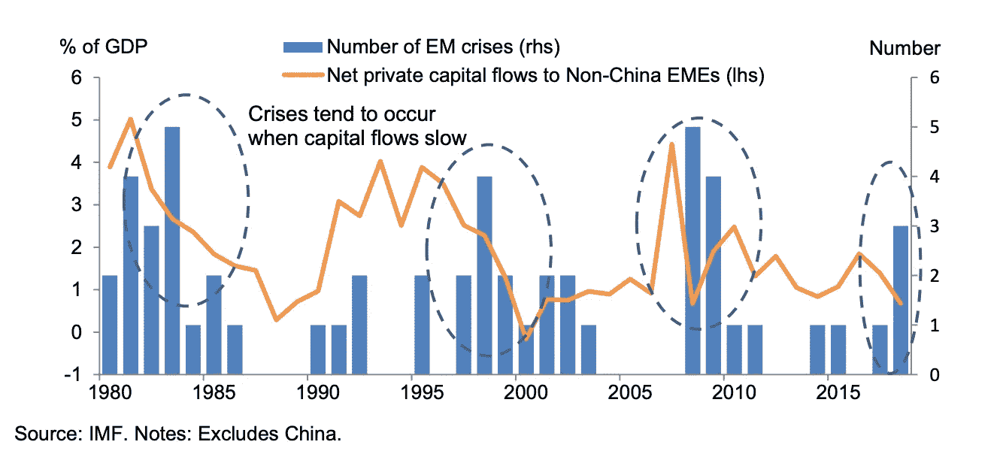
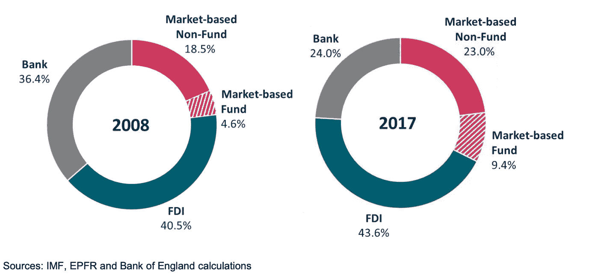
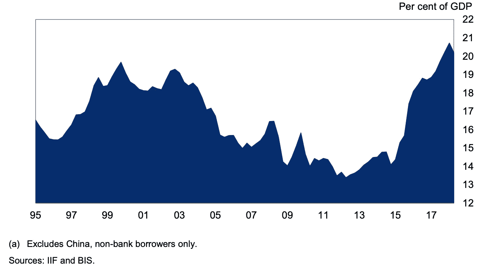

# 新兴市场:需要一种新的宏观审慎政策来解决对外汇相关债务的过度依赖

> 原文：<https://medium.datadriveninvestor.com/emerging-markets-a-new-approach-to-macroprudential-policy-is-needed-to-address-over-reliance-on-6f8a344b106b?source=collection_archive---------6----------------------->

随着大多数工业化经济体的趋势，新兴市场已经实现了经济自由化，拉丁美洲、东南亚和非洲的央行现在都有了明确的通胀目标。尽管向 2.0%的通胀目标靠拢的可能性还很小，但明确的通胀目标提振了金融稳定，平滑了金融和商业周期。如今，大多数央行都将追求金融稳定和价格稳定作为其使命的一部分。

新兴市场的外汇(FX)往往与大宗商品以及铜、石油、铝和石油产品等初级产品的出口密切相关。因此，商品价格的波动会导致其货币贬值，增加偿债成本——尤其是与外汇相关的债务——并导致通胀上升。大多数中央银行——例如。土耳其——当其他国家出现这种情况时，倾向于提高政策利率，以保护资本流动和抑制通胀压力。

 [## 为什么包容性财富指数比 GDP 更能衡量社会进步？|数据驱动…

### 你不需要成为一个经济奇才或金融大师就能知道 GDP 的定义。即使你从未拿过 ECON 奖…

www.datadriveninvestor.com](https://www.datadriveninvestor.com/2019/03/08/why-inclusive-wealth-index-is-a-better-measure-of-societal-progress-than-gdp/) 

尽管如此，流入和流出新兴市场的资本往往会放大这些过高或过低的通胀周期，从而加大对支持货币政策的宏观审慎工具的需求。此外，过度依赖与外币相关的债务会降低货币政策的有效性，货币政策的逆转往往会导致新兴市场的银行和经济危机。(见下图)。为此，新兴市场必须运用一系列工具来纠正与美元周期或货币政策密不可分的结果。

# **新兴市场货币升值降低了货币政策的有效性**

国际清算银行最近的一篇论文强调了这一点，即新兴市场货币升值往往会增加资本流入，降低货币政策的有效性。这一点对于那些收入和收益在新兴市场竞争激烈，但却在世界各地的交易所上市的跨国公司来说尤为突出。这一趋势是在英国退出欧盟全民公决、英国退出欧盟国务秘书 Dominic Raab 辞职和最近任命 Boris Johnson 为总理之后出现的。英镑贬值并没有导致资本外逃和股市动荡，而是见证了金融市场的反弹，因为从英国以外市场获得收入的上市公司价值增加。当一种货币升值而中央银行降低政策利率时，前者可能导致资本流入，从而减少货币政策对坚挺货币的约束，并使中央银行实现通胀目标变得复杂。这不仅增加了实施货币政策的成本，还可能导致政策失误，因为在几乎没有或根本没有正常运作的衍生品市场的市场中，央行别无选择，只能通过降低政策利率来纠正经济和金融失衡。

相反，当新兴市场货币贬值，而国内经济体利率上升又无助于阻止资本流出这些经济体时，情况正好相反。与股价往往会上涨的发达市场上市公司不同，新兴市场往往严重依赖基于市场的融资和外汇相关债务，而货币走软会增加上述公司的债务负担。基于市场非基金类融资占总融资的比例从 2008 年的 18.5%上升至 23.0%。与此同时，基于市场的基金在 2017 年的占比从 4.6%升至 9.4%。此外，根据美元计价债务的程度，美元突然升值可能引发银行危机或资本流动的重大逆转。当加拿大、美国、澳大利亚等发达经济体进入逐步退出货币刺激的阶段时，这种趋势反而更加明显。

# **基于市场的融资对新兴市场融资需求越来越重要**

由于金融市场欠发达，国内机构投资者较少，新兴市场倾向于借入外币。缺乏运转良好的金融体系——资本市场、交易所、监管、支付和清算——解释了发达经济体对外国投资者、金融机构和中介机构日益依赖的原因。根据国际货币基金组织和英格兰银行的计算，2008 年外国直接投资占新兴市场外债的 40.5%。其次是银行资金、基于市场的非基金和基于市场的基金，分别占 36.4%、18.5%和 4.6%。

Source [BIS](https://www.bis.org/review/r190606f.pdf)

到 2017 年，外部负债的动态发生了巨大变化，以市场为基础的非基金负债占新兴市场外部负债的大部分 23.0%，9 年增长 4.5%。与此同时，同期银行融资下降了 12%，至 24.0 英镑，市场基金在新兴市场外部负债中所占份额增加了约 4%，至 9.4%。这表明资金来源从银行向市场融资的结构性转变，外国直接投资占总外债的比例小幅上升 3.0%至 43.6%。这种外部依赖性使货币政策的正常运作变得复杂，因为它倾向于预期效果。升值会吸引更多的资本，降低降息的效果。

# **依赖市场融资很方便，但长期来看成本很高**

尽管由于新兴市场的监管制度更加宽松和宽松，更容易获得基于市场的资金来源，但这增加了金融不稳定的风险，因为在不利的宏观经济条件下，如对债务可持续性的担忧、税收减少、商品价格下跌或政策不确定性，货币更容易受到资本外流的影响。

一方面，现金短缺的新兴市场可以很容易地获得融资和基金投资或支持现金流需求，但发达经济体的银行挤兑和廉价出售资产引发的突然逆转可能对金融稳定、政府公共财政和宏观经济结果产生重大不利经济影响。

# **货币政策可能变得不那么有效**

新兴市场在全球经济活动中的份额显著增加——从 40%到 60%——伴随着对基于市场的金融和以外币计价的外汇相关债务的更大依赖，其中 2/3 的新兴市场债务、外汇储备和全球证券以美元发行。除了基于市场的金融，资本流动的逆转可能会加剧国内金融和经济的不稳定，即使各国央行通过加息来应对更高的通胀。即使他们坚持以通胀为目标，由于货币政策的稳定效应扭曲了经济活动，经济增长也可能会慢得多。

# **审慎工具和轻型监管**

即使货币政策的有效性越来越明显，也应该更有效地使用宏观审慎工具来稳定资本和金融流。新兴市场央行可以通过 LTV 比率、准备金和资本要求来降低对美元融资的过度依赖。这一点尤为突出，因为发达经济体的低利率引发了对收益率的新一轮搜寻。随着对基于市场的融资来源的依赖增加，投资基金对后者的贡献高达 40%，流动性和资本要求的设计应该阻止金融系统中杠杆的过度积累。发展中经济体的监管者不应过度监管资本流动和抑制投资，而应仅在必要时实施有限的资本管制制度。

# **有针对性的资本管制可能有效**

一是在市场紧张时期防止资本流动突然逆转；前瞻性的方法将确保投资基金的资本流动只能在三个月内撤回。这将激励投资者采取规避危机的方式，减少银行挤兑和来自发达经济体的资本流动，确保金融体系的流动性，并防止突然出售流动性差的资产(房地产、机械)，这往往会加剧新兴市场的压力。资本管制可能会造成扭曲，但它可以解决资本流动的突然逆转，平稳的结构调整将显著改善货币政策的运作。

此外，资本要求的设计应增加资金来源和货币的多样化。这将降低美元化金融体系(即过度依赖美元融资的经济体)中美元突然升值导致的银行危机风险。一个拥有多极和多样化外汇构成的金融体系将改善金融体系的运作，并使宏观审慎政策能够支持货币政策。

# **外汇干预和资本市场**

外汇干预在应对由资本流入或流出引发的货币突然贬值或升值方面同样有效。与南非和匈牙利不同，很少有新兴市场拥有发展完善、运转良好的衍生品市场。这使得任何影响即期汇率的努力变得复杂，导致过度依赖货币政策来实现经济再平衡。金融和技术进步将使新兴市场经济体能够应对货币价值的突然变化。然而，这不应削弱宏观审慎框架的持续改进，以提高资本流动的质量并稳定资本流动。

# **外汇干预不应降低宏观审慎政策改革的紧迫性**

外汇干预无助于改善资本流动的功能，而是倾向于压倒性地关注货币价值及其对通胀、家庭消费和偿债成本的扭曲效应。一个更平衡的方法将包括国内政策，以确保外国投资者不会突然出售资产并逆转在这些经济体的投资。三个月的缓冲期将让央行和政府更有效地制定计划，避免危机。更重要的是，这将对全球金融稳定产生积极影响，减少对特别提款权和 IMF 融资的依赖。这一点尤其突出，因为在大金融危机之后，各国往往倾向于自我保险，这与 1984 年、1992 年和 2000 年基金组织永久融资占全球负债的百分比下降相吻合。因此，更高的自我保险成本和对基于市场的融资来源的更多依赖预示着货币政策的有效性，必须有针对性地使用审慎措施，不仅要实现中央银行的目标；还能改善传播机制和预期结果。

**参考。**

1.  。马克·卡尼(2019)，国际清算银行。拉、推、管:新世界秩序的可持续资本流动