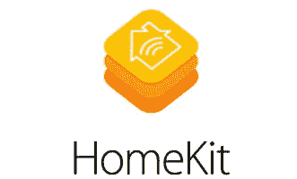

# 金融服务业的新兴趋势。

> 原文：<https://medium.datadriveninvestor.com/emerging-trends-in-the-financial-services-industry-45b7eac9dcaf?source=collection_archive---------1----------------------->

我最近看到一句有趣的话。事情是这样的。

商业中使用的任何技术的第一条规则是，应用于高效运营的自动化将放大效率。第二，自动化应用于低效率的操作会放大低效率。—比尔·盖茨

我认为这一原则在金融服务业比在其它任何领域都更适用。让我们探讨一下金融服务行业中出现的一些关键趋势，以更好地了解服务将如何发展，以及这对非专业消费者意味着什么。

 [## 分散金融的出现|数据驱动的投资者

### 当前的全球金融体系为拥有资源、知识和财富的人创造了巨大的财富

www.datadriveninvestor.com](https://www.datadriveninvestor.com/2019/03/14/the-emergence-of-decentralized-finance/) 

**1。共享经济正在快速追赶**

> *共享经济是一种经济模式，它被定义为一种基于点对点* *(P2P)的获取、提供或共享商品和服务的活动，这些活动通常由基于社区的在线平台促成。—投资媒体*

用外行的话来说，就是一切的 Uber 化。

现在考虑这个场景:**你最后一次去银行是什么时候？**

我猜不会很久了。现代银行业务是高度自动化的，大多数银行服务只需在你的智能手机上点击几下就可以使用。随着越来越多的尖端技术不断被金融服务行业所采用，银行作为中介的角色将发生根本性的变化。监管规定的变化扩大了新参与者进入该行业的范围，金融科技初创公司没有失望。

众筹是最近出现的最强有力的替代贷款形式之一。快速浏览一下 Indiegogo 和 Kickstarter 网站，你会对它们资助的大量商品和服务有一个很好的了解。Kickstarter 和 Indiegogo 成立十多年来，已经为用户筹集了数十亿美元的资金。对于那些想测试产品的市场有效性或者想资助一个从概念到商业化的项目的人来说，众筹是一个极好的选择。它可以让你获得资金，而传统上你要么去银行，要么去个人贷款机构。作为一名独立电影制作人，我亲身体验了这些平台给像我这样的创意者带来的好处，否则他们不会找到资助他们项目的方法，至少不会以有利的条件。随着更多专业化的众筹平台不断涌现，看到此类平台在整体贷款方面超过传统银行也就不足为奇了。众筹是共享经济的完美体现，资本提供者找到资本使用者，反之亦然，无需中间人。这使得资产分配更有效率，透明度更高。

Indiegogo is one of the most popular crowdfunding platforms.

另一个例子是点对点(P2P)支付平台的出现。Venmo、Zelle 和 PayPal 等平台已经为消费者铺平了道路，让他们不用去银行就能把钱汇过来。这些平台的强劲增长不仅促使传统大银行开发同一产品的专有版本，也促使谷歌、脸书和亚马逊等非传统参与者开发其数字钱包产品。促进同行之间的快速数字支付对新兴国家的经济产生了巨大影响。沃达丰开发的手机转账服务 M-Pesa 是肯尼亚和坦桑尼亚等国家的首选转账方式。M-Pesa 是让 2%的人口摆脱贫困的关键因素，也证明了金融普惠对任何经济繁荣都至关重要。

Widely considered as Indian PayPal, Paytm has revolutionized the peer-to-peer money transfer in India.

这种成功故事也在印度复制，PayTm 成为一种汇款服务，使中小企业主之间能够快速交换资金。现在，只需扫描条形码或共享钱包 ID，就可以转账付款。这反过来又使更多的企业能够通过跨行业合作开发和创造产品。例如，旅行社现在可以通过 Paytm 数字钱包为其客户预订机票，客户不仅可以在现金返还方面获得折扣，还可以为旅行社积累积分，这些积分可以兑换其他产品和服务。这样，任何一方都可以从单笔交易中获益。

因此，传统银行需要与这些新兴的金融科技创业公司结合起来，继续发展并接受这种颠覆。

**2。区块链**

区块链被视为新一轮技术革命，金融服务一直在投入资源，将该技术商业化。随着区块链资金的持续增长，你会看到更多的玩家拥抱公共账本系统，不仅用于零售，也用于机构方面的事情。这种分布式分类账系统最常见的用途是开发加密货币。尽管比特币很受欢迎，但加密货币的名声并不好，这是有原因的。

传统上，比特币一直被用作洗钱或资助恐怖主义和贩运活动的手段。然后就是比特币内在价值的问题。你的依据是什么？即使你要确定一个价值，你如何建模？在东京和韩国的比特币交易所遭到黑客攻击后，普通投资者，至少是美国的普通投资者，对任何加密交易都非常谨慎。

区块链肯定比当前的银行基础设施具有运营和技术优势，但正确的实施对于更大规模地采用这项技术至关重要。目前还不确定这个行业是否会接受这项技术，或者它只是另一种时尚。

**3。客户情报将是收入的主要驱动力**

如今，从数据中获得洞察力的最大障碍是大多数数据都不可靠。这种数据称为脏数据。肮脏的数据导致糟糕的洞察力和不一致的结论。导致竞争优势的战略传统上依赖于简单的措施，如调查和焦点小组。由于大量设备和持续的在线交互，现在产生的数据呈爆炸式增长，因此组织需要投资更复杂的工具来获得洞察力，从而在竞争中获得优势。

鉴于组织现在从多种设备和位置收集数据，金融组织不仅需要采用不同的方法来理解数据，还需要根据这些见解提供体验。公司都意识到了这一点。去任何大型银行公司的招聘网站，你会看到越来越多的工作与数据挖掘相关。对数据科学家来说，这是个不错的时机。作为金融服务业的现任参与者，这是一个特别棘手的阶段，因为竞争可能根本不是来自金融科技初创公司或其他现任参与者。它可能来自最意想不到的球员。

例如，苹果公司最近推出了一种信用卡。苹果推出了一种没有年费和卡号的信用卡，重新诠释了拥有一张信用卡意味着什么。通过敏锐地观察信用卡拥有者的痛点，苹果开发出了一种产品，不仅解决了他们的问题，还保持了苹果文化的真实性。苹果也在智能家居设备和医疗保健等行业进行类似的投资。苹果开发远远超出其核心竞争力的产品的能力证明了一个事实，即投资于客户情报将是现有参与者保持相关性和竞争力的唯一途径。

**4。网络安全将是重中之重**

当像脸书这样的公司分享你的私人信息来换取广告费时，感觉就像是一种背叛。鉴于脸书卷入剑桥分析公司丑闻和俄罗斯卷入 2016 年总统选举，隐私最近成为一个巨大的讨论话题。随着收集的数据点越来越多，这种担忧也越来越强烈。公司正在收集你的虹膜扫描、指纹、心率、语音指令和睡眠模式，以从你的行为中获得洞察力。如果这些数据落入不法之徒手中，就可能被用于身份盗窃和利用。

在电视剧《机器人先生》中有一个著名的场景，一群黑客能够侵入一家公司高管的智能家居设备，当有人试图通过操纵恒温器将水温升得很高来伤害高管时，开始只是轻微的烦恼(闪烁的灯光和调高音量)很快就会变得非常严重。

Mr. Robot is a TV series that depicts a group of hackers’ fight against an organization called E Corp.

随着我们走向一个日益互联的世界，违反上述任何数据点都足以获得对多台设备的访问权限。网络安全对于保护消费者的金融数据至关重要。云计算是增加投资可以为银行组织带来丰厚回报的一个领域。集中数据收集但分散访问看起来是为了构建更多的数据保护层，即使在发生违规的情况下，也能保护数据。此外，远离第三方供应商和本地化数据是几个额外的步骤，将大大有助于确保金融机构对数据的记录和分发方式有更大的控制权。

总之，有多种力量将决定未来金融和银行组织的行为。将组织目标与客户需求结合起来将是决定哪些玩家能够生存下来的主要因素。技术的出现为大规模服务消费者创造了更多的机会，但也为许多复杂的挑战让路。消费者行为和随之而来的消费模式将继续快速发展，有远见地利用新兴趋势的组织将形成强大的竞争优势。