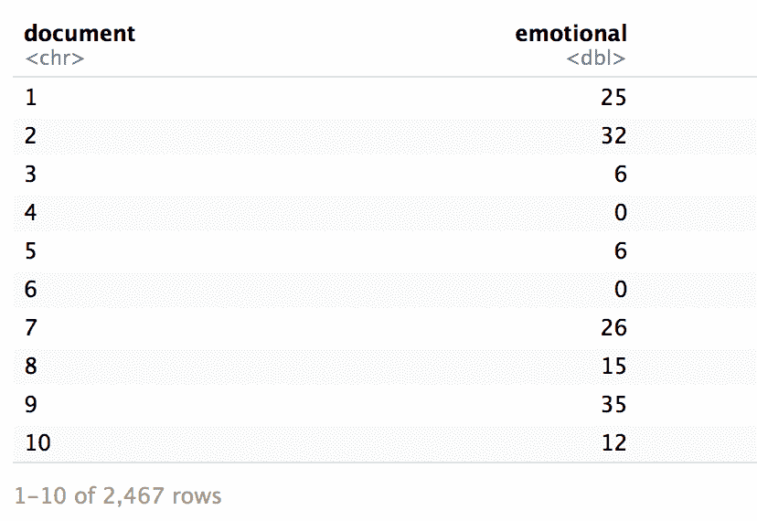
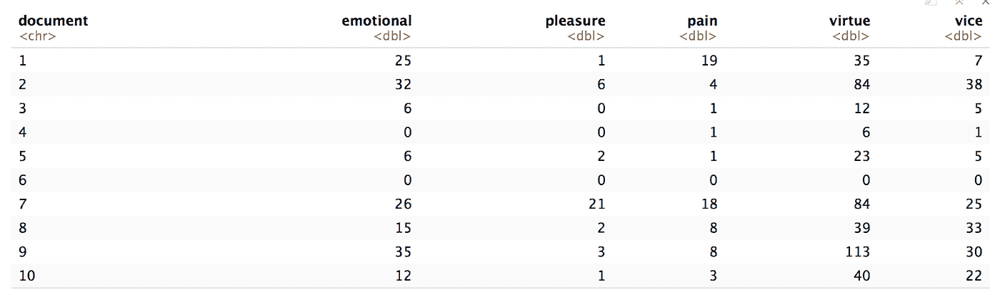
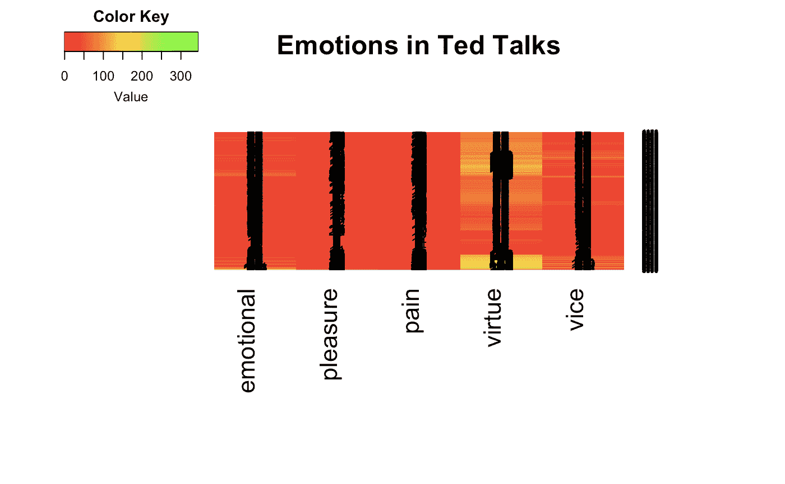

# 基于 R 的文本情感分类

> 原文：<https://medium.datadriveninvestor.com/emotions-in-ted-talks-text-analytics-in-r-1b6016f3316e?source=collection_archive---------10----------------------->


这篇文章是我的 NLP 博客系列的延续。你可能想看看我之前的博客，我在其中讨论了 r 中的数据预处理。在这篇博客中，我将确定与 ted 演讲相关的情绪。最后，我会计算出情绪和谈话的热图来帮助我们可视化。

所以，事不宜迟，让我们开始吧！

由于我在上一篇博文中已经讨论了详细的数据预处理步骤，我将假设您已经准备好了一个文档术语矩阵。

我们将从导入[普通问询者类别列表](http://www.wjh.harvard.edu/~inquirer/homecat.htm)数据集开始。该数据集来源于 4 种不同词典中的单词类别。一个特定的类别包含几个与该类别的语义相关的单词。例如——“快乐”类别包含表示享受某种感觉的词语，包括表示自信、兴趣和承诺的词语。

```
require(“tm.lexicon.GeneralInquirer”)words_with_emotions <- terms_in_General_Inquirer_categories(“EMOT”)
words_with_pleasur <- terms_in_General_Inquirer_categories(“Pleasur”)
words_with_pain <- terms_in_General_Inquirer_categories(“Pain”)
words_with_virtue <- terms_in_General_Inquirer_categories(“Virtue”)
words_with_vice <- terms_in_General_Inquirer_categories(“Vice”)
```

为了确定 Ted 演讲中的情绪，选择类别是一项开放式的任务。我挑选了我认为最适合这次谈话中的情感的类别。稍后，正如我们将看到的，热图将验证我的选择。你可以为你的实践选择完全不同的类别，这仍然很好。

接下来，我们将计算一个分数，该分数表示 DTM 中有多少词语与上一步导入的类别中的词语相匹配。为此，我们使用 tm_term_score 函数。

```
emo_score <- tm_term_score(dtm, words_with_emotions)
pleasure_score <- tm_term_score(dtm, words_with_pleasur)
pain_score <- tm_term_score(dtm, words_with_pain)
virtue_score <- tm_term_score(dtm, words_with_virtue)
vice_score <- tm_term_score(dtm, words_with_vice)
```

计算分数后，我将准备一个包含每个文档的类别分数的数据框架。

```
library(dplyr)
library(tibble)
library(tidyr)
library(tidytext)
library(gplots)doc_emo_df <- tbl_df(emo_score) %>% rownames_to_column %>% rename(document = rowname) %>% rename(emotional = value)
doc_pleasure_df <- tbl_df(pleasure_score) %>% rownames_to_column %>% rename(document = rowname) %>% rename(pleasure = value)
doc_pain_df <- tbl_df(pain_score) %>% rownames_to_column %>% rename(document = rowname) %>% rename(pain = value)
doc_virtue_df <- tbl_df(virtue_score) %>% rownames_to_column %>% rename(document = rowname) %>% rename(virtue = value)
doc_vice_df <- tbl_df(vice_score) %>% rownames_to_column %>% rename(document = rowname) %>% rename(vice = value)
```

一个这样的数据帧看起来像:



随后，我按照文档编号将所有数据帧连接在一起。这导致包含每个文档的每个类别的分数的单个数据帧。

```
library(tidyverse)all_emotions <- list(doc_emo_df, doc_pleasure_df, doc_pain_df, doc_virtue_df, doc_vice_df) %>% reduce(inner_join, by = “document”)
```

这一步产生的数据帧如下所示:



下一步是制作可视化热图。我使用了 heatmap.2 函数，在该函数中，我们需要输入要绘制的数值的数字矩阵。因此，这是我进行的第一步——将上面计算的数据帧转换成矩阵形式。随后，该矩阵与其他几个参数一起被输入热图 2 功能。我在下面的代码中注释了每个参数的描述和用法。我从 [Sebastian Raschka 的博客](https://sebastianraschka.com/Articles/heatmaps_in_r.html)中学习了热图的用法。

```
# transform the columns (except document number) into a matrix
mat_data <- data.matrix(all_emotions[,2:ncol(all_emotions)]) 
rownames(mat_data) <- all_emotions[,1][[1]] # assign row namesheatmap.2(mat_data,
 cellnote = mat_data, # same data set for cell labels
 main = “Emotions in Ted Talks”, # heat map title
 notecol=”black”, # change font color of cell labels to black
 density.info=”none”, # turns off density plot inside color legend
 trace=”none”, # turns off trace lines inside the heat map
 margins =c(12,9), # widens margins around plot
 col=colorRampPalette(c(“red”, “yellow”, “green”))(n = 299), # use on color palette defined earlier
 Colv=”NA”, # turn off column clustering
 dendrogram=’none’)
```

代码产生了下面的热图。



正如你在上面的热图中看到的，红色贯穿始终。一个明确的理由是 DTM 极其稀少。在 DTM 99%的稀疏度下，五个类别(情感、快乐、痛苦、美德和邪恶)中的单词无法匹配我们 DTM 中的大多数术语。一小段黄线表示特定情绪的存在——在这种情况下是美德。这意味着演讲者在他们的 Ted 演讲中使用了大量与美德相关的词汇。如果你使用不同种类的情绪，结果可能会不同。

目前就这些。我将在下一篇博客中讨论一个与 NLP 相关的新任务。敬请关注。

我也写过其他与软件工程相关的[帖子](https://medium.com/@shubhanshugupta/engineering-challenges-of-streaming-a-million-concurrent-json-data-streams-from-product-to-crm-360506b29aca)。你可能想看看这里的。

**本帖** **最初发表于 https://shubhanshugupta.com/emotions-in-ted-talks/**