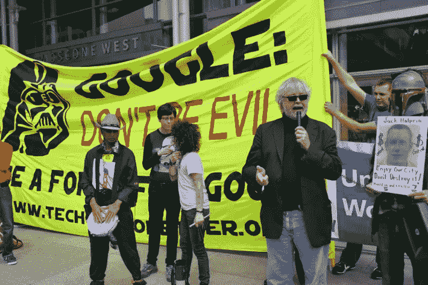

# 员工是技术行业变革的积极分子

> 原文：<https://medium.datadriveninvestor.com/employee-activism-and-change-in-the-technology-industry-62d1c54df640?source=collection_archive---------14----------------------->

Google Workers Protesting Against Immigration Ban

企业中的道德问题被定义为企业的社会责任，是所有企业重视的品牌建设的一部分。道德议程是如何设定的？是自上而下由首席执行官颁布一个组织的既定方向和风气吗？尽管这可能是传统模式，但员工行动主义有其作用，在本文中，我将研究过去一年主要技术公司中发生的一些例子，因为该行业正在寻求人工智能和机器学习可能性的道德参数。

让我从另一个问题开始，我们应该责怪科技公司给了我们我们不知道自己想要的东西吗？什么时候一些事情变得太好了？我们不断受到道德规范的轰炸，比如“一切适度就好。”显然，有些事情不在这条道德法令的范围内，但对大多数事情来说，这是一个很好的概括。

例如，你可能会说你重视隐私，但你会把当天吃的所有东西都上传到 Instagram 上。社交媒体是新的糖，我们不能放下包装在我们的 Iphones 和机器人完美中的美味。希望政府对我们的上瘾进行监管是不是很愚蠢？在瑞士，你可以去诊所注射任何纯度的海洛因，只要不是过量，与阿片类药物相关的死亡率和犯罪率都大幅下降。

我们应该期待我们的科技公司也受到类似的监管吗？它们以一种需要强加伦理观点的方式吸引了我们的注意力和时间；对个人和整个社会责任的思考。今天的设备和应用程序的设计是以一种方式来吸引用户的注意力，在一个永久的循环中[即时满足和上瘾。](http://www.tristanharris.com/2016/05/how-technology-hijacks-peoples-minds%e2%80%8a-%e2%80%8afrom-a-magician-and-googles-design-ethicist/)

一些公司越来越意识到持续的屏幕时间对个人和社会的不利影响。例如，苹果公司最近公布了一种限制 Iphone 使用的方法，这让青少年非常懊恼。[脸书和 Instagram 也做了类似的事情。](https://www.cnet.com/news/facebook-instagram-add-tools-to-limit-time-spent-on-the-apps/)这种情景很像打破上瘾的循环，首先认识并承认问题，然后采取措施解决问题。

但是我们应该在哪里划定我们期望的界限呢？我们应该期待一家公司因为潜在的不道德关系而拒绝投资吗？当一项政策被认为是不道德的时候，我们应该期望一个公司扣留一种用于为政府服务的产品吗？

**社会问题和硅谷**

在最近一篇名为[的专栏文章中，“谁来教导硅谷要有道德？”卡拉·费希尔分析了硅谷目前面临的一些困难。其中一个问题是关于贾马尔·哈肖吉(Jamal Khashoggi)被谋杀后，硅谷和沙特阿拉伯公共投资基金(Saudi Arabian Public Investment Fund)之间达成的浮士德交易的关联和激励。该基金向特斯拉、优步和 Magic Leap 等公司投资了数十亿美元用于开发，而沙特王国向愿景基金(Vision Fund)投资了 450 亿美元，该基金由软银首席执行官孙正义运营，他是硅谷最强大的风险投资公司的负责人。硅谷有道德义务不接受与记者谋杀案有关的政权的钱吗？](https://www.nytimes.com/2018/10/21/opinion/who-will-teach-silicon-valley-to-be-ethical.html?mkt_tok=eyJpIjoiTkRJNFltUXdaV0kzTVdJNCIsInQiOiJsTGlGSU5XNzNNTTJqeDlzMDFDWGVcLzY1K0dFWGNMeEl2QWFZbTlqRWNWSHJZeURtVmc4UlVYdElma1RIMlhiM1RLdm5LUWRTeVU5ODE4b1lJQSt6MWFsMjhTc0dvVDk0cDRTNDVaQjdvUDlsZkZmb1Q2aWtjVGRsZ2dWZ21XaXUifQ%3D%3D)

通过投资技术，风险投资公司期望获得回报。科技公司用赚到的钱回报投资者。可以说，在这种情况下，让那些被指控犯有滔天罪行的人发财等于支持一个不自由的政权，这个政权直接寻求破坏言论自由和法治的价值观。此外，费希尔女士提到的公司做出了强有力的声明，因为这些公司都是众所周知和估值很高的公司。特斯拉目前的估值为 610 亿美元，而优步在接受沙特的 35 亿美元之前的估值为 625 亿美元。

一个公司的品牌是一系列想法的集合，这些想法建立了消费者购买的声誉。消费者并不总是对他们喜欢的组织的不当行为做出回应。想想针对耐克使用廉价劳动力的指控。今天，这个标志性的品牌比以往任何时候都大。的确，一些组织利用这些困难时刻作为一个战略机会来重写他们的故事，并构建一个新的、更具同情心的故事。正是在这个节骨眼上，像脸书这样的公司发现自己在不断违反用户信任。

如果消费习惯没有改变，会发生什么呢？还有谁可能实现变革？

**员工是变革的催化剂**

在这个科技时代，发生了如此多的事情，以至于我们没有意识到或者缺乏理解的能力。作为参考，回到马克·扎克伯格第一次被带到国会的时候，以及[国会领导人](https://www.youtube.com/watch?v=ncbb5B85sd0)对扎克伯格质疑他的平台被恶意使用的理解是多么的无效。现在想想在最近的选举周期中，脸书被用作错误信息的宣传工具。这并不是说宣传是思想控制的新工具，而是方法、范围和目标将错误信息运动带入了新的进化领域。

那么，谁能对这个不稳定的新兴领域起到制衡作用呢？这个领域正在彻底改变这个世界。这些技术公司中有社会意识的员工最了解技术的潜在能力和新用途，最近他们反对滥用他们创造的工具。

Salesforce 最近因其决定[向海关和边境保护局](https://www.theguardian.com/business/2018/aug/20/salesforce-us-customs-border-protection-contract-protests)提供软件用于招募和管理“边境活动”而受到审查随着联邦政策导致儿童在边境与家庭分离，超过 650 名 Salesforce 员工在[签署请愿书，要求其首席执行官终止与联邦政府的合同。虽然 Salesforce 没有终止合同，但员工的策略引起了媒体的广泛关注，并要求联席首席执行官马克·贝尼奥夫(Marc Benioff)做出解释。他的回应是反对政府的政策，并补充说 Salesforce 不会终止与海关和边境巡逻队的关系，并指出他们的产品不是专门用于家庭分离的组织 ICE。](https://gizmodo.com/salesforce-workers-urge-ceo-to-re-examine-work-with-cus-1827118343)

而在编写本报告时，这些雇员无法促成变革。它们充当了组织内高级管理人员和决策者的责任检查点。

谷歌也看到了内部员工运动的使用，该组织在收到关于其与五角大楼的联系的宣传后反应更加积极。三月份，有报道称谷歌正在帮助[五角大楼为无人机](https://gizmodo.com/google-is-helping-the-pentagon-build-ai-for-drones-1823464533)建造人工智能。该合同将于 2019 年[到期，不会续签](https://www.wired.co.uk/article/wired-awake-040618)。这一举措是在激烈的内部请愿、辞职、公众抗议和人工智能专家批评运动后产生的。

亚马逊也不能幸免。他们一直在开发一款名为 Rekognition 的面部识别软件。Rekognition 在 7 月份引起了美国公民自由联盟的愤怒，当时该法律组织对该软件进行了一项实验，发现它错误地将 28 名国会议员识别为已经被捕的人。美国公民自由联盟的重点是证明软件的不准确性，提供给警察一个不正确的档案。例如，指认某人曾犯有武装抢劫罪，导致使用武力的可能性增加。这种担忧加剧了，因为被误报的群体不成比例地被认为是黑人。

10 月 16 日，一名亚马逊员工写了一篇名为[我的公司不应该向警方出售面部识别技术](https://medium.com/s/powertrip/im-an-amazon-employee-my-company-shouldn-t-sell-facial-recognition-tech-to-police-36b5fde934ac)的匿名专栏文章，同时指出，尽管亚马逊承诺出售其面部识别软件，但 450 多名员工已经写信给首席执行官杰夫·贝索斯，要求停止向执法部门出售他们的技术。

虽然不是所有的运动都是成功的，如果成功被狭隘地定义为迫使一些特定的行动。这些活动确实为决策算法引入了新的变量和考虑因素，为科技公司有时不透明的运营注入了道德和社会意识的维度。

我以为亚马逊只是想卖给我书…

**结果**

这些早期被定位为无政府极客的科技公司，是从什么时候开始被纳入资本主义无休止的搅动阴谋之中的呢？他们的技术和潜力太好了。他们强行进入权力的编年史，并被贪婪的驱动力所控制。

亚马逊网络服务公司(Amazon Web Services)首席执行官安德鲁·贾西(Andrew Jassy)在一次全体会议上告诉员工，违反 AWS 的服务条款和宪法权利将迫使亚马逊禁止使用其服务，尽管他将具体说明技术方面的监管准则的责任交给了政府。尽管我们已经看到国会对技术的理解是多么的无能。随着错误信息运动威胁到他们的权力，这种情况肯定会改变。

与此同时，我们有员工和他们的是非观。

这些事例暴露了这些组织的政治结构，利益集团向决策者的高层施加压力。这些事例也突出了内部法律和伦理委员会处理新技术对自由和自由提出的非常真实和非常令人担忧的挑战的必要性。

在科技发展的早期，人们对科技及其潜力有一种固有的信任，但这种信任在过去几年里逐渐消失了。传统上，治理和监管一直是政府的专利，很明显，这些科技公司不能再依赖自己的设备了。利润的诱惑颠覆了高贵的空想家。现在存在着重新将道德规范纳入决策的新挑战。对一个建立在新自由潜力基础上的行业实施监管。这一切都必须以不过度限制创新链的方式进行，创新链是资本主义叙事的伟大美德之一。

这些内部抗议的关键在于，它们将讨论带到了世界上。面部识别软件的潜在偏见是显而易见的，但这只是第一次迭代。覆水难收，软件会变得更好。很可能我们将不得不更加适应我们的脸在被捕者数据库中即时匹配。谷歌为五角大楼开发的人工智能能力将由另一个组织继续进行。我们需要建立一个框架，在这个框架内，对这些工具的考虑充分权衡我们对隐私和自由的渴望与无所不包的安全状态。

正如微软总裁布拉德·史密斯所说，“这是第一次，世界正处在技术的门槛上，这将使政府有能力跟踪任何地方的任何人和任何地方的任何人。它可以准确地知道你要去哪里，你去过哪里，以及你昨天在哪里。”时间已经到了。这只是在我们愿意使用的各种平台上以一种可访问的方式组织软件的问题。

然而，有必要就我们想要创造什么样的世界展开对话，并找出公司和政府在使用这些技术时的局限性。