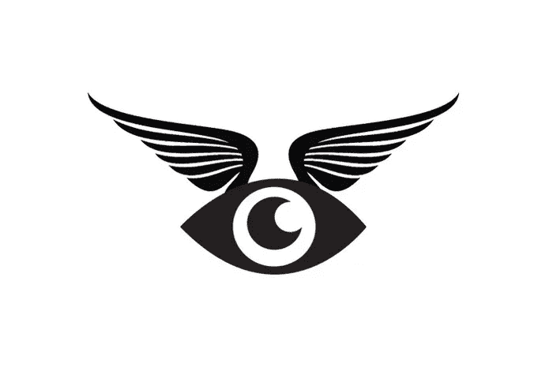

# 就业筛选打乱了 2028

> 原文：<https://medium.datadriveninvestor.com/employment-screening-disrupted-2028-40e0259c554f?source=collection_archive---------49----------------------->

到 2028 年，一个价值数十亿美元的庞然大物将被大数据人工智能传记作家赶下台。

2016 年，全球就业筛选服务市场规模为 30.12 亿美元，预计到 2022 年将达到 47.43 亿美元，2017 年至 2022 年的 CAGR 为 7.7%。—[https://www.reportbuyer.com/product/5371896](https://www.reportbuyer.com/product/5371896)

它还活着！我预测，到 2028 年，你在网络上的每一个动作都可以被记录下来，并被一位数字传记作者交叉引用。一个地图人工智能被设计来绘制你生命旅程的精确的时间顺序的过去和进程。更进一步，我相信从生到死；精英的未来后代将不由自主地但秘密地被第三方数字守护者 slash 传记作者监控。“年轻人，你不需要背景调查或药物测试；你的父母让你接受了市场上最值得信赖的人工智能守护者的数字洗礼。”

*在思考人力资源的未来时，我问自己，大数据和人工智能将如何颠覆全球就业筛选服务市场？*

人工智能，简单来说，就是自动决策的艺术。如果 A 然后 B，如果 C 然后 D，等等。对我来说，是曼德布罗特分形图像集引发了我的特别着迷。苦行僧般美丽的数学！

为了富有想象力的发现，从人工智能传记作者构建的理论四维分形中逆向工程人类在地球上的生活，其中 x，y，z 和时间是变量。x 代表生活中所有人类无法控制的因素，比如天气或者你的父母是谁。y 代表生活中你可以控制的所有因素，比如你早上什么时候起床，你如何喝咖啡。z 代表当面对生活中的选择时，考虑 X 和 Y 因素而做出的最终人类决定。例如，当 X 是星期六早上的一场及时的雷雨，Y 是刚刚清理过的 1000 条床单和塞得满满的被子时，Z 等于“贪睡按钮”。现在想象一下，这种计算在人的一生中重复数十亿次，并以四维艺术作品的形式表现出来，会出现什么样的美丽图像？

作为一个美国人，选择疲劳是真实的。当我们醒来，伸手去关掉一部尖叫的智能手机时，我们被各种选择轰炸。人工智能有可能减轻这种痛苦。尤其是在就业筛选方面。在不久的将来，随着人工智能技术的进步，将会出现一种服务，在这种服务中，一种算法将能够比任何旧的简历和背景调查更好地讲述你的故事。每个人都喜欢好故事，更好的是基于可证实的事实信息的真实故事。我们可以信任一个严格审查的系统，我相信我们会有公司有能力获得我们的信任，以奥斯卡获奖剧本写作和艾美奖口径纪录片的能力来撰写我们的故事。

在 App Store 上订购这项服务并确认您允许将您的所有数据交给 AI 进行处理后。在几分钟内，招聘人员将能够观看一部感人的三分钟传记电影，并观看十张幻灯片，其中包含您与特定工作相关的能力、最新的药物筛选健康体检、与角色相关的最大失败以及最高成就。你的网上生活甚至可以在最后一张幻灯片上展示为一幅漂亮的四维图像，显示你的生活到目前为止变得多么独特和复杂，并显示你在特定公司内增长潜力的动画预测。

高级订阅服务将是一个人工智能守护天使。这个人工智能将负责监控你的信用评分、银行账户和在线声誉。甚至可以与其他人工智能守护天使进行互动，以协调同步事件的交响乐，使双方用户都受益。乌托邦的可能性是无穷无尽的，不幸的是，反乌托邦的可能性也是无穷无尽的。如果你买不起人工智能守护天使；富人和穷人之间出现了更深的鸿沟。