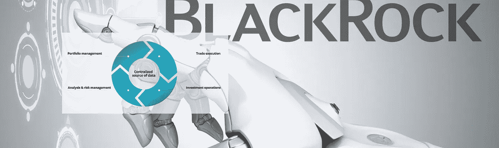

# 授权金融顾问:摩根士丹利的财富平台

> 原文：<https://medium.datadriveninvestor.com/empowering-financial-advisors-morgan-stanleys-wealthdesk-platform-5ffbd44ff970?source=collection_archive---------5----------------------->

## 一场全面咨询系统的竞赛正在进行，尽管是以金融巨头的速度进行，这些金融巨头已经积累了管理下的资产，并有数以千计的顾问使用他们的工具和服务。摩根士丹利比摩根大通、贝莱德、先锋、富达更低调。

11 月份引起我注意的是“WealthDesk”的推出，它整合了摩根士丹利的目标规划系统、投资筛选仪表板和投资组合构建工具。授权顾问提供整体服务，即使费用继续承受压力。此外，Blackrock Alladin 风险管理软件与 WealthDesk 平台的整合。Alladin 以前只对机构投资者开放。现在，使用 WealthDesk 平台的顾问可以为他们的客户进行情景分析，并与客户讨论替代投资策略。与竞争对手相比，以这种方式授权顾问给他们带来了强大的增值优势。

尽管瑞银集团**与贝莱德的 Alladin 风险管理系统**有合作关系，但它并没有整合到其咨询平台中。它是独立运作的，这使得顾问很难提供像瑞银管理解决方案总经理那样快速和定制的服务。

 [## 分散金融的出现|数据驱动的投资者

### 当前的全球金融体系为拥有资源、知识和财富的人创造了巨大的财富

www.datadriveninvestor.com](https://www.datadriveninvestor.com/2019/03/14/the-emergence-of-decentralized-finance/) 

在 12 月 3 日的 [**Autonomous Next**](https://next.autonomous.com/) 时事通讯中，讨论了贝莱德以 1.2 亿美元购买 Envestnet 股票和摩根士丹利的平台；我只能同意 Lex 的说法，即“…令人惊讶的是，出售 iShares 的最佳方式是给摩根士丹利一些高质量的 roboadvice 软件。”

摩根士丹利的平台表明，以一种增强中介能力并向最终客户提供整体服务的方式升级和整合工具和服务是多么具有挑战性。工具就在那里，商业模式不是问题。具有挑战性的是在内部实现最佳的技术整合，从而在客户服务中产生 X 因素。摩根士丹利在这一过程中的经验表明**其他人可能需要 3-4 年才能赶上这种整体整合。**

摩根士丹利 WealthDesk 还将所谓的“下一个最佳行动”机器学习系统的新版本集成到他们的 16，000 RIA 中。这个系统已经存在好几年了，但它是一个基于规则的系统，为顾问和他们的客户提供投资选择。一个每一家提供财富管理服务的银行都拥有的系统，作为客户，我们都想知道哪一个是“最好的”(就好像这首先是个正确的问题，因为这些基于规则的系统没有一个是可以定制的)。

摩根士丹利的“下一个最佳行动”是使用**机器学习来支持顾问增加参与度。**该工具的成功将通过其增强与客户对话的有效性来衡量，无论是通过面对面的会议、电话还是纯数字渠道。

像我一样，我们大多数人都厌倦了几个分析师报道阿里巴巴(我关心积累)的 pdf 附件电子邮件，不知道如何理解这些邮件。我们所有人都意识到，仅仅是因为 KYC 的严格要求，顾问才希望将我们的人生大事和目标纳入投资提案。摩根士丹利(Morgan Stanley)的“下一个最佳行动”系统正在利用 ML 向客户提供建议，让他们根据生活事件考虑什么。例如，一个客户的孩子患有某种疾病，系统可以推荐当地最好的医院、学校和治疗疾病的财务策略。该系统监控并学习客户对“建议”的反应，并根据客户的反应，每天提高创意的质量。

> 阅读更多关于投资: [**的信息，贝莱德以 1.23 亿美元收购 Envestnet 的爱，以破解其“开放架构”平台，并为另一笔利润丰厚的 Envestnet 收购**](https://riabiz.com/a/2018/11/29/blackrock-buys-envestnets-love-for-123-million-to-crack-its-open-architecture-platform-and-sets-stage-for-another-juicy-envestnet-acquisition) 做准备

将我们的生活事件和目标纳入投资提案。摩根士丹利(Morgan Stanley)的“下一个最佳行动”系统正在利用 ML 向客户提供建议，让他们根据生活事件考虑什么。例如，一个客户的孩子患有某种疾病，系统可以推荐当地最好的医院、学校和治疗疾病的财务策略。该系统监控并学习客户对“建议”的反应，并根据客户的反应，每天提高创意的质量。

在某种程度上，系统每天都在为顾问思考，并提供相关信息和不断改进的建议。这位顾问有选择权，可以向客户发送定制的电子邮件和短信。该系统在几秒钟内就能找到客户的资产配置、纳税情况、偏好和价值。

这个系统赋予了顾问权力，这也是广泛适应的潜力所在。不要忘记，技术的采用更多的是一个文化问题，而不是一个技术问题。在机器学习中，系统使用得越多，下一个最佳行动就越好。

如果由 1.6 万名摩根士丹利顾问组成的社区将“下一个最佳行动”作为他们的盟友，那么微软将拥有一个优势和一支忠诚的军队来照顾他们的客户。

这不是某个版本的 robo-advisory 专注于最佳的 on-boarding 和低费用执行。它正在增强一种混合财富管理产品，为那些利用摩根士丹利作为平台提供商(即顾问)的人和终端客户提供尖端(价值)。

摩根士丹利在蒙特利尔建立了技术中心——蒙特利尔技术中心。它已经发展到 1200 名技术员工，专注于低延迟和电子交易、云工程、网络安全、人工智能/机器学习和最终用户技术的创新。

[**巴伦的报告**](https://www.barrons.com/articles/morgan-stanley-eyes-ambitious-ai-project-1531764075)MS 花了大约 6 年的时间才开发出“下一个最佳动作”。主要的 KPI 是客户参与度。监测的其他五个变量是:现金流、经纪业务量、新咨询客户、银行业务水平和账户流失。

## 联系电喷:[www.efipylarinou.com](http://www.efipylarinou.com)