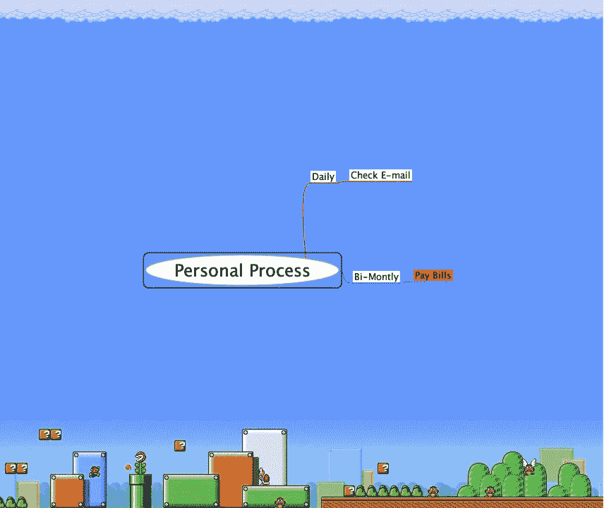

# 利用技术实现个人流程，从一开始…

> 原文：<https://medium.datadriveninvestor.com/enabling-personal-process-with-technology-the-very-beginning-1e5b24f1b282?source=collection_archive---------29----------------------->

最近买了新的 Macbook。这尤其令人兴奋，因为这是我的第一次，因此，打开了一个可用功能的新世界…因为我是使用技术来实现功能流程(而不是创建不适当的流程本身)的坚定支持者，我开始思考我生活中哪些流程是重复出现的，以及每个流程出现的频率。这开始了一个项目，它极大地简化了我管理生活的方式，因为这给我带来了效率和生产力的提高，我非常高兴也将这个主题作为我的第一个博客。这只是我加入 Mac 家族以来所取得成就的一个非常小的片段，也是一个过于简化的版本，也是我为什么这么快成为一名 Mac 发烧友的原因。

在这篇简短的博客中，我将用一个简单的例子来更好地理解我自己的过程，然后尽可能地用技术进行优化。第一项任务是确定一个循环过程。我经常参与哪些活动？我每两个月付一次账单…我每天检查我的电子邮件…然后，当我思考例子时，这些将如何被记录下来？我可以创建一个列表或电子表格——但我个人会建议一个相当强大的技术解决方案。因为我们刚刚进行了头脑风暴，所以从思维导图软件开始是非常恰当的。

如果你不熟悉思维导图，我强烈建议你研究一下我的两个最爱:MindNode 和 Freeplane。对于一个由技术支持的过程，我更喜欢 Freeplane，因为我实际上可以创建到软件组件的超链接。因此，与我们的示例保持一致，它表示账单每两个月支付一次，电子邮件每天检查一次。快速使用 Freeplane，我可以创建如下示例:

当我开始填充 Freeplane 时，我开始看到有多少过程在重复，每个过程都有不同的活动和频率。思维导图软件非常有助于组织和可视化。当我添加越来越多的流程节点时，我也会思考我在每一个节点上实现了什么。此外，如果流程失败了会发生什么？你可能会注意到，在这个例子中，我用红色突出显示了“支付账单”。这表明这个过程带有很大的风险(我认为不付账的后果是显而易见的:)。

继续快速分析，我确定与双月“账单支付”相关的一个特定风险是简单地记住这样做。虽然很简单，但这是一个我已经确定了应该监控的个人过程的例子。用技术来实现这个过程，特别是用我的 Macbook，我可以简单地创建提醒。这一点以及许多其他的例子说明了我是如何识别可以从技术支持和优化中获益的过程领域的。

从小处着手后，我很快发现我已经超越了简单的提醒，进入了自动化的工作流程，整合所有需要支付的账单，将其记入预算，然后提交给我审批。也许有些人对技术不感兴趣，但我很惊讶自己能如此迅速地简化简单的工作，然后用学到的技术去帮助攻克更难的问题。