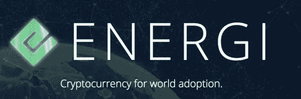

# 人人享有能源

> 原文：<https://medium.datadriveninvestor.com/energi-for-all-f9333bddfd60?source=collection_archive---------16----------------------->

> **项目理念:**
> 
> 如果投资得当，再投资于该体系的每一美元都将带来更多回报。

# **稍微讲一下问题**

自第一种加密货币问世以来，许多年过去了，但数字货币尚未在日常生活中得到应用。

市场在不断增长和发展，但数字货币目前对大多数人来说并不具有实用价值。

 [## 2019 年十大区块链课程|数据驱动的投资者

### 渴望在区块链发展吗？你想知道区块链是如何工作的，但不知道在哪里？或者就是太多了…

www.datadriveninvestor.com](https://www.datadriveninvestor.com/2019/03/08/top-10-blockchain-courses/) 

加密货币的主要问题是什么？

可量测性

规章制度

安全性

信息库不足

大众用户的可访问性

目前没有一种加密货币可以完全解决这些问题。

# **什么是能量？**

Energi 是一种自筹资金的加密货币，由加密货币领域的爱好者和专家团队创建，他们的目标是创建一种在世界各地使用的加密货币，并将成为智能合同的盈利平台。因此，无论是现在还是将来，Energi 都应该是一个巨大的投资机会。

> **规格:**
> 代号:NRG
> 阻断时间:1 分钟。
> 哈希算法:EnergiHash(类似以太坊)。
> 主节点要求:10000 能量。
> 资金周期:每 14 天。
> 
> 每月生产约 100 万 Energi。
> 可以很容易地观察到分布为“10/10/40/40”10%给能源公司
> 10%给矿工
> 40%给工长
> 40%给财政部

# 那么 Energi 项目能提供什么呢？

Energi 专注于四个领域:

信托基金

意识

实用性

可用性

# **劲力的特性:**

**雄厚的经济基础**

该项目的一个显著特点是全面管理的财政自筹资金系统..它是通过不断发行矿币实现的，其中 40%进入所谓的国库。从这笔资金中提取资金用于项目的开发、营销和推广。

创建一个强大的支持系统:Energi 社区。

创建增长和稳定机制:Earndrop 的营销活动和 Energi Masternode 网络具有强大的奖励系统。

**建立基于区块链能源的生态系统**

Energi 平台面向 dApps 应用程序开放，并计划创建一个智能合同平台来提供站间服务。

Energi 团队也在开发自己的智能合同平台。

**营销和社区发展**

主管系统意味着在可能的情况下立即向所有网络进行营销；LinkedIn、Twitter、Telegram、脸书、Reddit、Steemit 等。这给了最大的受众范围。

社区开发和支持可以降低社会各个部门的进入门槛，增加对项目的兴趣和忠诚度，从长远来看，能够解决平台可扩展性的问题。

**业务发展**

作为对业务的支持，能源团队计划资助初创公司区块链。

这个项目将由一个与 Energi 长期合作的高质量项目特定的
资助。Energi 将吸引和支持
优质项目，提供咨询，为
合作提供
规则的经济和商业模式及项目设计。

**安全**

Energi 项目有自己的 EBI 安全服务。EBI 致力于尽可能保护用户群免受攻击。

Energi 项目有自己的 EBI 安全服务。EBI 致力于尽可能保护用户群免受攻击。

Energi 团队将与执法部门紧密合作以提高安全性。复杂的安全措施将防止许多黑客攻击，并节省用户的密码。

# 使用 Energi

**Masternode 持有人**
持有人可以根据约定的 Energi 工作证明模型，为第二层的
布局提供 Masternode 奖励。(排放资金的 40%)

**采矿**
矿工利用自己的计算能力运营 Energi 网络获得奖励。(排放资金的 10%)

**合作伙伴**
DApps 等 Energi 智能合约应用开发合作伙伴。

**消费者\持有者**

企业消费者可以使用 NRG 作为价值存储，并作为在智能合同/系统 DApp 中进行交易的工具。

除了 P2P 交易，普通用户还可以通过加密货币交易所交换/购买/出售 NRG。

# 交换

现在令牌 NRG 可用于交易所- KuCoin 和 DigiFinex(分散式)和 CryptoBridge(分散式)。

# 结论

能源团队的项目之所以有趣，主要是因为它构建商业模式的方式非同寻常，而不像其他数百个项目那样是彼此的翻版。

其实现的一般思想和方法是可见的。值得注意的是，这个项目是由对未来区块链有着自己愿景的热心人士创建的。Energi 团队着眼于长远，毫不犹豫地宣布其成为头号加密货币的愿望。

与此同时，人们不能不注意到 NRG 具有无限发射的事实。从长远来看，这将如何影响汇率还不得而知。

从今天的市场状况来看，一切都没那么糟。Energi 项目有很多优点，但接下来会发生什么，时间会证明一切。金融革命并不容易，Energi 团队还有很多工作要做。

祝你好运。