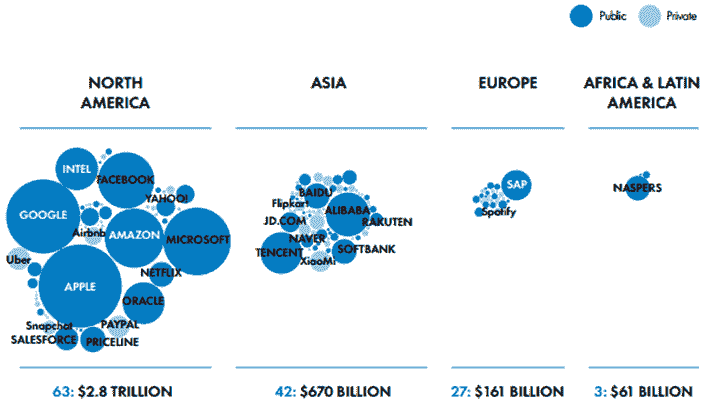
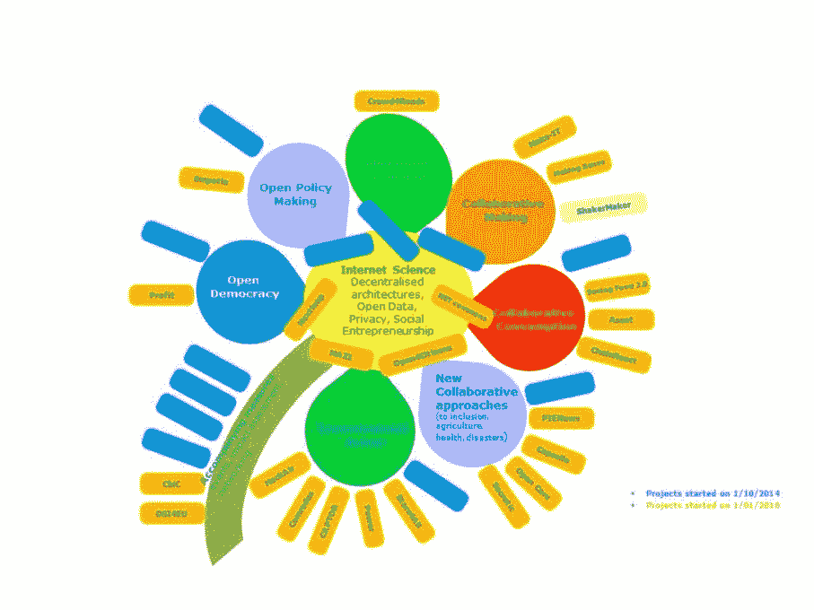

# 英国人的英语数据，以及 Decode 会议的其他收获

> 原文：<https://medium.datadriveninvestor.com/english-data-for-english-people-and-other-take-aways-from-the-decode-conference-392c6578d235?source=collection_archive---------23----------------------->

就像我们之前的佛莱迪·摩克瑞和蒙塞拉特·卡巴莱一样，[@里克斯托克](https://twitter.com/rickstock?lang=en)、詹姆士 [@0charactersleft](https://twitter.com/0charactersleft?lang=en) 和 [I](https://twitter.com/futurlix?lang=en) 也被巴塞罗纳美丽的地平线所吸引，尤其是 Decode 大会。这里有一篇简短的文章，描述了当时的情况以及我们从这次事件中学到的东西。

这个特别聚会的轻松前提是:欧洲正在被科技巨头(GAFA)搞得一团糟，资金和数据从生活在这里的人那里流失，我们在技术领域和我们需要竞争的投资方面落后很多，特别是在人工智能领域。那么，情况会变得多糟呢？我们能从中国学到什么？我们还有其他什么好主意吗？

但是，我们不要太早感到沮丧——我介绍米拉多！

在我分享一些批评之前，我必须说，我们在巴塞罗那的这段时间里，不止一个演讲者发出了一些真正的惊叹。紧张的两天的形式有时感觉有点罗嗦，并暴露出明显的学术偏见(见讲座主席)，但我们可以应付这一点。然而，如果这是为了展开一场辩论，询问技术专家和像我们这样来自私营部门的人的意见，那就糟透了。感觉就像一个封闭的小团体在他们之间讨论，不情愿地让观众进来，我们很失望在任何阶段都没有机会非正式地聊天。

会场上没有喝咖啡的休息时间(当然，除了在一个单独的区域的少数开明人士！)，所以没时间去人脉和挖掘内容。没有名牌！？没有赛后活动，晚上场地。说真的，我们旅行的目的是什么？我在家里直播的时候也会有完全一样的经历。[@ evgenymorozov](https://twitter.com/evgenymorozov?lang=en)[@ Francesca _ bria](https://twitter.com/francesca_bria?lang=en)——我保证支付公共饮料的费用，请问我们下次能不能找一个在科技界协调合作活动的人来帮忙？

情况会变得多糟？

欧洲真正的担忧是双重的。其公民的隐私和数据正被从其边境开采出来，没有任何补偿或控制，其在世界上的整体地缘政治影响力将随着其技术的发展而减弱。当我们展望未来时，房间里肯定有一种感觉，欧洲还会存在吗，还有什么意义吗？GAFA 的游说者已经在塑造有利于他们的贸易协定。这是房间里的一颗重磅炸弹——数据和算法规则正在 TPP 和 NAFTA 贸易协定中具体化，并作为未来的拟议模板提交给 WTO。这些条款包括:

*   要求各国允许跨境信息传输自由流动
*   禁止强制本地化(即要求企业将包括服务器和存储设备在内的计算设施放置在一个国家的领土上，以此作为开展业务的条件)
*   禁止将转让软件源代码作为在一个国家做生意或投资的条件
*   禁止对跨境电子传输征收关税；
*   要求各国制定消费者保护和隐私立法，具体细节由成员国自己决定。

**我们能从中国学到什么？**

中国在这个房间里得到了很多爱，关于讨厌的人权等明显的问题，除了“那里不同”之外，并没有真正参与进来。然而，在乌托邦解决方案的汪洋大海中，至少他们精心设计了一个有效的回应。他们已经制定了一个计划，并由 T2 提供了充足的资金。可以把它看作是他们的[一带一路](https://en.wikipedia.org/wiki/Belt_and_Road_Initiative)计划的技术版本。当你不需要面对变化无常的选民时，这就是你能做的。他们利用法规和税收，如果你想进入他们的市场，他们制定了向当地公司转让知识产权的规则。他们还确保外国公司不能控制本土公司的股份，现在他们在自己的数据领域之外提供数字服务。很明显，中国的技术民族主义正在增长，人们对他们在街上所取得的成就感到自豪。黑镜式的[社会信用体系](https://en.wikipedia.org/wiki/Social_Credit_System)，关于通过公众声誉进行社会控制，在此基础上于 2020 年推出。人们想知道这在欧盟会有什么反应，尽管有趣的是，叶夫根尼·莫罗佐夫在巴塞罗那说，他原则上不反对社会信用体系，尽管它已经成熟到可以滥用了——但当然，我们没有在几个小时后继续跟进！

美国和中国都有足够大的国内市场，可以在国际贸易中公平竞争。英国没有，但欧盟有这样的规模。不幸的是，它对 R&D 的国家资助也有规定，当试图制定大的长期计划和作为一个群体进行支出时，就像是在赶猫。那么欧盟能做些什么呢？

我们了解到，提议的新欧盟税收规则意味着公司可以从其产品和服务交付地征税，而不是公司总部所在地。从细节上看，这些措施直接针对 GAFA 类型的公司，以弥补通过卢森堡或其他税收法规较低的成员国流出的资金。我们从 GDPR 了解到，当欧盟的规则符合时代精神时，它可以超越其他地理区域或公司的政策，就像我们看到的[苹果的新页面](https://privacy.apple.com/)允许用户下载他们所有的数据。

**我们还有什么好主意？**

说实话不多！当“区块链”被提起时，人们的内心有一种集体的呻吟，这是左倾技术专家的梦遗——尤其是那些实际上没有用它建造任何东西的人。问题是，“区块链”已经成为一个迷因，可以意味着无数不同的东西，现在更多的是一个营销术语。在大多数情况下，它声称要做的事情可以用当前成熟的技术来完成。[欧盟显然还没有阅读来自澳大利亚的备忘录](https://www.theregister.co.uk/2018/10/24/oz_spent_700k_to_decide_that_blockchain_isnt_worth_the_hype/)，所以如果你有一个项目，你想在散列链接时间戳上栓上螺栓，那么有[500 万欧元可供“区块链”项目](https://ec.europa.eu/research/eic/index.cfm?pg=prizes_blockchains)争夺——在 2019 年 4 月 9 日之前登记兴趣。

有一些有趣的“集体意识平台”项目被展示为一朵花，awww。我们嗅出了它的味道，认为它需要更少嬉皮士式的自由竞争，更多愤世嫉俗的 it 程序方法来修剪无数的项目。或者把它转移到创新慈善机构[内斯塔](https://www.nesta.org.uk/)的控制之下，他似乎更专注一点？

作为英国公民，我们结束两天的访问回来后，特别担心后英国退出欧盟时代的前景。在政治右翼，我们很可能会考虑放松监管，降低外国公司的税收，但我们没有意愿阻止 GAFA 疯狂的收购。在左边，听起来很像是我们在看“为英国人提供的英国数据”，里克对数据主权的高风险单边围栏的精彩阐述，附带命令是通过强制竞争和更高的监管来分裂 GAFA。随着政府 IT 系统失败的故事不断发生，一些事情做起来是多么的简单。这令人深感不安。麻烦到足以让我们开始抛出自己的怀疑帽子。

**我们的结论**

当我们在晚上反思时，我们意识到很多呈现给我们的往往是非常男性的解决方案。让我们花费大量的现金和时间来建造最大、最聪明的人工智能迪克，当它最终完成时，将击败其他所有人，并追溯我们需要的一切——而不是建立成熟的基础设施，逐步解决目前在实地有用的真正的社会和商业问题。不管她是否读过这个房间， [@francesca_bria](https://twitter.com/francesca_bria?lang=en) 提醒每个人，我们的工作是在最后解决真正的问题，下次这个信息应该是横在前面墙上的横幅。

我们离开巴塞罗那时，非常感激能够深入了解技术和地缘政治的潘多拉魔盒，我们一直在思考我们在这些未来中的位置。

如何才能真正建立一个数据“湖”，将开放政府数据和自愿数据结合起来，我们能做到吗？我们能通过 GDPR 请求建立一个自动收集个人数据的系统吗？中小企业和组织如何使用从这些公共数据中预先构建的人工智能来帮助自己？公众对向英国国家医疗服务系统和苹果公司提供健康数据，或者向伦敦或当地市议会提供位置数据有什么兴趣？务实创新需要什么样的结构才能从零开始？

我们不知道——但找到答案会很有趣。

【people-first.com】最初发表于**。**