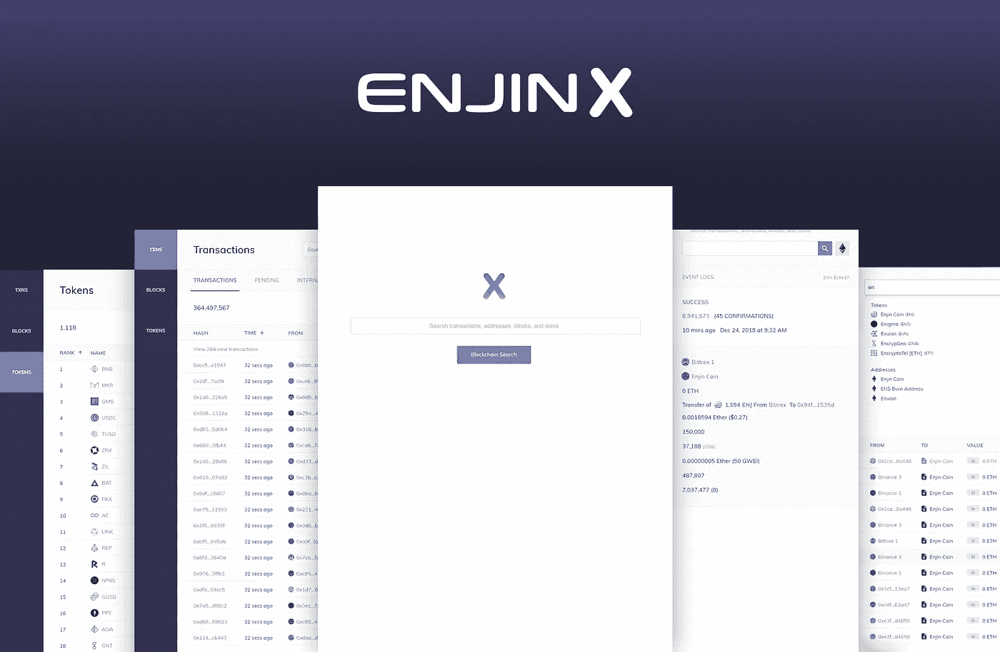
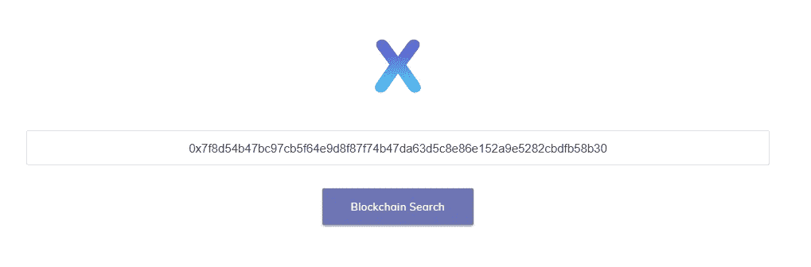
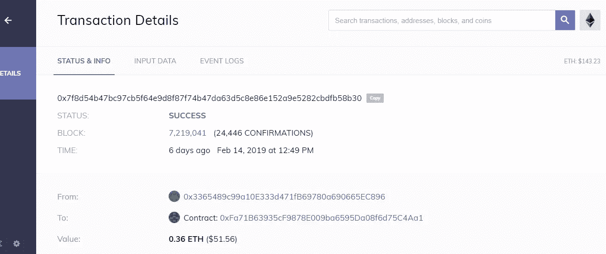

# EnjinX |以太坊区块链的“谷歌”

> 原文：<https://medium.datadriveninvestor.com/enjinx-the-google-of-the-ethereum-blockchain-23fe977b29bc?source=collection_archive---------16----------------------->

[EnjinX when opening](https://enjinx.io/)

EnjinX |以太坊区块链的“谷歌”

20/02/2019

你现在终于可以掌管你的财务交易了！en jinx“The ether eum block chain Explorer”为您带来所需的透明度，让您随时了解区块链交易的最新情况。

在当前的菲亚特世界中，我们相信我们的银行会让我们的支付顺利、快速、安全地进行。我必须说实话，我从来没有喜欢过银行！作为南非的一名前企业主，“我发现它们贵得离谱，几乎没有透明度，似乎试图尽可能长时间地持有交易资金，以获得展期资金的最大利息。”

直奔主题“我认为这一切都将随着#区块链和#加密货币而改变。”有了#[**en jinx**](https://enjinx.io/)**这样的产品，你就能做到这一点，拥有你交易的证据，并能透明地让你的收款人看到。**

**在银行系统中，你无法跟踪你的交易，如果你从一家银行向另一家银行转账，可能需要 2 天时间。如果你和跨国公司或国际公司做生意，时间会变得更糟。两天的钱在哪里？这样想吧。我跟你做笔交易。区块链交易产生 ID 或交易散列。该 ID 在区块链上变得可见和可追踪，在这种情况下，使用 EnjinX 的#以太坊区块链。交易是快速的，几乎是即时的，没有银行或第三方参与其中。**

**有了区块链技术，你就是主宰！让我们举个例子。前几天，我决定尝试对一只新基金进行小额投资，[0xMultiPly.com](https://0xmultiply.com/)该基金通过#Kyber Network 和 Kyber Swap 提供:**

**“0xMultiply 允许用户用 ETH/ERC20 令牌交换 0xMultiply 令牌(0xWBTC/0xWETH)。每当其他人购买代币时，每个 0xMultiply 持有者都会根据其持有的代币数量获得 WBTC/WETH 的直接收入。**

**这意味着，一旦您持有 0xMultiply 令牌，您就在不断累积“免费”WBTC，或根据 0xMultiply 令牌的数量在每笔交易中分配给您的 WETH。"**

**让我们找到我的交易。我将我的交易 ID 复制并粘贴到 [EnjinX 的搜索金恩中。](https://enjinx.io/)**

****

**Copy and Paste Transaction ID**

**我的交易马上就来了！**

****

**Transaction History**

**现在我将重复我自己，因为这是一个相当大的药丸吞下。**

**这个交易实习生出示了一个以太坊区块链上的 ID。现在，我们将这个 ID 放在 EnjinX 网络上，这样，整个交易历史就会弹出来，证明我向他们支付了费用，它将永远保存在区块链中， ***没有要签名的纸质单据，没有要保存在盒子中的收据，也没有打电话到银行询问交易需要多长时间。*** 区块链交易证明！将资金转回给我时，区块链会记住我的地址。**

****

**EnjinX 的优势和使用案例:**

*   **不加，是不加**
*   **最快的事务搜索时间**
*   **支持比特币，以太坊，莱特币，和 721 & 1155 收藏品。**
*   **EnjinX 为您的金恩钱包提供动力**

**如果你不太了解金恩钱包，请在这里阅读我的文章:**

**[游戏|我通往世界的加密网关](https://medium.com/@morneolivierblog/gaming-my-crypto-gateway-to-the-world-5b95ee52dc2f)**

**我觉得 Enjin.io 的这款产品旨在为用户带来透明度，因为它计划推出一项巨大的加密游戏任务，可能会有数以千计的令牌穿过它的路径，但仍通过向客户提供视觉证明的网关来保持其完整性。**

**我使用推荐链接为您节省成本和安全的目的。从链接中获得的任何被动收入对你此后的收入没有影响。**

****了解我的重要链接:****

**[关于莫纳·奥里维](https://medium.com/@morneolivierblog/mornes-bio-a-little-bit-about-me-before-i-start-my-writing-journey-84c0bf463ba)**

**[#免责声明](https://medium.com/@morneolivierblog/disclaimer-c22bc70d7a29)**

**[#被动收入](https://medium.com/@morneolivierblog/passive-income-5-01-2019-ac2b1bfdbb62)**

**[中等](https://medium.com/@morneolivierblog)**

**[推特](https://twitter.com/Morneolivierhc1)**

**[被动收入电报](https://t.me/BlockchainPCI)**

**[领英](https://www.linkedin.com/in/morne-olivier-20406989/)**

**[电报](https://t.me/MorneOlivier)**

**[小野](https://www.ono.chat/ono/m3-invite/page1.html?uid=100278429&lang=en)**

**[杂音](https://play.google.com/store/apps/details?id=com.murmurdapp)**

**[钢模](https://steemit.com/@morneolivier)**

**#去中心化#区块链#区块链技术#技术#加密货币#密码#数字资产# takechargeofyourforte # tcoyf # morneolivier #内容#内容战略#营销#数字营销#广告和营销#内容营销#启动#被动加密收入# pci #区块链 pci #个人金融#股票市场#零售#供应链#商业#商业智能#商业模式#隐私#未来#不可变#总账# dapp #以太坊# eth #比特币# btc #移动支付#大数据#银行业# ai #工业**