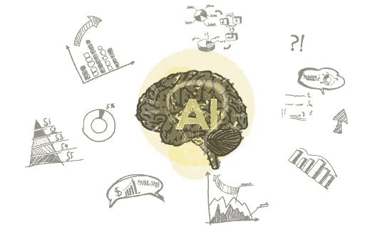

# 在 B2B 营销中用人工智能丰富销售线索

> 原文：<https://medium.datadriveninvestor.com/enriching-leads-with-ai-in-b2b-marketing-7968a611a2d8?source=collection_archive---------36----------------------->

当今世界个人的生活与十几年前不一样了。从工作到休闲，从信息到娱乐，从营养到健身，生活的每个方面都经历了技术进步。技术的出现是为了适应我们的需求，我们也适应了不断变化的技术。

随着世界正在经历第四次工业革命，我们正在将人工智能(AI)和机器学习融入我们日常工作的每个领域。人工智能使我们平凡的工作变得有趣和简单。从 SIRI 到 WATSON，人工智能让我们能够高效地解决问题。

人工智能可以帮助 B2B 营销更加创新和高效。任何倾向于向前发展的企业都希望充分利用人工智能来促进业务和客户的增长。

密切关注趋势和创新型初创企业，讨论 B2B 营销人员如何使用人工智能来增强线索生成已成为当务之急。营销人员被万亿字节的信息所包围，而将所有这些信息充分利用是人类不可能做到的。问题是，她/他如何将这些数据转化为销售线索，进而转化为组织的新销售和收入。

人工智能可以指出积极的销售线索，这也将满足营销，并确保潜在客户针对正确的平台。我们不希望公司浪费时间和资源来识别和推销与愿景和使命不一致的错误客户群，或者组织不符合条件/标准，从而延长销售周期。

要在销售线索挖掘活动中协调人工智能，应遵循五个方面的方法:

**1。客户概况:**

首先，我们需要确定我们的目标受众，即我们希望与之合作的客户类型。这可以根据公司过去的经验来决定，并且可以从垂直市场营销和销售两方面收集数据。在必要的检查和平衡以及数据清理之后(如果在可用的信息集上存在任何缺口，AI 就无法提出完美的解决方案)。第二步是创建算法模式。

**2。预测数据的形成:**

客户档案数据将研究这些线索，并将其与营销和财务数据的所有可能排列和组合进行比较。信息可以从各种来源获得，即网站、社交媒体*等*。由此，人工智能可以预测客户未来可能的趋势，潜在客户的产生，以及吸引他们注意的活动的支出。

**3。分析是营销活动的武器库:**

人工智能还可以帮助简化营销活动，因为可以创建从各种来源收集的指向销售线索方向的数据，这将增加组织/产品登录页面的牵引力，并吸引更多眼球。需要理解的重要一点是，这些活动不仅有助于我们创造更多销售线索，还能让我们在客户中建立品牌认知。人工智能可以预测哪些内容将引起特定受众的最大参与，哪些活动将激发最大兴趣并有助于达成交易。反过来，这将有助于营销人员更好地了解她/他应该瞄准的细分市场，以获得最大的利益。有了更好的活动洞察力，自动化的力量可以得到利用，因为人工智能提供了基于我们正在处理的目标受众创建新鲜和独特内容的工具。人工智能工具通过资源流提供数据，并使用自然学习处理工具从见解中提取数据，以更好地向我们的消费者提供智能内容。

**4。为销售团队提供相关且可行的见解:**

只有进行一对一对话的销售代表才能达成交易。人工智能允许营销团队在整个销售周期中为销售部门的同事提供关于潜在客户的宝贵见解。营销人员可以告知销售同事最适合他们的理想客户群，提供有关组织和行业动态的背景信息，确定决策者和关键潜在客户，并分享有关参与度的信息。这些信息可以帮助销售代表锁定合适的客户，关注能引起共鸣的信息，并建立高度个性化的关系。

**5。改善销售线索生成，从而做出明智的决策:**

所有上述步骤，如果遵循得当，可以为任何计划将人工智能纳入其营销计划的组织提供主要的竞争优势。明智的决策将节省营销人员和销售代表的大量时间，他们可以利用这些时间在工作中学习更好的东西，使他们在分配的任务中更有影响力。

B2B 销售线索生成的关键是给你的潜在客户更多发现你、了解你和信任你的途径。通过智能战略布局使您的接触点多样化来创建价值主张，将通过人工智能集成给您带来预期的结果。