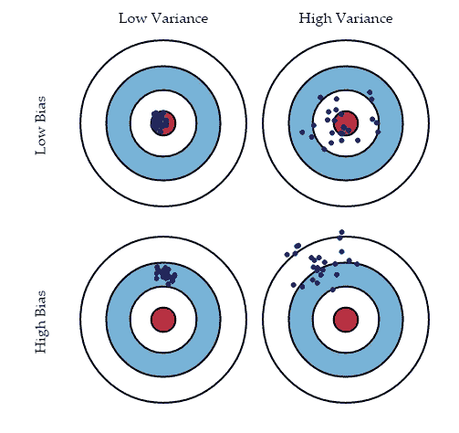
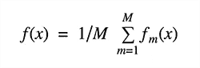
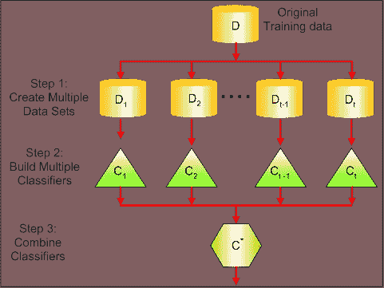
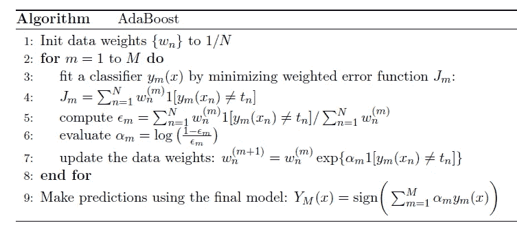
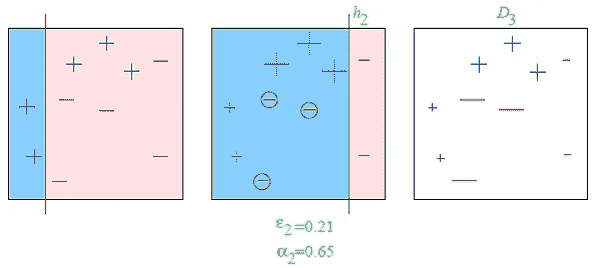
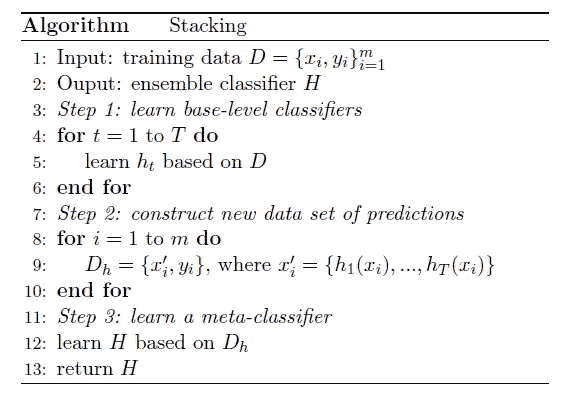

# 集成学习

> 原文：<https://medium.datadriveninvestor.com/ensemble-learning-9e5924fd6567?source=collection_archive---------6----------------------->

集成学习是一种更好的方法来提高我们模型的准确性。如果我们将集成技术应用于我们正在构建的其他模型，它可能会给我们带来更好的结果。

集成是将单个模型组合在一起以提高模型的稳定性和预测能力的过程。这些算法将不同的模型组合成一个预测模型，用于减少方差(bagging)、偏差(boosting)和改善预测(Stacking)。

**偏差误差:**这些误差用来量化预测值与实际值平均相差多少。

**方差误差:**用于量化对相同观测值做出的彼此不同的预测。具有高方差的模型将表现不佳，因为它将过度适合我们的训练数据。

Source : [AnalyticsVidhya](http://www.analyticsvidhya.com)

这里红点是我们的实际值，蓝点代表预测值。

由于我们将增加我们模型的复杂性，这将减少我们模型的偏差，并将减少我们的误差，但这将发生在一定程度上。如果我们继续增加我们模型的复杂性，我们将会以过度拟合我们的模型而告终，结果，将会出现很高的方差。

最好的模型或冠军模型应该保持这两个错误之间的平衡，并应该保持权衡管理。集成技术是保持这种折衷分析的一种方式。

Source : [AnalyticsVidhya](http://www.analyticsvidhya.com)

集合方法分为两组:

*   **顺序方法:**基础学习器顺序生成( **Adaboost** )。他们利用基础学习者之间的依赖性。
*   **并行方法:**并行生成基础学习器(随机森林)。他们利用基础学习者之间的独立性。

整体技术:

## 制袋材料

打包被称为引导聚合。我们可以通过对多个估计值进行平均来减少方差。我们可以在不同的数据子集上训练多个 M 树。并且计算系综:

它使用 bootstrap 采样来获得可用于训练基础学习者的子集。它使用投票进行分类，使用平均值进行回归。所以它基本上在不同的子集上实现相似的学习器，然后取所有学习器的平均值。它可以帮助我们减少方差误差。

## 助推

这些算法家族可以将弱学习者转化为强学习者。它使弱学习者序列适合加权数据。弱学习者是比随机猜测更好的模型。使用加权多数投票(分类)或加权和(回归)来组合预测，以产生最终预测。boosting 和 bagging 之间的基本区别在于，基础学习者是以加权数据的顺序方式进行训练的。它是一种迭代技术，根据先前的分类调整观测值的权重。如果一个观察分类不正确，它会尝试增加权重。一般来说，它减少了偏差误差，并产生了一个强有力的预测模型。

这是 AdaBoost 或自适应升压的算法。

Source : [AnalyticsVidhya](http://www.analyticsvidhya.com)

## 堆垛

结合不同学习者的有趣方式。这里我们使用一个学习器来组合不同学习器的输出。它可以减少偏差误差或方差误差。通过元分类器或元回归器进行各种模型的组合。

这是叠加的算法。

***快乐编码！！！***