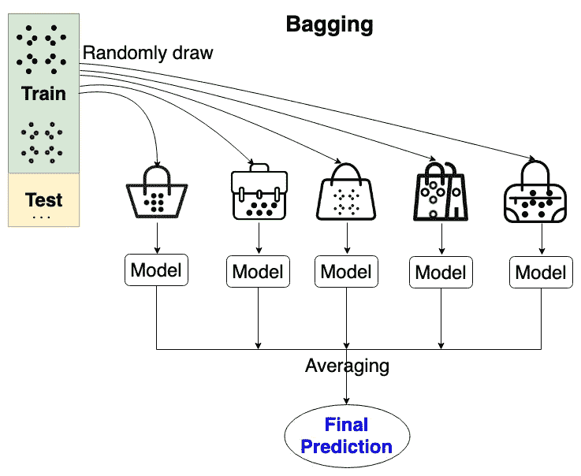
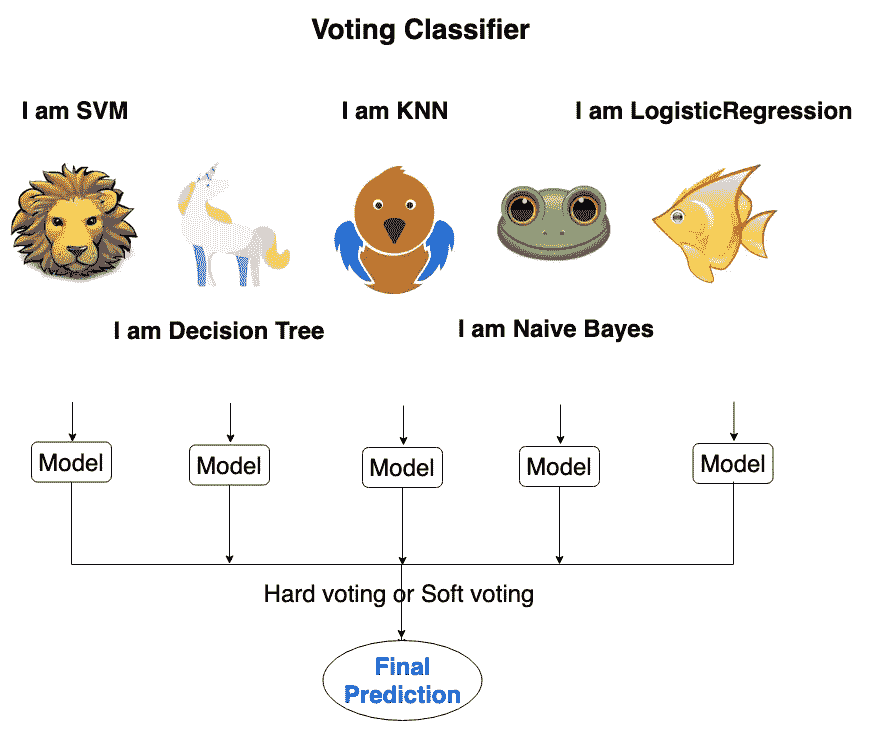
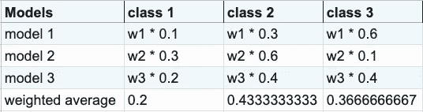
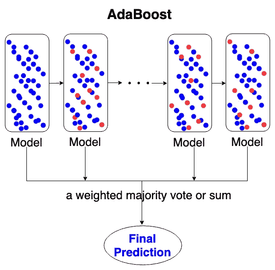

# 机器学习中超越任何单一模型的集成策略

> 原文：<https://medium.datadriveninvestor.com/ensemble-strategy-in-machine-learning-to-surpass-any-single-model-a75a92c3f1f0?source=collection_archive---------2----------------------->

您对 SVM、决策树或 KNN 的表现满意吗？您是否希望减少过度拟合、方差和偏差以实现更好的预测？本文的目的是介绍机器学习中集成策略的基本思想，你可以实现它来超越任何单一的模型。

集成策略的核心原理是组合几个基本模型的预测，以提高单一模型的稳健性。在合奏中有两种主要方法:

*   平均方法:随机森林、Bagging、投票分类器、投票回归器等。
*   升压方式:AdaBoost 等。

# 随机森林

Image by Alina Z

*   你的林中有几个决策树，比如默认情况下，如果你调用 scikit learn 版的 sk learn . ensemble . randomforestclassifier，林中有 100 棵树。
*   每个决策树都是独立的。
*   将整个数据集分割成几个子数据集。
*   对于每个子集，运行不同的决策树进行分类预测。
*   从你森林中的树木中选择最频繁的预测。这叫做多数投票，就像选举一样。
*   森林的偏差通常会增加一点，因为在构建树的过程中分割节点时，所选取的分割是要素的随机子集而不是所有要素中的最佳分割。
*   由于平均所有树的预测，它的方差减少，通常超过补偿偏差的增加，这导致一个整体更好的模型。
*   在随机森林中要调整的主要参数是 n 估计量和最大特征。
*   n_estimators 是森林中树木的数量。越大越好，但训练/测试模型所需的时间也越长。当达到树的临界数量时，预测将停止改进。
*   max_features 是在寻找最佳分割时要考虑的要素数(来自随机子数据集而不是原始数据集)。对于回归问题，我会建议设置 max _ features = n _ features 而对于分类问题，设置 max_features=sqrt(n_features)。
*   feature_importances_ 可以告诉你每个特性有多重要。

# 制袋材料

Image by Alina Z

*   Bagging 方法从原始训练数据集中抽取随机子集。
*   对随机子集运行黑盒模型(例如决策树或 KNN 分类器)的几个实例，然后聚合它们各自的预测以形成最终预测。
*   减少过度拟合(→方差)。
*   max_samples 和 max_features 控制随机子集的大小。您可以将样本理解为原始数据集中的数据点，将要素理解为列。例如，max_samples=0.5，max_features=0.6 表示从包含 60%列的训练数据集中随机抽取 50%的样本。

# 投票分类器和投票回归器

Image by Alina Z

投票分类器背后的核心原则是拥有一个由若干机器学习模型组成的军队，例如朴素贝叶斯、随机森林、KNN。每个模型进行独立的预测，该预测将用于计算最终的类别标签。

有两种方法可以组合这些预测:

*   硬投票:也叫多数票，像选举一样。如果出现平局，最终预测将根据模型的升序排序选择最后一个预测的类标签。
*   软投票:也叫平均投票。软投票将类标签作为预测概率之和的 argmax 返回。我们可以为每个模型分配特定的权重，并选择平均概率最高的最终标签。例如，有 3 个权重相等的模型:w1=1，w2=1，w3=1。然后，加权平均概率将如下计算，选择类别 2 作为最终预测:

Soft voting

*   GridSerchCV 可以与投票分类器一起使用，以调整模型中的超参数。

与投票分类器类似，投票回归器计算多个模型的预测平均值。

# adaboost 算法

Image by Alina Z

*   AdaBoost 可用于多类分类(AdaBoostClassifier)和回归(AdaBoostRegressor)问题。
*   我们上面介绍的 AdaBoost 和平均方法之间的主要区别，例如随机森林、Bagging、投票分类器和投票回归器，是 AdaBoost **不独立考虑模型。AdaBoost 按顺序训练模型。**
*   换句话说，AdaBoost 使用第一个模型进行预测，然后前进到第二个模型，之后是第三个模型，依此类推。AdaBoost 不能像平均方法那样并行训练作业。AdaBoost 按顺序处理模型。
*   最初，训练样本的权重 w1，w2，…，wN 相等，都被设置为 1/N
*   权重 w1、w2、…、wN 在下一步的每次预测之后被修改。那些被错误预测的训练示例的权重会增加，而那些被正确预测的训练示例的权重会减少。
*   因此，随着迭代的进行，AdaBoost 迫使模型专注于难以预测的训练样本。
*   AdaBoost 中的模型可以被称为弱学习器，因为这些模型只比掷硬币稍微好一点，比如小决策树。
*   学习率缩小了每个模型的贡献。学习率和模型数量之间是有权衡的。AdaBoost 中的模型越多，每个模型对最终预测的贡献就越小。

总之，本文介绍了两类集成策略:平均方法和 boosting 方法，它们产生了总体上更好的预测。在实践中，我建议使用单一模型作为基准，并实施集成方法进行最终预测。

***真正的将军是以他的军队而不是士兵赢得战斗；一个真正的数据科学家用他的组合而不是单独的模型赢得预测。***