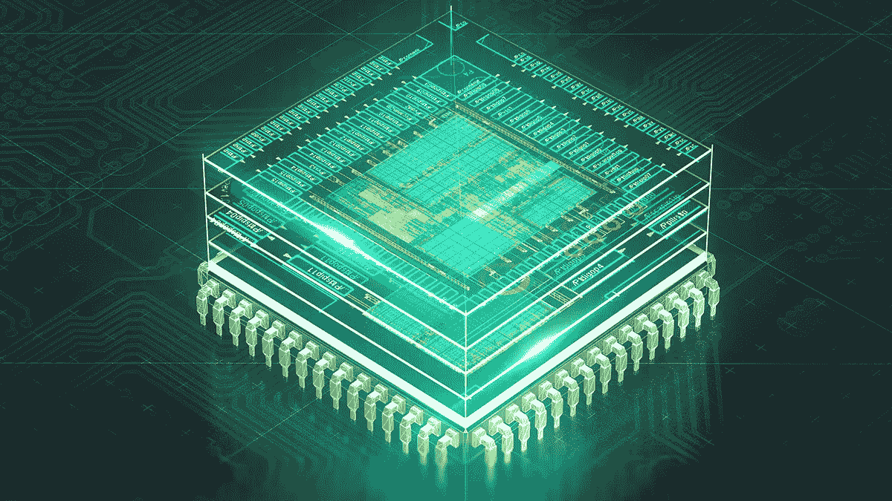
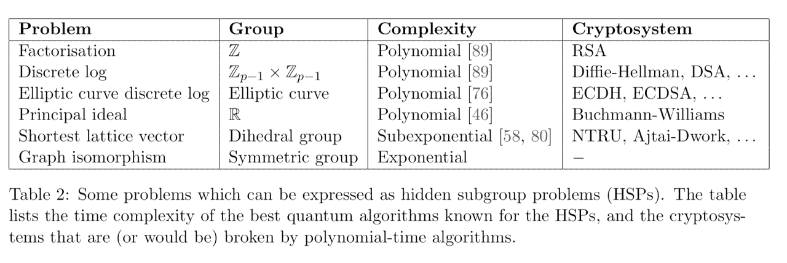
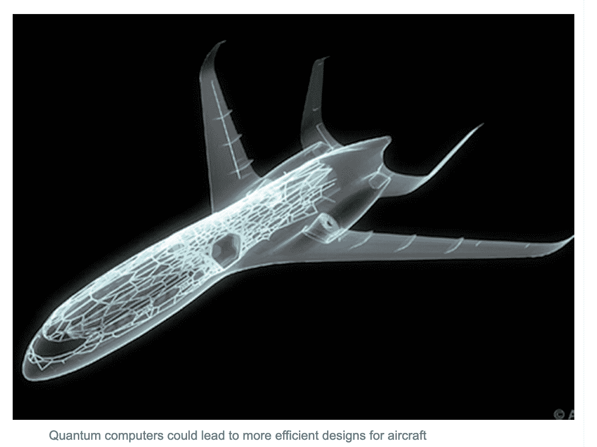

# 进入 21 世纪 20 年代:介绍和理解 Q 计算

> 原文：<https://medium.datadriveninvestor.com/entering-the-2020s-introducing-understanding-q-computing-db0e5029f9e7?source=collection_archive---------5----------------------->

*2019 年 12 月 30 日—* 量子计算机有能力改变我们今天所知的生活。当我和其他人讨论量子计算机时，经常会遇到困惑不解或冷漠怀疑的表情。我的目标是澄清这一点:尽管量子计算(以下简称 q-computing)在未来几十年内通常会被忽视，但它将比人们预期的更快地显示出它的影响。特别是随着人类进入下一个十年，我们在这个量子时代的意识变得越来越重要。随着 2010 年即将结束，我们对 q-computing 迄今为止的进展了解得越多，我们对它的准备就越充分，这将导致我们的社会对它在我们的新世界中的许多后果变得更具想象力。

关于 q-computing 可能还没有被理解的观点是**它不能和普通的计算机相比。**与过去 50 多年来经典计算机的工作方式不同，我们现在将拥有使用 [**物理**](https://www.newscientist.com/term/quantum-physics/) 定律而不是数学定律的计算能力，以我们以前无法想象的方式计算几乎任何类型的问题。这使得任何“大问题”或任何具有大量数据集的挑战现在都可以以指数速度解决。我们将直接利用量子粒子的自旋，而不是量化 0 和 1 的数量，来将决定存储在称为量子位的比特中。虽然这对于普通用户来说意义不大，但对于数据科学家、生物学家、化学家、经济学家、心理学家以及坦率地说对于整个社会来说，意义重大。

 [## 2019 年即将改变世界的技术|数据驱动的投资者

### 很难想象一项技术会像去年的区块链一样受到如此多的关注，但是……

www.datadriveninvestor.com](https://www.datadriveninvestor.com/2019/01/17/the-technologies-poised-to-change-the-world-in-2019/) 

2019 年初(也是我搬到纽约市的一个巨大原因)，IBM 宣布发布其第一个商用量子计算系统。2019 年 10 月，谷歌表示，该公司已经凭借其版本的量子系统达到了量子霸权。显然，量子竞赛已经开始，甚至这些公司也知道它将对全世界的社会产生巨大的影响。然而，世界上大多数人甚至不知道它是什么，更不知道它可能导致的巨大的伦理影响。虽然 q-computing 仍处于早期发展阶段，但一旦它公开实用，它将带来好处，并给我们的社会带来复杂的变化。量子计算机可以带来几个好处，尽管这种量子计算机的伦理后果也会被意识到。

当量子计算机正式被公司大规模使用时，巨大的后果将意味着破坏我们今天所知道的经济、政治和社会现实。有了量子计算机，几乎每一种可能性都将实现。例如，它对生物的影响将是巨大的。最近，有大量的研究投入到使用量子计算来模拟分子& DNA。DNA 中的所有序列现在都可以非常详细地建模，这是经典计算机以前无法用量子计算机做到的，量子计算机具有极大的细节和精度。由于可以处理和吸收大量信息，量子计算机将输出精确的模型和结果。这将意味着疾病和改造的巨大影响，科学界可以改善人类的健康和生活，以根除我们未来可能面临的任何疾病。例如，我们可以高精度地模拟几乎任何生物医学疾病、病毒或分子，从而在医学领域产生影响。

除了影响地球上每个人的健康，量子计算机还可以为我们提供更高智能和安全性的工具。基本上，每一个 RSA 支持的安全系统，甚至区块链密码术，都可以通过使用 Shor 算法的量子计算轻松破解。这将产生巨大的影响，因为如果量子计算机被公众错误地使用或被更高的公司利用，世界的安全系统和金融基础将完全处于危险之中。由于量子计算机可以在非常低的运行时间内处理大量的信息，它们可以产生更多的输出可能性，不仅打破了密码学领域，还导致了更高形式的人工智能。IBM 的超级计算机深蓝在 1997 年能够击败俄罗斯棋手卡斯帕罗夫。它能够获得竞争优势，因为它每秒钟检查 2 亿次可能的移动。然而，一台量子机器将能够每秒计算 [1 万亿次](https://www.wired.com/2017/03/race-sell-true-quantum-computers-begins-really-exist/)。这使得计算机能够以前所未有的速度处理人工智能。

当量子计算机得到广泛应用时，这将意味着我们的社会在经济、政治和哲学方面的彻底转变。将未来的技术视为无足轻重是荒谬的，因为不知道一项技术将在多大程度上改变我们的生活将导致那些无知的人更容易被技术精英阶层操纵。随着对量子是什么、已经做了什么以及将会做什么的进一步研究，社会将会有更充分的准备，并享受接下来的事情。

***什么是量子科学和量子计算？***

*为了理解量子物理对我们社会的意义，我们需要一个关于什么是量子物理以及它如何导致量子计算的数学应用的简短背景。*

那么什么是量子计算呢？

量子计算深入研究量子科学和量子力学领域。为了理解什么是量子计算机，我们需要了解量子科学如何将我们所知的经典计算系统转化为量子计算机。美国理论物理学家理查德·费曼因其在量子力学方面的进展和发现获得了诺贝尔物理学奖。他的发现暗示，如果你能够让量子力学发挥作用，它将导致能够使用这门科学来计算指数数量的信息。这震惊了科学界，并引发了致力于量子科学及其理论应用的新一轮研究浪潮，最终导致了量子计算机的诞生。在量子系统中，量子比特被用来代替经典计算中我们熟悉的常规“比特”系统。这种量子计算机中的比特可以做比普通计算机中的比特更多的事情。在普通计算机中，0 和 1 是信息。但是，在量子计算机中，可能性相差很大。

经典计算机通过操作来操纵 1 和 0，但量子计算机使用量子位或量子位来跨越各种操作。就像经典计算机一样，量子计算机使用 1 和 0，但量子比特有第三种状态，称为“叠加”，允许它们同时代表 1 或 0。叠加不是依次分析 1 或 0，而是允许叠加的两个量子位同时代表四种情况。因此，处理数据集所需的时间显著减少。

但是量子计算能用来做什么呢？

**生物化学:**

*“…自然不是经典的，该死的，如果你想模拟自然，最好是量子力学的…”—***，* [*用计算机模拟物理*](http://people.eecs.berkeley.edu/~christos/classics/Feynman.pdf)*

*1982 年，传奇理论物理学家理查德·费曼提出，量子计算机最强大的应用之一是模拟自然本身:原子、分子和材料。因此，许多研究人员开发了在 NISQ 设备(以及未来完全纠错的量子计算机)上模拟分子和材料的算法。这些算法可以增强从能源到健康科学等领域的新材料的设计。量子理论领域的许多专家也指出，量子计算目前最适用于化学和医学领域。*

*例如，虽然分子氢的能量可以用经典方法计算，但仍然被认为效率很低。随着量子硬件规模的扩大，模拟更大的化学系统成为可能，包括“经典难处理”的系统。例如，只有大约 100 个可靠的量子比特，就有可能模拟细菌在室温下制造肥料的过程。使用量子计算来解决这个问题可能会带来巨大的影响，因为人类生产肥料的方式效率极低，每年消耗世界能源的 1-2%。根据谷歌专家的说法，这种计算也有助于基础科学的突破，例如，对高温超导的理解。*

*尽管前面还有许多理论和实验挑战，但从定性/描述性化学模拟到定量/预测性化学模拟的量子化范式转变可以极大地使该领域现代化，以至于今天可以想象的例子只是冰山一角。*

***数据科学与人工智能:***

*我们目前生活在一个信息超载的时代。我们有一整个学校的知识唾手可得，然而我们大多数人不知道如何筛选这些信息，以找到我们正在寻找的挑战的最佳解决方案。我们每天都在创造大量的数据。为了充分处理这些信息并从中提取意义，我们需要更多的计算能力。这就是量子计算机介入拯救世界的地方。量子计算将解决我们每天产生的大量数据，并通过利用量子计算解决方案以有意义的方法智能地呈现信息。例如，需要注意的是，平均每天我们会产生 2.5 艾字节的数据。这个数字相当于 500 万台笔记本电脑上的内容。量子计算机将有可能处理我们在[大数据](https://www.bernardmarr.com/default.asp?contentID=766)时代产生的大量数据。例如，回想一下 IBM 的计算机深蓝在 1997 年击败了国际象棋冠军加里·卡斯帕罗夫。它能够获得竞争优势，因为它每秒钟检查 2 亿次可能的移动。然而，一台量子机器将能够每秒计算 [1 万亿次移动](https://www.wired.com/2017/03/race-sell-true-quantum-computers-begins-really-exist/)。*

*谷歌和许多其他大公司仍在测试这些算法解决方案，与经典计算相比，这些算法解决方案将允许这些量子计算机以更快的运行时间执行。然而，一旦这些算法经过实验优化，可以处理以显示准确信息的数据量是不可想象的。*

***密码术&安全性:***

**“RSA-2048 挑战问题用经典计算机需要 10 亿年。一台量子计算机可以在 100 秒内完成”——*[*Krysta Svore 博士*](https://twitter.com/krystasvore) *，微软研究院**

*随着量子系统现在理论上能够在指数时间内完成计算，这对我们现有的银行和金融系统的安全具有重大影响。世界上大多数银行和机构都使用 RSA 安全加密，加密货币使用 ECC 安全方法加密。然而，Q-computing 很容易破解这两种加密，因为它需要指数级的时间来解决这些算法。量子计算机不是用暴力破解 RSA 加密(这是经典计算的局限性),而是找到包含 RSA 密钥的函数的周期，并且经典计算出最大公约数。这是利用肖尔算法，一个专门设计的量子算法，在 1994 年数学证明。*

**

*因此，有了量子计算机，几乎任何今天存在的加密都可以用 q 计算破解，包括所有当代形式的区块链和加密货币。尽管许多人在努力工作，试图为一个“量子安全”的未来而努力，但还没有任何进展。从本质上来说，我们今天拥有的所有加密形式在量子机器的计算能力下都是不安全的，因为有许多算法证明了这一点。因此，可以有把握地认为，量子计算机将在未来几年改变数据安全的格局。尽管量子计算机将能够破解今天的许多加密技术，但预测机构将会挺身而出，创造出防黑客的替代品。*

*即使现在，“后量子纸”已经被创造出来，尽管我们距离完全的 q 计算迁移还有几年的时间，但我们仍在努力确保安全，以防[量子加密](https://cr.yp.to/papers/pqrsa-20170419.pdf)到来。*

***飞机设计:***

*虽然现在量子计算机的应用并没有全部被直接实践，但是欧洲空中客车公司已经直接采取了迅速的措施，以确保他们的公司处于这项非常有用的技术的前沿。据称，空中客车公司正在与学术界和 it 公司合作，定义利用这项新技术的巨大能力所需的算法，而不是自己建造量子计算机。然后，该公司可能会在数字建模和模拟中使用量子计算机，例如在其客机机翼上的气流，以提高效率。事实上，随着空中客车公司在其位于 T2 新港的工厂设立量子计算单元，硅谷技术正在进入威尔士山谷。*

*这个泛欧洲航空航天集团正在计算的前沿领域开展工作，以探索如何利用量子计算机预计将产生的巨大处理能力，这可以用于改善计算机建模和模拟。*

*比安科先生说:“目前，完全模拟机翼上的空气可能需要 7 年或更长时间。”“利用量子计算，只需几周时间就可以模拟以各种角度和速度从零到高超音速流过机翼的每个空气原子。”*

**

***量子计算机有哪些伦理问题？***

*一旦开发出稳定的量子计算机，预计[机器学习将成倍地加速](https://phys.org/news/2015-03-quantum-greatly-machine.html#nRlv)，甚至将解决问题的时间从几十万年缩短到几秒钟。这可能会给我们的社会带来巨大的变化，导致我们作为一个社会整体不得不考虑的难以想象的道德变化。今年，[谷歌公开声明](https://www.wired.com/2017/03/race-sell-true-quantum-computers-begins-really-exist/)它将在未来 5 年内生产出可行的量子计算机，并补充说他们将通过 50 量子位的量子计算机达到“量子霸权”。顶级超级计算机仍然可以处理 5-20 量子位量子计算机可以处理的一切，但将被 50 量子位的机器超越，并在这一点上取得优势。在该声明发布后不久，IBM 表示将在今年内向企业提供商用量子机器。即使一个广泛的 q 计算时代还没有被接受，争夺未来的竞争显然正在发生。*

**在没有太多 q 计算理论技术的情况下，我喜欢探索公司和初创公司近年来在量子领域取得的创新。我希望探究每家公司的方法之间的差异，以及对这个新计算空间的重大贡献，作为帮助解决人类许多巨大的不完全(或计算机科学家术语中的 NP 完全)问题的一种手段。作为一名计算机科学专业的学生，我本人也是一名创意者，我只能满怀热情地想象 q-computing 的解决方案能带给我们什么。我真的非常兴奋。**

*根据研究结果，我希望读者理解 q 计算可能带来的巨大影响，特别是在全球经济体系转型以及量子霸权的到来带来的大量社会经济变化方面。有了适当的教育，只有拥有巨大的想象力和雄心，最大的问题才能得到解决。考虑到这一点，q 计算可以帮助人类做到这一点。*