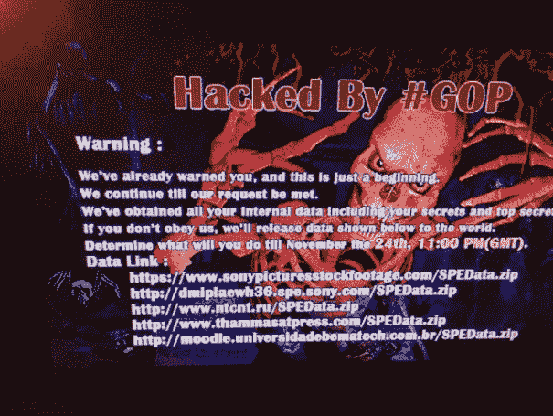

# 企业数据不安全

> 原文：<https://medium.datadriveninvestor.com/enterprise-data-is-not-safe-fe1baebb2bc9?source=collection_archive---------21----------------------->

以太坊令牌如何保护知识产权

Photo by [Bich Tran](https://www.pexels.com/@thngocbich?utm_content=attributionCopyText&utm_medium=referral&utm_source=pexels) from [Pexels](https://www.pexels.com/photo/black-laptop-beside-black-computer-mouse-inside-room-669996/?utm_content=attributionCopyText&utm_medium=referral&utm_source=pexels)

## 一.问题

你会时不时地听说这件事。一些大型企业实体恰好成为数据泄露的受害者。事实是，尽管找到进入一家价值数百万美元的企业的方法并向其发送电子邮件要求重置密码听起来很困难，但实际上并不困难。

有时，这些攻击被美化，并留在我们的记忆中，作为一个警告，来改变我们自高中以来一直使用的密码。比如 2014 年 10 月索尼影业被黑。

> “攻击者从好莱坞工作室窃取了大量机密文件，并在接下来的几周内将它们发布到网上——将它们暴露给每个人，从潜在的网络罪犯到一直在研究文件并报道一切的记者，从最近电影制作的细节到互联网上易受攻击的员工数据。”——[华盛顿邮报](https://www.washingtonpost.com/news/the-switch/wp/2014/12/18/the-sony-pictures-hack-explained/?noredirect=on&utm_term=.7b4836a13cb8)

Credit: [Deadline](https://deadline.com/2014/11/sony-computers-hacked-skull-message-1201295288/)

普通公民可能没有意识到的是，业余黑客大多不被注意，攻击每天都在较小的规模上发生。

少数被公开的通常是关于企业的。削弱一个企业的切入点太多，这样做的理由有数百万个，远远不止信用卡和银行账户。目前，信息安全非常薄弱，包括从电子邮件到医疗记录的所有内容。

我在 2018 年的前 6 个月…

*   挪威 RHF 东南部卫生部门—290 万患者
*   **GitHub** 成功抵御大规模 DDoS 攻击——每秒 1.35 太比特的流量
*   **安德玛 my fitnesspal**—1.5 亿用户受到影响
*   **英国国家彩票**—1050 万用户
*   萨克斯第五大道精品百货店和洛德泰勒百货公司——500 多万信用卡用户
*   **Careem 乘车共享** —中东地区 1400 万用户
*   **日本零售网站** — 2 亿多用户数据出售
*   **Ticketfly** 勒索软件攻击/数据泄露—2700 万个账户
*   **my heritage**—9200 万用户 DNA 相关数据受损
*   Bithumb 加密货币交易所——3150 万美元的货币被盗

## 二。解决方案

企业数据通常被紧紧地锁在有点安全的数据库后面，但这并不是知识产权被窃取的地方。数据泄露最常见的方式是通过通信渠道，如电子邮件或发送文件。

Loyakk Vega 是一个位于硅谷的小团队，不仅创建了首批为数不多的对数据进行令牌化和加密的私有区块链之一，还充当了一个允许在其平台上进行公开交易的混合体。

## 为什么要对数据进行令牌化？

该平台将交易数据以及任何形式的通信放在一个*“令牌化容器”*中，以保护他们的产品不被彻底克隆，这很像传统的数据库，允许所有人都可以阅读和编辑。

这一切都建立在多级后端之上，允许第三方和企业自己创建和利用自己的 API 以及 Loyakk 的所有操作。不仅要保护蓝筹公司的数据，还要保护从区块链核心处理到制造商、供应商和最终用户的整个企业价值链中的数据。

Loyakk Vega ERP smart 合同最近已经过独立审计，LYKK token 不久将在交易所上市。

*作者塔克罗宾逊* [*@VIEWBULL*](https://twitter.com/ViewBull)

# DDI 特色区块链课程:

*   [**认证以太坊开发者**](http://go.datadriveninvestor.com/ethdev/mb)
*   [**智能合约开发者**](http://go.datadriveninvestor.com/smartcontract/mb)
*   [**密码交易员**](http://go.datadriveninvestor.com/cryptotrader)

**DDI 可能会从这些链接中收取会员佣金。我们感谢你一直以来的支持。*