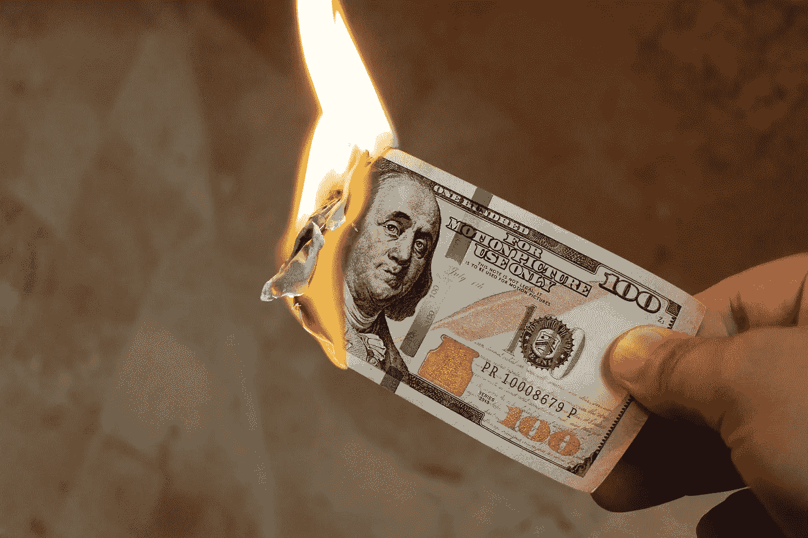
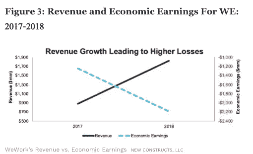
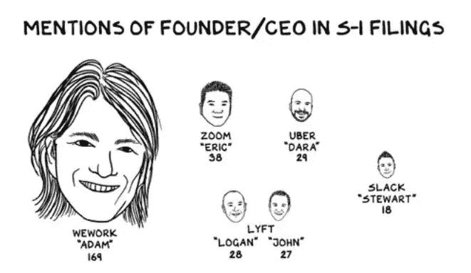

# 浪费大钱 101

> 原文：<https://medium.datadriveninvestor.com/entitled-people-getting-rich-shortlist-bbea7a7061d6?source=collection_archive---------17----------------------->

Image by [Intellectual](https://pixabay.com/users/Intellectual-4717896/?utm_source=link-attribution&utm_medium=referral&utm_campaign=image&utm_content=2113914) from [Pixabay](https://pixabay.com/?utm_source=link-attribution&utm_medium=referral&utm_campaign=image&utm_content=2113914)

# 朱尔 vs 女性创始人

*   2018 年，所有女性创始人加在一起获得的资金比一家电子烟公司朱尔本身获得的资金少 100 亿美元。
*   波士顿咨询公司的一项研究显示，每筹集一美元的投资，女性经营的初创公司产生 78 美分的收入，而男性经营的初创公司仅产生 31 美分的收入。
*   下图告诉我们，我们从投资朱尔的所有资金中得到了什么。

# 兄弟文化偶像优步

*   尽管在 5 月份首次公开募股后市值达到 575 亿美元，但据报道，拉里·埃里森(Larry Ellison)表示，该公司“几乎一文不值”，并补充说，该公司没有汽车或控制其司机，只有一个“我的猫可能会写的应用程序”。。
*   纽约出现了一波出租车司机自杀潮，但出租车行业内部人士表示，全国各地的司机都面临着同样的压力——特别是那些在大城市投资数十万美元购买出租车牌照的司机，随着拼车服务的兴起，这些牌照迅速贬值。
*   美国联邦贸易委员会去年起诉了优步，声称其误导司机，既有虚假的收入估计，也有误导性的租赁协议条款。
*   优步刚刚公布了其作为上市公司的第二季度收益，天啊！那是许多红墨水！打车巨头[报告称](https://investor.uber.com/news-events/news/press-release-details/2019/Uber-Reports-Second-Quarter-2019-Results/default.aspx)在过去三个月中损失了 52 亿美元。不，你的屏幕上没有灰尘。那是带 b 的十亿。

# WeWork 还是 WeWTF？

*   根据 NYU 大学教授 Scott Gollaway 的说法，“亚当·诺伊曼已经卖出了 7 亿美元的股票。作为一名创始人，我曾通过二次发行出售股票来获得一些流动性，并分散持股。好吧，我明白了。但是 3/4 亿美元？这是 7 亿面红旗，在中场休息时在一个足球场的球场上拼出这样的话:“让我滚出这只股票，但你应该买一些。"

*   创始人非常自负，没有同理心。在一次会议上，他讨论了将 WeWork 实际员工人数削减 7%的裁员计划，纽曼带来了装有龙舌兰酒的服务器，并让 Run-DMC 的 DMC 进行了一场特别表演。

# 来源

[2018 年，所有女性创始人加在一起获得的资金比朱尔少 100 亿美元
2018 年，所有女性创始人加在一起获得的资金比 took…fortune.com 朱尔一家电子烟公司少 100 亿美元](https://fortune.com/2019/01/28/funding-female-founders-2018/)

[朱尔如何引诱儿童并引发公共健康危机
朱尔正处于美国面临的最大公共健康危机之一的中心。以下是 the…time.com 如何引发公共健康危机的内幕](https://time.com/5680988/juul-vaping-health-crisis/)

投资女性创始人的价值
男性领导的初创公司获得的资金不成比例，这可能表明这些公司更像 lucrative…www.forbes.com

[“一个我的猫可能会写的应用程序”:拉里·埃里森说优步的商业模式“几乎一文不值”
亿万富翁企业家和甲骨文联合创始人拉里·埃里森在谈到 cohort…www.businessinsider.com 和优步时直言不讳](https://www.businessinsider.com/larry-ellison-says-uber-wework-are-almost-worthless-barrons-2019-9)

随着打车公司接管，自杀事件震动了出租车司机社区
“司机们都破产了，如果他们不能再融资，他们就要放弃他们的执照，had…www.nbcnews.com 的乌瓦齐说

成千上万的优步司机将收到结算支票
由于一辆 Federal…www.cbsnews.com，成千上万的现任和前任优步司机本周将开始收到平均 223 美元的支票

[优步在一个季度内损失了超过 50 亿美元，但别担心，情况会变得更糟
我不是华尔街分析师，你也不是(可能)，所以所有这些可能会感觉有点抽象。损失 520 万美元…www.theverge.com](https://www.theverge.com/2019/8/8/20793793/uber-5-billion-quarter-loss-profit-lyft-traffic-2019)

[任何相信 WeWork 价值超过 10 美元的华尔街分析师都会说，NYU 教授称之为“we wtf……”
Scott Galloway 是新 York…www.businessinsider.com 大学的市场营销教授，他是畅销书作家，也是知名的科技行业专家](https://www.businessinsider.com/nyu-professor-calls-wework-wewtf-and-slams-bankers-2019-8)

[WeWork 是 2019 年最荒谬的 IPO
We work——现更名为 We Company(We)——于 8 月 14 日提交了首份 S-1 文件，据报道，该公司计划在 to…www.forbes.com 上市](https://www.forbes.com/sites/greatspeculations/2019/08/27/wework-is-the-most-ridiculous-ipo-of-2019/#3e8c81dc1ad6)

大规模裁员后，WeWork CEO 举办了一场以 DMC 和龙舌兰酒为特色的派对
在这个躲避法律的科技公司和初创公司似乎对任何真正的压力都免疫的地狱世界，这是 is…www.complex.com 的一个小乐趣