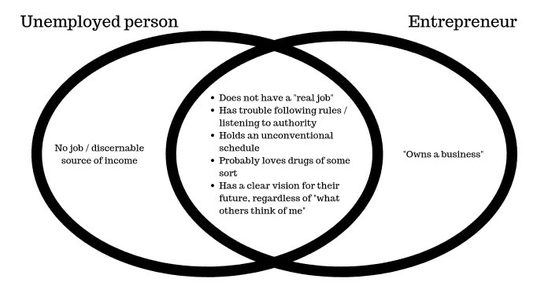
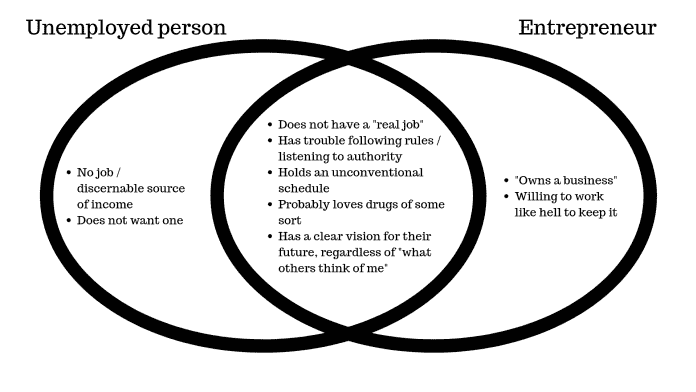

# 企业家还是失业者:一个关键的区别

> 原文：<https://medium.datadriveninvestor.com/entrepreneurial-or-unemployed-the-one-key-difference-aae0a0cf84af?source=collection_archive---------12----------------------->

*Photo by* [*Justin Luebke*](https://unsplash.com/photos/Gcl6jcB1r9g?utm_source=unsplash&utm_medium=referral&utm_content=creditCopyText) *on* [*Unsplash*](https://unsplash.com/search/photos/change?utm_source=unsplash&utm_medium=referral&utm_content=creditCopyText)

让我们以这样一个事实开始这整件事，它始于一个维恩图的笑话。

我的一个朋友随口说，她需要开始和我一起参加更多的企业家聚会，因为这可能会让她停止和“失业的瘾君子”约会。

 [## 在创业之旅中，拥抱学习数据驱动的投资者

### 好像建立一个数百万美元的公司还不够困难，企业家必须额外照顾他们的…

www.datadriveninvestor.com](https://www.datadriveninvestor.com/2018/10/16/on-the-entrepreneurial-trek-embrace-the-learning/) 

我告诉她这两者惊人地相似。这张照片证明了我的观点:

背景:我既是一个企业主，也是一个单口相声演员。

我的情况是这样的，我遇到了商业上的高绩效者*和*那些在经济上勉强度日的人，因为他们想“专注于他们的艺术”

(旁注:你不必为[在艺术上的成功而受苦](https://medium.com/datadriveninvestor/artist-or-entrepreneur-what-about-both-8d4e5cd5ed50)。但那是题外话。)

每次我去参加企业家聚会，我都会对我周围的人所知道的事情感到敬畏。帝国被创造和建立。这些人把一个想法变成你可以触摸的东西。

每次我走到一个开放的麦克风前讲一些笑话，我都同样感到敬畏。这些人*了解*人性。它粗糙的锯齿状边缘。没有人想在私人场合谈论的事情以一种可理解的宣泄方式被带到了舞台上。

他们比大多数人看到的更多。他们可以毫无愧色地把它写下来。

但他们中的大多数人失业或几乎没有工作。

我听说了很多关于在一个生活成本不断上涨的城市里勉强度日的情况。这并不是因为这些人“笨”他们非常聪明。

那么，是什么让这两个世界——企业家和失业者——如此不同呢？

*Photo by* [*Patrick Tomasso*](https://unsplash.com/photos/fMntI8HAAB8?utm_source=unsplash&utm_medium=referral&utm_content=creditCopyText) *on* [*Unsplash*](https://unsplash.com/search/photos/fun-at-work?utm_source=unsplash&utm_medium=referral&utm_content=creditCopyText)

# 对待工作的态度是不同的。

请注意，这些都不涉及那些患有真正的精神/身体健康障碍、无法工作的人。

但从我作为企业家的几年经历来看，他们真正展现了失业者的大部分相似特征:

*   没有“真正的”工作/缺乏维持“正常”工作的能力
*   对权威的厌恶
*   非常规的日常时间表
*   非传统的工作周
*   愿意涉足能够“增强他们的认知/意识/业务”的物质
*   别人很难想象，但对他们来说却很清晰的愿景

然而，上面的原始维恩图有点偏离。

这两者之间有一个很大的区别，它被添加到最初的维恩图的第二个版本中:

# 工作心态是商业成功的关键

我从小就认为你去工作，你不喜欢这份工作，然后你回家。喜欢就不叫工作了。但你是为了钱，这就是生活。

无意冒犯那些选择这条路的人，但我很难相处。我也有多种[性格测试](https://www.understandmyself.com)来支持这种说法。

也就是说，我不喜欢那些规则。提示一，我应该一直知道我不会有一个传统的职业生涯。

但是仅仅因为我不喜欢做我讨厌的事情并不意味着我不会工作。我只需要找到一个点或对它的热情。

而*这个*就是失业者和成功企业家的区别。

企业家相信他们可以将激情转化为利润。那些陷入失业循环的人看不到这种可能性。

不要误解我的意思:能够开创自己的事业，伴随而来的是令人难以置信的特权。许多企业家在攒钱之前，把他们 5-20 年的服务“交给机器”,并鼓起勇气跳出自己的想法。

然而，心态是实现飞跃和最终成功的关键。

# 人类为什么讨厌工作？

工作不需要成为你讨厌的东西。事实上，当不是你讨厌的事情时，你会更有效率。

但我认为这是一个双重问题:

1.  从穴居时代起，我们的生存本能就根植于相信工作=能量消耗=死于饥饿的风险更大
2.  我们的社会告诉我们一句伴随我成长的格言:工作之所以被称为工作，是因为它是娱乐的反义词。

在我自己的情况下，在商业所有权和喜剧之间平衡，我看到了第二点的阻力。

漫画家和企业家都认为工作可以充满乐趣。有些部分你不想做。有些部分你非常讨厌。有时候演喜剧真的很糟糕。拥有一家企业有时真的很糟糕。

但它们都植根于激情。追求一些非传统的东西。正在建造的主要“东西”对建筑师来说是愉快的。正如史蒂文·普雷斯菲尔德所说，他们一直在与阻力抗争。

虽然你可能会在这两个领域中的任何一个短期内挣扎，但你已经走上了摆脱财务不安全感的道路。

因为你不反对*为某事而工作*。

*Photo by* [*Daniel Chekalov*](https://unsplash.com/photos/OxU08SFhPbI?utm_source=unsplash&utm_medium=referral&utm_content=creditCopyText) *on* [*Unsplash*](https://unsplash.com/search/photos/hard-work?utm_source=unsplash&utm_medium=referral&utm_content=creditCopyText)

# 失业者反对工作的心态

提到这方面的事情有点讽刺。因为我在我的漫画朋友身上看到了这一点，当谈到“白天的工作”，正如大多数艺术家所说的那样。

这就是“工作不有趣”心态真正闪耀的地方。

漫画想通过他们的艺术赚钱。大多数艺术家都是这样。

但他们知道，在那之前，他们必须以某种方式支付账单。所以，他们找了一份工作，做一些他们不关心的事情，这样他们就可以在一个允许他们的艺术成长的城市里生活。

他们经常换工作，因此经常拿失业开玩笑。他们不在乎为了钱做什么，所以对他们来说都一样。

这对一些人来说很管用，直到他们在艺术上“撞上了一个突破口”。

但对其他人来说……这让他们对任何工作都感到厌恶，包括他们的艺术作品。

日常工作的单调让一些人放弃了他们的艺术，完全感到无助。

这就是为什么我认为即使作为一名艺术家，找到一份你不讨厌的“日常工作”也是至关重要的。

它让你充满活力，而不是耗尽精力，让你在生活的各个方面都保持高效。

如果你是一名企业家，你已经在你热爱的事情上赚到了钱。

即使不是很多，你知道做你做过的事有多难吗？你创造了一个收入流，而这个收入流在你造成它之前是不存在的。太不可思议了。不要忘记这一点。

# 这种思想转变如何适用于员工

现在让我们换个话题。

不是每个人都是企业家或艺术家，甚至不是每个人都想成为企业家或艺术家。

大多数人*喜欢*有某种稳定的时间表，老实说，你对我们的社会比外面的许多企业主更重要。

正如我的一个客户所说，你们是“把事情做完的团队”。

但是这种心理转变仍然适用于你。

不要去上班时想着“改天我*得*在这里”，试着想想你如何*让*在那里。

如果这是一份你非常讨厌的工作，并且不能从中找到乐趣，为什么不考虑换一份别的工作呢？

有了 LinkedIn 这样的工具，与你想从事的行业的人联系比以往任何时候都容易。我的朋友 [Destiny Lalane](https://resources.destinylalane.com/book/) 是一个利用这个平台持续实现巨大业务增长的奇才。

*Photo by* [*Justin Luebke*](https://unsplash.com/photos/Gcl6jcB1r9g?utm_source=unsplash&utm_medium=referral&utm_content=creditCopyText) *on* [*Unsplash*](https://unsplash.com/search/photos/change?utm_source=unsplash&utm_medium=referral&utm_content=creditCopyText)

# 企业家和失业者可以用这些知识改变他们的生活

这听起来可能有点戏剧性，但这是事实。

一旦你让自己明白，从事你喜欢的事情也能给你带来经济上的成功……你的生活将会大不相同。

这可能是一个疯狂的旅程，但它是非常值得的。

与其放弃一切，你会想要坚持一些东西。你会发现你每天记录的时间是有目的的，即使是简单的管理任务(提醒你，这是企业主经常做的)。

愿意投入工作。把精力放在你喜欢的事情上，让自己轻松一些。

亲爱的读者，这是让你留在企业家圈子里的东西，也是让你远离失业圈子的东西。

— —

## 关于作者

Allison 是 [Flabs to Fitness，Inc.](https://www.flabstofitness.com/) 的创始人，这是一个在线健身、营养和健康教练平台，也是为其他以健康为导向的公司创建内容的公司。她拥有德克萨斯大学奥斯汀分校的表演学士学位和运动学学士学位，如今仍住在奥斯汀。她把两个学位都用在了专业上，白天创建自己的公司，晚上表演莎士比亚和单口喜剧。她喜欢研究心态及其对人类行为的影响……包括投资决策。在她的“业余”时间，她喜欢打猎、阅读和旅行。

*原载于 2019 年 5 月 27 日*[*https://www.datadriveninvestor.com*](https://www.datadriveninvestor.com/2019/05/27/entrepreneurs-and-unemployed-mental-difference/)*。*