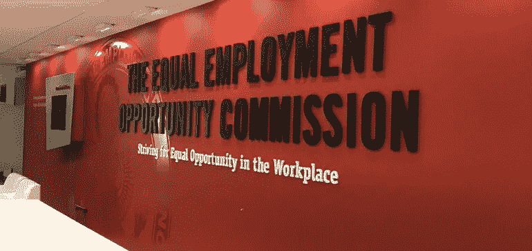

# 企业家瞄准不断变化的就业法律

> 原文：<https://medium.datadriveninvestor.com/entrepreneurs-take-aim-at-moving-employment-laws-141ec590c397?source=collection_archive---------0----------------------->

## 与时俱进会让你比竞争对手更胜一筹

Keeping up with employment law is time consuming — and essential.

就业法是最复杂也是最重要的劳工议题之一。试图掌握不断变化的联邦、州和地方法规就像玩 3d 象棋一样。

然而，不了解或忽视最新发展的企业家们这样做是在自担风险。

戴夫·伯恩特是 T2 G A Partners 的专家客户律师，他与 T4 的凯特·托内和乔恩·斯坦加特就这些问题进行了讨论。G & A 是一家人力资源和行政外包公司。它提供关于公司文化、工作场所动态和福利的人力资源专业知识和见解。

Tornone 是《人力资源潜水》的高级编辑，作为一名企业对企业的记者，他已经报道劳动法超过 10 年了。

史坦加特，彭博法律的法律编辑，报道劳工和就业法领域的诉讼和发展。这包括工资和工时规定，工作场所的歧视和骚扰，以及零工经济。

 [## 科技让所有人都能更好地招聘

### 在拥挤的就业领域，人工智能寻找偏见

arvrjourney.com](https://arvrjourney.com/tech-powers-better-hiring-for-all-cc8d6fc9ef27) 

就业法的主要趋势包括地方和州一级的带薪病假；骚扰和歧视，包括关于法律解决的新法律；隐私，包括数据泄露法；背景调查和筛选；和禁止薪资历史记录。

“一般来说，趋势包括越来越多的州和地方法律关于带薪休假、大麻等，”托诺内说。“具体来说，我们听说了很多关于药物测试的事情。这些法律加上人才短缺——部分是由阿片类药物危机造成的——导致许多人缩减了测试规模。

她说:“公平劳动标准法案也正在考虑零工经济引起的分类问题。”

# 永无止境的变化

如果企业家与这些问题发生冲突，他们可能会被送上法庭。那些表象是可以避免的。

“对于雇主来说，掌握劳动法的最新发展并确保他们的人力资源实践和程序是合规的，这一点非常重要，”Berndt 说。

他说:“如果雇主没有手段和资源来监控这种发展，那么他们向 G&A 合伙人这样的公司寻求建议和忠告是至关重要的。”"在许多情况下，雇主会发现不知情不能成为承担法律责任的借口。"

有准备的人会得到回报。

Tornone 说:“经理们可能会在这些方面搞砸，这意味着培训是至关重要的。”

她说:“当员工下班时，经理们会睁一只眼闭一只眼。”“经理们会说‘我们没有家庭和医疗休假法’或者‘我有太多怀孕的员工了’"

# 法律跟踪

彭博法律追踪雇主在联邦法院的法律，包括[新工作诉讼](https://news.bloomberglaw.com/daily-labor-report/new-work-suits-pressed-and-filed)。

如果雇主没有记录导致和导致问题的事件就对员工进行处罚，那他们就是失败的。这很容易导致败诉。

“许多雇主做决定太快，尤其是当它导致解雇时，”Berndt 说。

“在这样做之前，雇主必须退后一步，从各种来源收集信息和反馈，并评估到底发生了什么，”他说。

 [## 改善之旅从幸福开始

### 员工的需求和愿望应该定义工作文化

medium.datadriveninvestor.com](/journey-of-improvement-starts-with-well-being-c9864698904c) 

错位的同情也可能代价高昂。

“许多人忘记了纪律和批评可能是就业的‘好处’，”托诺内说。“一名经理感觉很糟糕，所以她一直给一名残疾员工夸大的绩效评估。

“如果你终止合同，并以歧视索赔告终，你就没有文件证明该员工多年来表现不佳，”她说。

# 滴答作响的时钟

“下班后”工作是企业诉讼的一个长期来源。这种情况的发生是因为雇主鼓励或直接要求员工做一些在正常工作时间无法完成的工作。

那些不加班的人被视为不敬业。

“加班主要是因为员工和经理的无知，”Berndt 说。

“为了确保这种情况不会发生，一些公司将把准确计时和监督员工计时作为其纪律程序的一部分，以追究员工的责任，”他说。

 [## 企业文化的未来就在现在

### 企业家需要认真审视他们今天的处境

medium.datadriveninvestor.com](/corporate-cultures-future-is-now-2f7fd6bfcaa1) 

斯坦加特采取了不同的观点。

"我想把这个问题反过来问，为什么下班后的工作据称正在发生，"他说。“有时候，关于什么是可赔偿的，什么是不可赔偿的规则很难操作。

斯坦加特说:“美国劳工部工资和工时司允许雇主写信询问 FLSA 在特定情况下如何适用的意见。”。“这种做法已经持续了几十年，直到奥巴马政府终止了它。然后[川普政府恢复了它](https://news.bloomberglaw.com/daily-labor-report/a-break-from-paying-for-health-breaks-labor-dept-tackles-issue)

解决时间以外的问题需要打破常规的思维。

“我们看到了一些新颖的方法，比如关闭电子邮件，”托诺内说。“但合规始于要求员工报告所有工作时间。

“员工需要诚实地填写时间表，或者在自动生成的时间表上签字，”她说。“如果他们在未经授权的时间工作，因为他们违反了规定而惩罚他们——但不要拒绝支付他们的工资。”

像#MeToo 和#TimesUp 这样的运动不仅将性骚扰推到了工作场所问题对话的前沿，还提出了薪酬公平问题。

骚扰和同工同酬运动揭示了现状的不公正。男性和女性管理者都需要明白，勇气和社交媒体会让他们承担责任，即使旧的企业文化不会。

托诺内说:“EEOC(T4)肯定在关注 T5。”。“薪资公平和透明度运动似乎也起到了相关的推动作用，各州和各城市越来越多地采用公平和薪资历史法。”

这些冲突表明问题无处不在。

“重要的是，这些运动提高了人们对两个非常重要问题的认识:骚扰和歧视，”Berndt 说。

“随着意识的增强，我们发现越来越多的公司围绕防止骚扰和歧视重新审视他们的内部政策，”他说。

投诉的激增可能没有看上去那么大。

“也许令人惊讶的是，EEOC 代理主席说该机构没有看到骚扰指控的上升，”Steingart 说。

“与此同时，EEOC 骚扰指导在白宫管理和预算办公室被搁置,”他说。"薪资公平是另一个州立法机构正在制定自己法律的领域"

# 多层次改造

地方政府(州、市、县)通过的就业相关立法的数量正在增加，这给雇主带来了挑战或机遇。

应该有一个不断变化的联邦、州和地方法律法规的中央资料库。对法律的无知不是借口，但很容易看出这是如何发生的。

“最大的挑战是跟踪所有的变化，并了解它们如何应用于您的组织，”Berndt 说。“这样做的责任完全落在雇主身上，这对于中小型企业来说通常很难做到。

“以奥斯汀市的带薪病假法为例，”他说。「这条法例与许多其他本地条例相似。它影响到任何有员工在该司法管辖区工作或旅行的公司，无论该公司是否在那里设有办事处。”

 [## 特殊福利是工人幸福的决定因素

### 正确的程序阻止人们走出大门

medium.datadriveninvestor.com](/special-benefits-are-the-decider-for-workers-happiness-bdc4b2207410) 

企业家们不知道该往哪个方向走。

“当然，主要的挑战是跟踪和遵守每个工作现场的各种要求，”Tornone 说。

她说:“负担如此沉重，以至于有些人选择向所有员工提供[最慷慨的福利](https://www.hrdive.com/news/amazon-bans-salary-history-inquiries/515111/)。“这并不总是奏效。例如，有些公司有不同的通知要求。”

Steingart 指出，许多管辖区已经颁布了最低工资增长。

“不仅仅是立法机构，”他说。“行政机构也很重要。密歇根州民权委员会将其反性别歧视的法律解释为包括[女同性恋、男同性恋、双性恋和变性偏见](https://news.bloomberglaw.com/daily-labor-report/michigan-commission-says-lgbt-bias-illegal-under-existing-law)。

“除了加州，纽约也在推进一些规则，这些规则在某些方面比联邦政府和其他州走得更远，”Steingart 说。

# 监测事态发展

在谷歌上搜索并不是跟上劳动法趋势的好办法，但总比什么都不做好。

“在人力资源合规问题上保持最新的最好方法是在公司内部设立专门的资源来监督法律法规的发展，或者与 G&A 合伙人公司这样的公司合作，让你随时了解变化以及它们可能对你产生的影响，”Berndt 说。

Steingart 说他的公司也有信息资源。

“彭博法律的劳工和就业团队充满了对法律了如指掌的人，”他说。

有[每日劳工报道](https://news.bloomberglaw.com/daily-labor-report/new-york-tightens-wage-rules-as-us-mulls-easing-of-regulations)加上[彭博推特](https://twitter.com/jonsteingart/lists/labor-news-bloomberg-bna1)提要。斯坦加特还建议“从律师那里获得有能力的法律建议。”

 [## 员工寻求最佳福利计划

### 人们需要知道和理解他们所有的选择

medium.datadriveninvestor.com](/workers-reach-out-for-the-best-benefits-plan-1ac3301f4fff) 

Tornone 在会议的同时为管理新闻做了人力资源方面的宣传。

“他们可以让你很好地了解更广泛的趋势，”她说。"也有一些很棒的律师事务所博客跟踪各个州和行业."

在不久的将来，Berndt 希望看到更多的司法管辖区通过带薪病假条例。

“国会还在讨论一项潜在的全国带薪病假法，该法将取消地方法规，并给公司一部法律来解决这个问题，”他说。

“我们正在关注一部潜在的国家隐私法，”Berndt 说。“目前，我们有 50 个州的隐私或数据违反法律。这给在多个州开展业务或拥有客户的公司带来了另一个监管负担。”

地方和州司法机构将继续积极参与背景调查、以前的赔偿和药物测试。

“这些行动可能采取许多不同的形式，”伯恩特说。"睁大你的眼睛寻找更多的变化。"

# 多样性推动

托诺内会关注平等机会。

她说:“我们将看到雇主们努力将老年员工和 LGBTQ 员工纳入多元化和包容性的努力中。”“EEOC 在这些领域非常活跃。这样做既有业务方面的原因，也有法规遵从性方面的原因，是的，这两个原因可以是同一个原因。”

 [## 寻求多样性是必须的，而且永无止境

### 许多员工觉得他们不属于自己的公司

medium.datadriveninvestor.com](/diversity-quest-is-a-must-and-never-ending-901eb9a73257) 

Steingart 补充说，国家劳工关系委员会计划启动其联合雇主规则制定。

他说:“(T2)美国劳工部(T3)的小费共享规定是另一个值得关注的大问题司法部撤销了奥巴马政府的一项规定，这项规定在最高法院受到质疑。"

公平劳动标准法案有一个[小费信用条款](https://www.govdocs.com/new-federal-spending-law-scales-back-proposed-regulation-change-on-tip-pooling/)。它允许雇主向给小费的雇员支付降低的小时工资或次最低工资，只要给小费的雇员得到足够的小费，使他们的小时工资达到现行的最低工资。

“在小费共享上，有一个更大的问题，”斯坦加德说。“讨论涉及劳工部如何管理 FLSA。

“这是一个就业法问题，影响着该机构的解释应该得到多大程度的尊重，这可能会持续到特朗普政府之后，”他说。

托诺内预见了未来的重大时刻。

“我觉得我们正处于基于性取向和性别认同的歧视的临界点，”她说。

Tornone 说:“如果最高法院再次通过这个问题，我们可能会看到更多推动国会介入的力量。”。

**关于作者**

吉姆·卡扎曼是拉戈金融服务公司的经理，曾在空军和联邦政府的公共事务部门工作。你可以在[推特](https://twitter.com/JKatzaman)、[脸书](https://www.facebook.com/jim.katzaman)和 [LinkedIn](https://www.linkedin.com/in/jim-katzaman-33641b21/) 上和他联系。