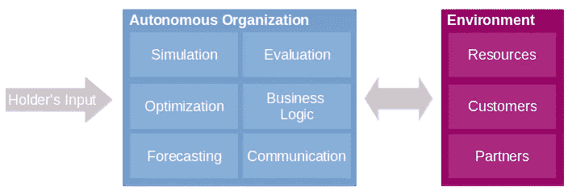

# 拥有遥控器的企业家

> 原文：<https://medium.datadriveninvestor.com/entrepreneurs-with-remote-controllers-33ff1fb72a03?source=collection_archive---------34----------------------->

> “未来的工厂将只有两个员工，一个人和一条狗。那个人会在那里喂狗。这条狗会在那里，防止那个人碰设备。”(沃伦·本尼斯)

我把这种公司叫做完全自治组织(FAO)，这个词我是从去中心化自治组织(DAOs)衍生出来的。Dao 最初与区块链科技一起出现，它们运行在区块链网络中。A DAO 和 a FAO 的目标都是通过自主地与客户互动来最大化公司资产。然而，因为 Dao 只在区块链中运行它们不可变的代码，所以我更喜欢 FAO——它们更灵活，可以在本地服务器或云中运行。

## 但是我们为什么需要自治组织呢？

> 被动收入是从出租财产、有限合伙企业或个人不积极参与的其他企业获得的收入。(Investopedia)

在一个机器越来越多地取代人们就业的世界里，我们必须创造新的生活方式。什么样的生活方式会比自己当老板更酷？我想，不多。然而，一个常见的回答可能是:“哦，但我没有创业经验。”我会回答:“那没关系，因为组织完全自主运行。”

## 它应该如何工作？

> “把这些点连接起来..”(史蒂夫·乔布斯)

目前的神经网络已经可以评估图像的美学，所以用不了多久，神经网络也可以评估产品的吸引力、实用性和其他因素。

1)进化算法(可以“解决”优化问题)，2)模拟和 3)市场界面的结合，你将能够自主地运行组织。图 1 展示了一个自治的组织框架。持有者输入大量资产，并配置自治组织应该做什么。AO 对自己进行校准，然后与 *Google Trends* 对接，分析市场。例如，它的分析可能会发现，目前销售遥控汽车是一个有利可图的时机。然后，它可以使用社交媒体平台来寻找流行的模型，并在其他网站上搜索玩具的建造计划。之后，它可以访问在线商店，提取所需的组件，模拟许多不同的组合(在*凉亭*装载模型，通过进化算法进行优化，通过深度学习进行评估，最后进行预测)来建造最好的遥控汽车。在构建产品后，它可以通过*亚马逊*界面销售。

Figure 1: Autonomous Organization Framework

我在图 1 中用三个组件而不是两个组件来绘制环境组件。可能只使用两个组件:资源和人员(合并客户和合作伙伴)。我没有这样划分，原因是客户和合作伙伴也可以是他们自己的其他自治组织。

## AOs 的未来

> “是生意。把情绪留在门口。”(《华尔街之狼》中的乔丹·贝尔福特)

不久的将来，会出现越来越多的自治组织，两种人会发财。首先是拥有组织的人，同样，也是开发这种组织的人。这种快速增长的原因将是低拥有成本。在某一点上，将会有几乎完全的 AOs，考虑到现在公司统治着世界，你可以猜测最终的结果…

更多阅读:[https://dennis-gross.blogspot.com/](https://dennis-gross.blogspot.com/)

