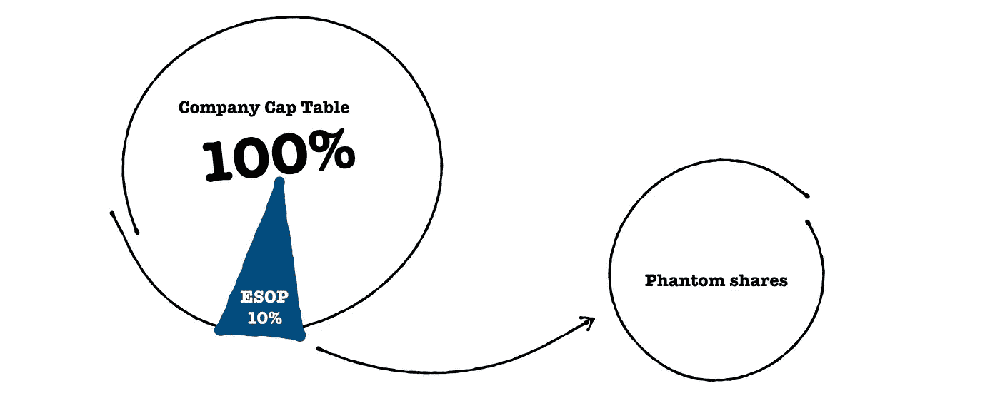
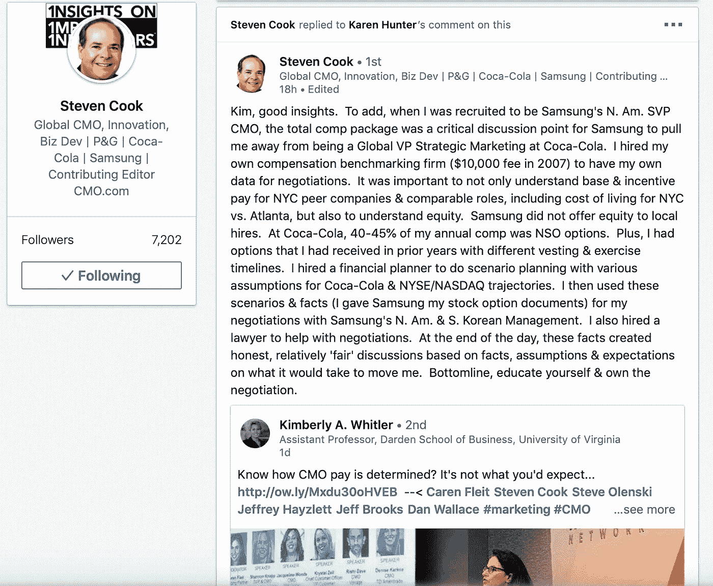

# 企业家的仙境或幻影股份计划

> 原文：<https://medium.datadriveninvestor.com/entrepreneurs-wonderland-or-phantom-shares-scheme-6bc78b984c5f?source=collection_archive---------6----------------------->

[https://www.linkedin.com/in/lujzabubanova/](https://www.linkedin.com/in/lujzabubanova/)

员工的公司股份。您有多少次看到、读到或听说过这种形式的员工激励措施，尤其是在创业环境中，同时想到… *希望这在我们国家的司法管辖区也是可能的？*嗯。这可能不是最佳方案，因为虚拟股权结构需要员工对雇主的高度信任，这是一个值得了解的选择。我不是律师，所以在你把我在这里写的东西付诸实践之前，请确保你在你的公司法允许的范围内。然而，在与可能的团队成员谈判时，发现虚拟股份结构作为员工激励因素打开了我的选择。

人力资源对任何公司都很重要，因为人才很难找到、留住和激励，员工持股计划是最有效的解决方案之一。在这里分享一些发现和实践，希望对创业者或即将成为创业者的人有所帮助。

什么需要说，我不能强调这一点不够，但官方文件遵循当地司法可能会有所不同，无论是写在你的幻影计划。简单地说，如果有争议，你在签署这些虚假文件时所达成的共识可能无法通过审判来实现。我真的相信，一旦你暴露了自己是创始人，违背对员工的基本承诺就是你的死亡。这是一名雇员能够拥有的唯一保障，这就是相关各方的诚实，最重要的是双方达成一致。

 [## 睁大眼睛冲破多样性壁垒——数据驱动的投资者

### “科技女性”是蒂芙尼·霍兰的激情之一，最初她在 Twitter 上主持“科技女性”聊天。她也是一个…

www.datadriveninvestor.com](https://www.datadriveninvestor.com/2019/03/20/hurtle-diversity-barriers-with-eyes-wide-open/) 

想象一下，当你创建自己的规则时，一个符合你当地司法管辖的公司结构，允许你操纵股票，增加归属权，悬崖，根据加入或离开公司的条件和清算优先权。

**ESOP** -最有价值员工的员工股票期权池

**-在实现预定的关键绩效指标或里程碑后，根据其分配公司股份的时间计划**

****悬崖**——一段时间内，一个人必须成为团队的一部分，才有资格从员工持股计划中获得股份**

****优秀离职者** -根据协议离职的员工**

****不良离职者**——因违反保密协议或其他对公司造成损害的事件而被解雇**

****清算优先权** -在退出的情况下，谁先得到支付，在获得优先权后，现金如何分配**

**因此，在这个想象的世界中，诀窍在于真正思考所有的场景，并能够与团队的其他成员公开讨论它们。然而，这些并不总是好的谈话，如果你没有事先做好，保证他们会咬你的屁股。我的屁股被反复咬过，虽然我可能觉得被背叛了，但这绝对是我的错。如果你懈怠，同样的事情也会发生在你身上。**

**在你开始为员工交易制定规则之前，确保员工持股计划和它的创建是预先定义好的，并得到所有股东的同意。这些应该包括员工持股计划的规模(以百分比表示)，它将如何产生，我的意思是谁将被稀释多少，哪些工作岗位将由员工持股计划覆盖，以及在什么条件下这些规则可以根据需要进行更改，如最低票数，谁可以投票以及每个股东有多少票。尤其是稀释，是几轮融资后战略思考公司所有权的关键时刻。你的目标是保持一分钟。50%的团队所有权。当然，员工持股计划是为了激励团队成员，除非是投资者带来的顾问角色。谁知道生活能带来什么。只要确保你把员工持股计划放入资本表方程中。Okurrr？**

**顺便说一句。在写这篇博客的时候，一位经验丰富的朋友 Cook 史蒂芬·库克在 linked-in 上发布了这篇文章。**

****

**感觉非常适合这里，这表明作为一名员工，意识到自己的价值是多么重要，但作为一名雇主，在寻找人才时，要能够在竞争中脱颖而出。**

**一旦 ESOP 成为你的战略计划和股东协议的一部分，你就可以开始考虑招聘了。此时你可能会想，那为什么要有影子股票计划呢…所以有几个理由你应该考虑把影子计划作为你的员工持股计划的补充或完全替代(以防你像我们一样遇到当地法律的麻烦)**

**…仙境的想法来了…**

**虚拟股票完全在你的控制之下，没有过多的文书工作，既费钱又费时。只要弄清楚几条规则，你就可以走了。**

****

**你的幻影值多少钱？不管你说他们是什么。修好了？反映公司估值？在波动区？当然可以。只要对你和你的团队有用。美妙之处在于能够为不同的员工“发放”不同的类型。假设你不想给开发人员带来好处，因为公司收入不依赖于他们的工作，但他们可能会享受固定价格的稳定性，这反映了他们为公司付出的时间。销售需要随着业绩增长的估值上升来直接激励。假设你正在为一个开发人员计划一份工作。每月 5K，一年后每年增加 25%作为悬崖。加薪是固定的，但它要么以现金支付，要么以股票支付，从雇佣的第二年开始实施。尽可能简单的例子。**

**你正在聘用你的销售副总裁，他/她不会在乎固定的加薪。这些人习惯于固定(即月薪)加上上涨股票(即基于公司估值或净收入或其他反映业绩的指标的虚拟股票方案)的组合。对于如此重要的职位，我会建议采用公司估值，因为也许有一天事情真的如你所愿，你可能会希望将这些虚拟股票转化为公司股票，从而添加到公司资本表中。由于虚拟股票大多是在清算活动中支付的，因此可能需要比预期更长的时间，或者太好了而无法出售。在这种情况下，避免因不耐烦而可能失去最优秀的人才。永远记住他们的动机和担忧。**

**我什么时候能拿到工资，这样我就可以预定去伊比沙岛的机票和租我的豪宅了？**

****

**在清算事件如退出的情况下。那些是快乐的时光。或者至少是兑现的时间。每个人都可以想象公平分配收入是多么美好。但是万一离开公司，幻影股怎么办。这段时间很艰难，双方的性格对于维持一次体面的谈话变得至关重要。作为一名离职者，不管是好是坏，你都不再为公司带来价值，因此奖金会受到影响。因此，无论怎样强调这一点都不为过，一开始就做好准备，即使在这种情况下，生活也会变得持久。确保好的离职者和坏的离职者在协议中有明确的说明，以及在这两种情况下你损失了多少股份，如果你愿意，可以没有。规则的示例:**

**假设你正在为一个开发人员计划一份工作。每月 5K，一年后每年增加 25%作为悬崖。一年后加薪，但如果是好的离职者，在工作 5 年前，只有 75%的股份将归离职者所有，而如果是坏的离职者，只有 25%。如果违反保密协议，则为 0%。因此，某种反向授予可以应用于离职者和情景。**

**在这个过程中，授权是一个非常有用的工具，需要了解并付诸实践，所以我把它留到了最后。最好作为一个例子来描述。雇佣一个重要的职位。工作机会说明了工资条件，并增加了 5%的股权或虚拟股权作为激励，并与竞争条件相匹配。一年的悬崖和五年内要实现的三个里程碑。这意味着 5%的股权将分三个阶段转让。就业公司保证 xy 增长，你男(女)得 1.5%。**

**维持员工持股计划和增加股东可能成本高昂，但也会影响投票权。三思而后行，采纳幻影。把他们变成真正的股东永远是你的锦囊妙计。**

**毫无疑问，挑战来自于在你的团队中恰当地传递幻影的故事，让他们相信、理解并去实现它，结合所有不同的工具和规则来实现可能的最佳解决方案，然后从此快乐地生活。顺便说一句，简单是女王，所以没有必要把它和各种各样的股票和不同头寸的规则混在一起。**

****