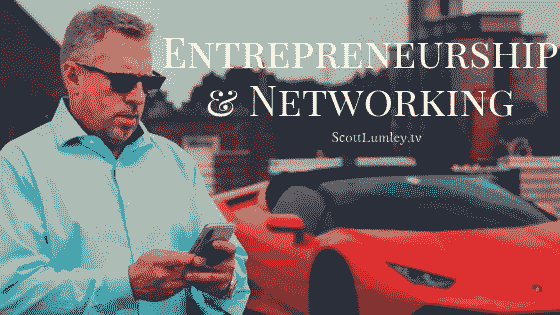

# 企业家精神和网络

> 原文：<https://medium.datadriveninvestor.com/entrepreneurship-and-networking-4e6ad1f3f71a?source=collection_archive---------37----------------------->

当我开始创业之旅时，我没有导师，也没有大型的支持系统。我犯了错误，并从错误中吸取教训，创造出我成功的方法。正因为如此，作为一名企业家和商人，我的部分目标是通过指导和资源帮助其他企业家取得成功。

**联网的关键**

当你完全独自做生意时，你肯定会犯错误。每个角落都有挑战，但与合适的人联系可以让这个过程更顺利一些。此外，[强大的专业网络](https://www.entrepreneur.com/article/299088)可以成为你实现整体业务目标的资产。

“这不是你知道什么，这是你知道世卫组织”不只是一个陈词滥调。这是商业中的真理。当你有一个很好的关系基础时，你可以直接接触到有影响力的人，他们可以成为各种业务方面的资产，从分享商业知识到扩大你的业务范围和机会。

关键是在人际交往中找到一个好的平衡。如果你不首先为他人的挑战提供你的价值，你就不能指望从与你的关系网中获得好处。当你证明你能带来一些东西时，你就更有可能培养有价值的互惠关系。

成功的人际网络不仅仅是在 LinkedIn 或脸书上拥有一个庞大的网络。在你建立了一个强大的人际网络后，这一切都是为了保持你的关系。不要只是更新你自己。注意你的职业关系和他们的成功/失败。当事情进展顺利时祝贺他们，并在适当的时候提供建议或支持。

**内圈**

因为我知道一个好的人际网络有多重要，所以我为希望发展业务的企业家们创建了自己的核心圈子。我提供一对一的指导、业务咨询、接触我的 A-Team、战略业务规划、获得法律顾问、与精英商务人士建立联系的机会等等。所有这些独有的好处都是为了帮助你实现梦想。

然而，内部圈子是一个排他性的团体，只对经过斯科特·拉姆利内部圈子同行审查的合格企业家开放。对于每年 25，000 美元的投资，认真的投资者有特权成倍地增长他们的业务。

我们提供一个为期两天的教育周末，在那里核心成员了解我的革命性软件，哲学，投资组合和更多。

如果你有兴趣了解我的核心圈子，请访问[我的网站](https://www.scottlumley.com/inner-circle/)并联系我们！或者在社交媒体上关注我开始对话。

*原载于*[*www . scottlumley . TV*](http://www.scottlumley.tv/entreprenuership/entrepreneurship-and-networking/)*。*