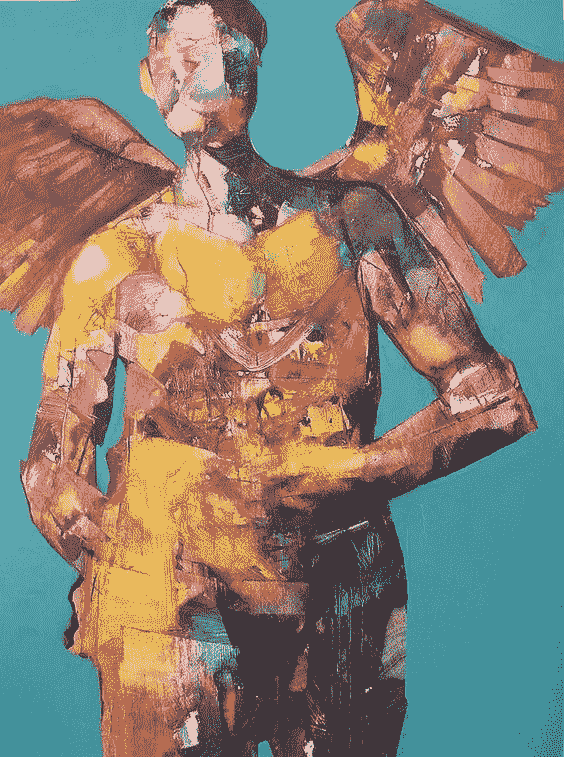
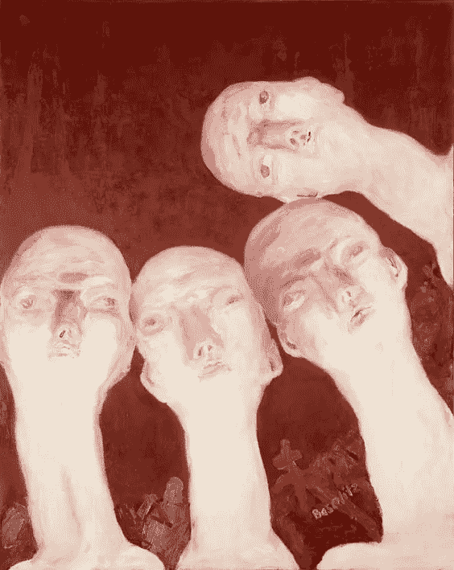

# 企业家精神

> 原文：<https://medium.datadriveninvestor.com/entrepreneurship-spirituality-c51f3be07b2f?source=collection_archive---------10----------------------->

## 商业如何给我们的生活赋予意义？

Angel Painting by Dan Boylan

作为一个企业主，企业家，经理或任何其他难以捉摸的定义，我给自己在我的日常互动和沟通，我总是非常投入的概念，资源利用创造财富。我毫不怀疑为社会福利创造财富的价值和必要性，但我对其充分性极为怀疑。没有一个企业主会后悔开发资源来创造更多的价值，但由于每个人的每一个行为都是有目的的，所以关键问题来了:“我们开发资源是为了自己的唯一享受吗？这种资源利用的道德极端是什么？”难道我们不是为了自己的利益而占用他人的时间、精力和能力吗？的确，每个人都故意选择不合作，但真的每个人都故意不选择吗？

我在组织中与许多效率不同的资源一起工作，我经常被告知，为了组织的利益，我必须摆脱那些效率较低的资源，但这难道不是我们对自己说的又一个谎言吗？一个虚构的身份，我们称之为组织，但如果没有妥协的人，组织是什么呢？不是为了组织，而是为了股东的利益，资源被开发，被衡量效率，如果需要，被踢出组织，这不是更真实吗？让股东受益显然不是不道德的。事实上，资本主义的基础是承担风险、接受支付运营成本并为企业发展带来动力的私人(即企业股东)的利益。但是深入观察我们人类所做的任何活动，很明显，我们做这些是为了填补整个时间中存在的空白。我们赚钱是为了能够做事和穿越时间。开采资源不是为了生存，是为了超越生存。埃隆·马斯克可能会将他的财富用于雄心勃勃的项目，这些项目在人类生活的发展中发挥着至关重要的作用，但他这样做是为了让自己的一生充满自我实现和有用的感觉。尽管任何成就都会使其他成就成为可能，并且从战略的角度来看可能是必要的，但所有这些成就的原因都很深，需要做些事情来度过这段时间，并在历史上留下指纹。我当时在这里，这给了我们意义。

 [## 在创业之旅中，拥抱学习|数据驱动的投资者

### 好像建立一个数百万美元的公司还不够困难，企业家必须额外照顾他们的…

www.datadriveninvestor.com](https://www.datadriveninvestor.com/2018/10/16/on-the-entrepreneurial-trek-embrace-the-learning/) 

因此，除了经营企业的主要目标——股东利益最大化之外，创办或经营企业的真正原因是让生活更有意义，至少对一些企业主来说是这样。因此，对一些企业主来说，重要的不是金钱和对拥有更多的执着。也许寻找意义才是重要的，因此组织本身没有身份，除非它是实现和创造存在意义的一种手段。

有没有可能假设一个企业主不太关心利润最大化，而更关心培养人际关系？有没有可能假设一个企业家更关心人的发展，同时自己赚钱并帮助他人赚更多钱？是一个领导者带领团队发展他们的能力，创造价值，赚钱来享受他们的生活，并共同使这种悲惨的无意义的存在，一个有意义的有价值的一生？对于这样的人来说，资源的效率意味着什么？计划的有效性意味着什么？那个企业主的失败和成功是什么？

我经常被批评过分看重精神信仰而忽视经典商业法则。对我来说，商业中经过验证的实践模式似乎并不必要，除非我发现它们有用，并且符合我对发展和人类社会繁荣的热情和渴望。任人唯贤很重要，也有激励作用，但优点不能仅以客观结果来衡量。我们是复杂的生物，我们中的一些人更有能力控制我们的内部过程，也更容易控制。谁会否认这样一种资源的价值，并且肯定这样一种资源应该有机会领导团队。但是，没有什么比这更贬低另一个人力资源的价值了，他可能在更好地控制内部过程方面能力较弱，但却更有生产力。这是人类社会的价值，它让每个人都有责任和参与，在辛苦工作的一天结束时，每个人都为创造价值感到高兴，从主观目标到真正的客观结果，除此之外，与一群人一起消磨时间，与他们分享他的感受、他的弱点、他的优势、他的悲伤、他的快乐、他的恐惧，在这个复杂的人际关系网络中，他发现生活是有意义的。创业不是赚钱的活动，是人生的一种精神修行。

Georg Baselitz, Oberon (1st Orthodox Salon 64 — E. Neizvestny), 1964\. Oil on canvas, 250 x 200 cm. Städel Museum, Frankfurt am Main. © Georg Baselitz, 2018\. Photo