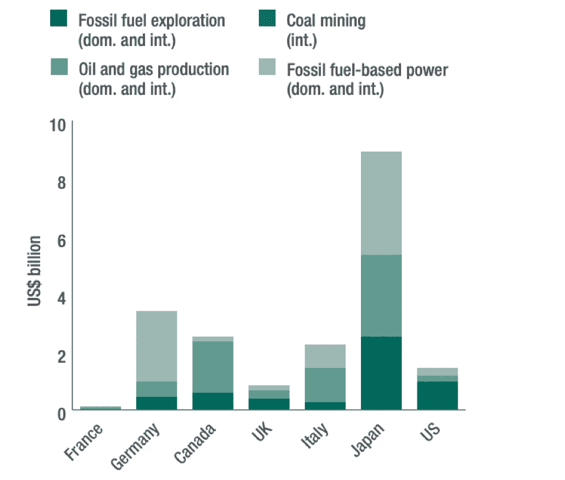
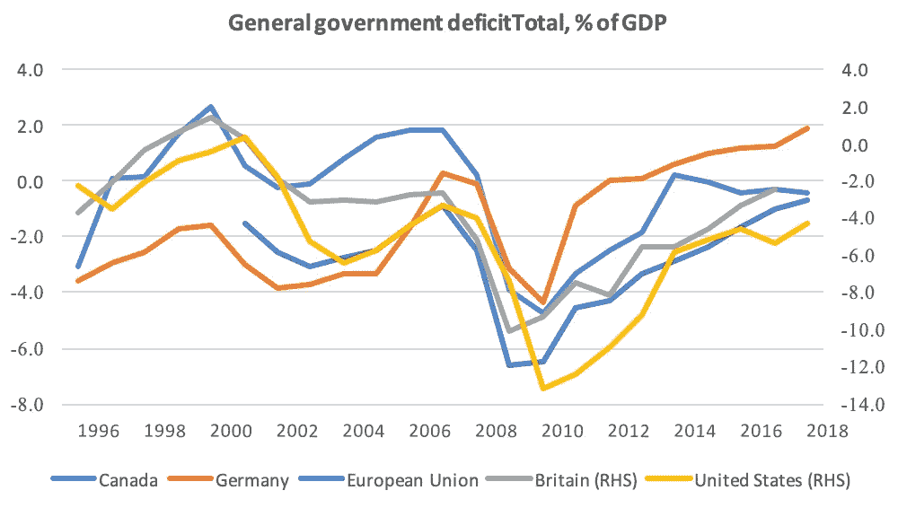
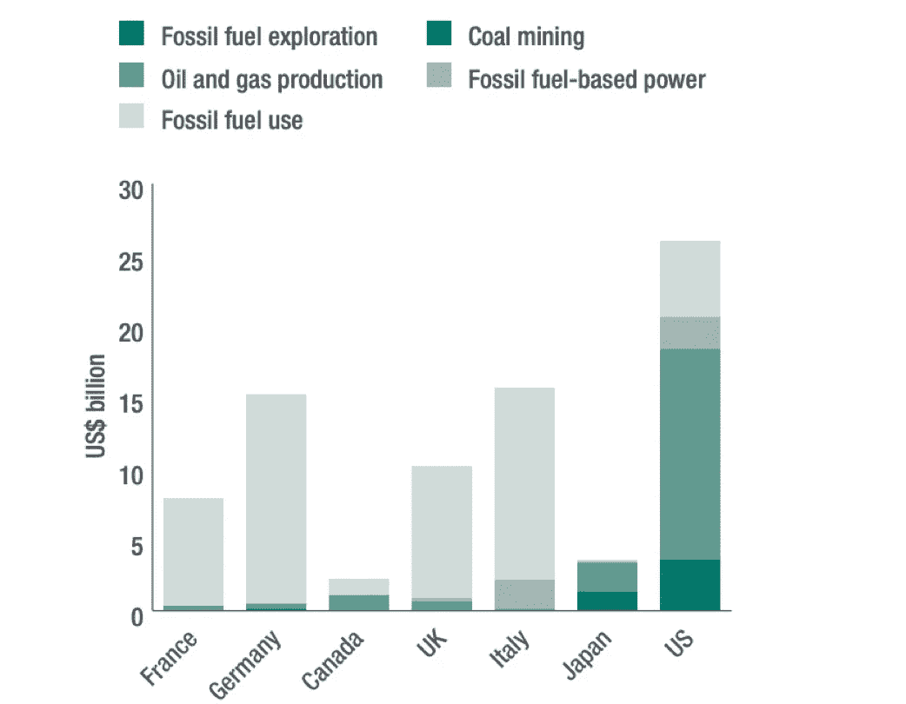

# 对环境有害的化石燃料补贴在经济上也适得其反！

> 原文：<https://medium.datadriveninvestor.com/environmentally-dangerous-fossil-fuel-subsidies-are-also-economically-counterproductive-c69a93c72b43?source=collection_archive---------5----------------------->

大气碳浓度增加的影响对供应链、资产价格、风险溢价和环境造成了长期的社会经济和生态损害。尽管有几个政府间小组和承诺，但最近亚马逊和加利福尼亚的野火以及意大利和英国的洪水表明，解决气候变化的人为原因缺乏紧迫性。

Source: [Mom’s clean air force](https://www.momscleanairforce.org/fossil-fuel-subsidies/)

一些公约、首脑会议和多边协定，如七国集团、《京都议定书》和《巴黎气候协定》,都重申了这些原则。本报告将调查补贴国内能源和勘探公司的经济上适得其反的政策，同时创建一个蓝图，以财政可持续的方式解决气候危机，同时提高宏观经济弹性并实现通货膨胀目标。

 [## 气候变化、ESG 和对更好数据的追求|数据驱动的投资者

### 在地球上许多地方经历了另一个令人难以置信的炎热夏季后，来自 S&P 的最新发现…

www.datadriveninvestor.com](https://www.datadriveninvestor.com/2018/08/24/climate-change-esg-and-the-quest-for-better-data/) 

政府间气候变化专门委员会(IPCC)对生物多样性和物种损失的详细分析清楚地表明，缺乏行动和政策惯性与破坏的规模相匹配。从私有财产的损失、流离失所、政府公共财政的新压力及其对经济增长的影响，气候变化的影响在新兴经济体和发达经济体都显而易见，从南苏丹、美国到英国的干旱。与此同时，对格林纳达等国的影响，将对其经济平衡产生持久影响。

> Henri Kouam 说，从商业、环境和社会的角度来看，采取更加协调的方法和逐步取消化石燃料行业融资的紧迫性同样是合理和紧迫的。

**需要更大的透明度，以便更好地理解补贴的影响**

尽管尽了最大努力来理解化石燃料补贴对环境、公共财政和长期经济增长的影响，但缺乏概述政府对碳密集型产业支持的信息限制了对其影响和旨在应对气候紧急情况的可能行动的理解。尽管退出并承诺逐步取消政府补贴，但德国等国政府定期报告财政支持情况，意大利推出了第一份有害环境补贴清单。这为它们实现巴黎气候协议中的国家目标设定了框架。与此同时，意大利、德国和美国承诺对其他国家的化石燃料补贴进行同行审查，以更好地理解政府的不作为，并促进以可持续和经济上有益的方式减少化石燃料补贴。这种结果将有助于向多边目标靠拢，认识到具体国家的因素，并允许出现一套与减少气候排放相一致的做法和项目。

尽管这在目前收效甚微，但它提供了一个路线图，指引 G7 经济体如何开始逐步取消有害环境的补贴，并将设计不当的激励措施转向更清洁的能源，从而带来积极的就业溢出效应。与此同时，英国否认提供任何补贴，但缺乏可核实的数据和对补贴构成的细微定义表明，对化石燃料行业的大力支持依然存在。因此，在政府造成的污染缺乏更大透明度的情况下，目前的净零排放目标和鼓励公民转向电动汽车的激励措施可能会被证明是徒劳的。这标志着在补贴问题上存在一定程度的政策惯性，但不采取行动将对环境造成破坏，从长远来看，对政府财政和绿色技术及能源供应商的创新步伐也会产生经济上的反作用。

***初创企业有利于减少碳排放***

英国政府必须确保处于气候转变中心的公司提供必要的专业知识，从锂离子电池存储(Acceleron 和 Gravitricity)，节约成本的家庭和电器(BBox)，匹配能源需求和供应(Upside energy)，灵活的天然气和电网(Bulb，Buffalo grid 和 Oxford PV)，同时 Verv 等公司可以帮助减少客户账单。此外，虽然政府应该依靠电子公司等公司，但可以引入区块链技术，以更好地了解供需平衡，同时利用 Igloo Energy 等公司来提高客户家庭的效率。

***图 1: G7 对化石燃料的公共财政(2015 年和 2016 年年均)***

Source: Whitley et al 2018

如图 1 所示，大多数 G7 政府向化石燃料公司提供大量支持，以燃料为基础的电力和油气生产受益于大部分政府补贴。由于没有记录补贴的全部范围，很难让他们自己对实现逐步取消政府补贴的承诺负责(*见图表，注:煤矿开采的规模太小，无法在该图中直观地表示出来*)。更令人担忧的是煤炭，它仍然是最大的温室气体排放者，但如果从化石燃料向风能和太阳能的过渡突然发生，它也会增加长期的结构性失业。G7 政府应该将化石燃料补贴转移到一个绿色基金中，该基金将提供失业保险，支持积极的劳动力市场政策和失业保险，以减少气候变化带来的社会经济影响。

***政府税收的很大一部分被用来补贴化石燃料工业***

政府收入的很大一部分用于补贴化石燃料工业；放弃政府收入(财政激励和税收支出)、价格收入支持和直接资金转移(赠款、股权注入和预算转移)。未能概述支持的类型和水平，减少了问责制，并对政府处理破坏环境的支出的方法提出了很少的治理建议。

***缺乏透明度降低了气候友好项目的影响***

如果政府继续补贴温室气体，管理从化石燃料公司的过渡是一项挑战，政策制定者可能不了解政府的不作为和补贴在多大程度上抵消了减排的进展。更令人担忧的是，英国的年度产能市场因歧视低碳选项、推迟燃煤电厂退役和高估未来供应需求而受到批评。

逐步取消补贴是可能的，因此应该被夸大。

对化石燃料行业的补贴不仅在环境上代价高昂，而且对于一个即将向英国退出欧盟投入大量资源(应急计划和公共投资)的政府来说，在经济上也会适得其反。他们应该关注环境政策，反映问题的规模和紧迫性，解决潜在的就业替代问题，并通过设计在全球范围内激励创新和竞争力的补贴来增强绿色部门的竞争力。此外，很少有人强调如何转移目前的化石燃料补贴，以解决油田和煤厂关闭可能带来的就业冲击。

这种准备不足将加剧欧盟内外国家当前的去工业化和地区不平等趋势，而流离失所将进一步分化政治话语，最近特朗普和英国退出欧盟的经历表明了这一点。这一点尤为突出，因为准备最少的国家最容易受到影响，正如我使用收益指数****所论证的那样。与此同时，G7 所有其他成员国目前都存在财政赤字，如果金融衰退给政府财政带来新的压力，这种状况不太可能改善。****

**

*Source: [OECD](https://data.oecd.org/gga/general-government-deficit.htm)*

*如下图所示，除德国之外，大多数 G7 国家政府目前都存在财政赤字，向绿色能源的突然转型将给已经捉襟见肘的公共财政带来新的压力。诚然，大多数发达经济体的利率都很低，这应该为政府借贷和投资风能和太阳能发电场提供了充足的空间，但这必须辅之以旨在支持这种转型对劳动力市场影响的谨慎政策。*

*尽管财政平衡紧张，但补贴依然存在*

*与此同时，德国和法国也向国内外的化石燃料公司提供补贴。与此同时，英国和日本为煤矿开采和化石燃料发电提供补贴，从勘探到生产，英国提供的补贴最多。即使 G7 国家逐步取消对化石燃料行业的国内支持，对国际勘探的支持也与巴黎气候协议背道而驰，并将抵消任何旨在应对气候变化的国内政策的环境收益。*

****气候变化需要全球共识和全球解决方案****

*发达经济体在减少碳排放方面的任何进展，无论多么不温不火，都将被气候监管制度较弱的发展中经济体不断增加的排放所抵消。在缺乏新的气候技术和基础设施融资存在巨大缺口的情况下，这一趋势将得到特别强化。例如，法国正在莫桑比克提供化石燃料勘探，而一家提供浮动太阳能电池板的法国公司“Saft”支持中国的绿色能源计划和向清洁能源的过渡。*

*同时。马克龙总统最近主张取消对污染企业的补贴。这不仅将补充巴黎气候协议，还将使广告、融资和发展计划的重点转向更清洁的能源供应商。化石燃料补贴对政府财政平衡的负面经济影响不能低估；这无意中增加了资本的不当分配，因为用于补贴的资金可以更好地用于支持气候变化、纠正区域不平衡和为气候技术和能源创造新的市场。*

****图 2:图 2 G7 对化石燃料的财政支持(2015 年和 2016 年年均)****

**

*Source: Whitley et al*

***正在取得一些进展***

*对化石燃料使用的支持不成比例，这降低了建设基础设施以支持向更清洁能源过渡的动力。所有这些都发生在 G7 和 G20 承诺从 2009 年开始逐步淘汰化石燃料的背景下，意大利、法国、加拿大和英国承诺在 2023-2030 年间停止煤炭生产。与此同时，法国没有发放新的原油生产许可证，并希望在 2040 年前停止生产，这是巴黎气候协议中规定的减少碳排放的可靠方式。类似地，苏格兰、德国、威尔士和法国已经禁止了水力压裂法；如果这些国家要像 G7 和其他多边倡议所重申的那样，可信地减少碳排放，其他国家也必须效仿。*

*如图 2 所示，对化石燃料公司的财政支持仍然很高，尽管除德国之外的大多数 G7 国家目前都存在经常账户赤字。英国目前为英国退出欧盟应急计划和债务推动的公共支出拨款 64 亿英镑，为化石燃料公司提供补贴将削弱政府支持不可避免的气候变化的能力，并减轻就业冲击。*

****在缺乏积极的劳动力市场计划的情况下，将会出现就业冲击****

*诚然，化石燃料行业将会失去一些工作，但风能和太阳能行业将会创造出新的、技能更高的工作岗位。为此，支持和鼓励再培训的积极的劳动力市场政策不仅是必要的，而且意味着更好的经济规划和务实。包括英国在内的 G7 政府应该逐步取消补贴，并为此建立一个能源过渡基金，而不是促进纳税人出资补贴那些对社会经济有负面影响的生态危险企业。这些不仅能让政府实现可持续发展目标(SDG)和巴黎气候协议，还能通过为生产绿色能源和技术的公司创造市场来促进全球能源转型，并通过促进国内市场的创新和竞争来降低绿色技术的价格。*

****国内解决方案最终支持急需的应对气候变化的全球方法****

*全球协调应对气候变化的原则被广泛认为是正确的。但这种方法的成功取决于 G7 经济体的国内环境和补贴政策，以及对绿色产业公司发展的支持。为了支持向电动汽车(ev)的过渡，英国政府拨款目前支付购买价格的 35%，最高可达 3，500 英镑。与此同时，英国和法国政府也预计到 2040 年禁止汽油车。尽管取得了这些值得称赞的成就，但没有一个 G7 国家做出结束石油和天然气公共财政的具体承诺，这表明了对 2015 年签署的巴黎气候协议的承诺水平，该协议旨在防止全球气温上升超过 1.5%。为此，对化石燃料的财政支持和公共财政从 2015 年的 50 亿美元增加到 2016 年的 70 亿美元，这与里程碑式协议的预期背道而驰。*

****超过 50%的财政支持用于补贴化石燃料产业****

*与化石燃料消费补贴主要是新兴市场和发展中国家面临的挑战这一说法相反，Whitley 等人(2014 年)的研究发现，G7 中 64%的总财政支持是针对化石燃料使用的。这包括大力支持运输(260 亿美元)、工业(90 亿美元)、家庭(110 亿美元)和其他部门(50 亿美元)使用化石燃料。虽然其中一些补贴在中短期内减少了家庭消费的增长，但取消补贴将带来更大的调整成本。为了保护消费者的购买力，绿色能源转型的理由从未如此清晰。*

*如果逐步取消补贴的环境理由不明确——至少对气候变化怀疑论者来说——那么经济理由是最有说服力的。亨利·库安 *

****人口老龄化，更高的财政赤字标志着应对气候变化的紧迫性****

*大多数 G7 国家政府目前都有赤字，如果发生危机或其他外部冲击，赤字可能会扩大。通过维持对化石燃料补贴的支持，赤字可能会在未来几年扩大，削弱政府有效应对下一场危机的能力，尽管利率处于创纪录低点。此外，大多数发达经济体的人口老龄化将给政府公共财政带来巨大压力，降低政府应对气候紧急情况的能力，并导致大量失业。*

*在这种情况下，政府将面临财政紧张，进一步限制其支持向风能和太阳能等更清洁能源转型的能力，同时为失业保险和积极的劳动力市场计划提供足够的支持以减轻劳动力市场冲击。*

****推迟气候转变意味着显著的就业冲击和更高的大气碳浓度****

*在缺乏足够的财政空间的情况下，突然转向更清洁的能源将导致更大的就业冲击，并可能恶化已经存在的政策惯性，这一问题一直困扰着大多数 G7 政府，它们也是巴黎气候协议的签署国。与其简单地逐步取消化石燃料补贴，不如用以前发放的补贴建立的气候过渡基金直接支持职业培训和学徒计划，提供工资补贴，支持绿色技术和企业。如果政府不采取措施减少化石燃料消费的刺激，亚马逊和大堡礁的困境怎么强调都不为过。*

****降低利率和限制补贴可以促进能源转型****

*能源转型不仅会减少空气、水和土地污染(这一点正变得越来越重要)，还会防止转型放缓和持续补贴带来的环境、经济和社会影响成为现实。此外，这将减少未来政府支出的压力，从而避免未来限制政府支出的必要性。较低的利率确实有利于增加政府支出，但较高的债务水平却抑制了潜在增长率。因此，如果要实现气候变化的积极溢出效应，政府必须尽早取消化石燃料补贴。*

*最后，有组织的、姗姗来迟的远离化石燃料的转变将让更具竞争力的清洁能源和技术出现。更重要的是，这将把英国工业置于国内和全球能源转型的核心。这将降低消费者的价格，促进新产业的出现，在沿海和工业城镇创造就业机会，改善国家对市场的出口，如正在经历绿色革命的中国，以及其他新兴市场，如印度、巴西、南非和肯尼亚。如果气候转变的环境理由不明确——对怀疑论者来说——转变的经济理由从未如此清晰和紧迫！*

***参考列表。***

1.  *。G7 化石燃料补贴记分卡:跟踪石油、天然气和煤炭财政支持和公共财政的逐步取消(2018 年 6 月)。希拉·惠特利、陈晗、亚历克斯·多卡斯、伊佩克·根苏、艾薇塔·格拉西姆丘克、亚尼克·图切特和利亚·沃拉尔*