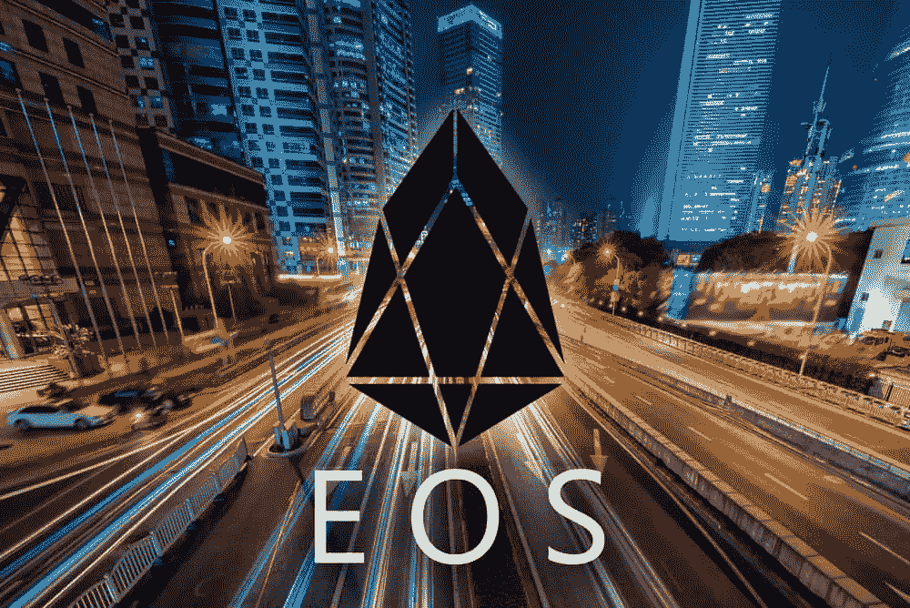
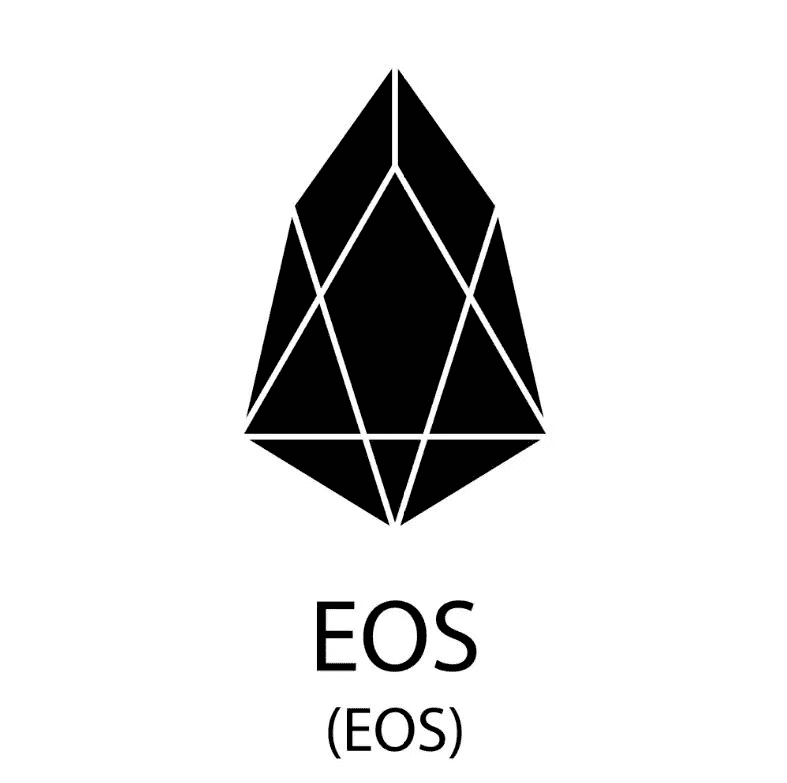

# EOS |解释

> 原文：<https://medium.datadriveninvestor.com/eos-explained-9dbc83b47ea8?source=collection_archive---------5----------------------->

# EOS 概述

EOS 是一个用于分散应用程序(dApps)的开发平台，它看起来接近于一个操作系统，因为它模拟了一台真实的计算机:硬件(CPU + GPU)用于处理，内存(local/ RAM/ HDD)用于存储和软件，平均分布在 EOS 持有者之间。

EOS 是一个区块链协议，旨在为分散化的应用程序运行一个智能合约开发平台，具有快速、高度可扩展(每秒数千和“潜在数百万”的交易)和几乎免费(对用户而言几乎为零的交易成本和费用)的优势。

基本上可以看出 EOS 的相似之处。IO 到区块链上的操作系统，允许开发人员在其上创建应用程序。

EOS.IO | Video

# EOS 创始人

软件 EOS。IO 由开曼群岛公司 [block.one](https://block.one/) 创立，但其员工遍布全球。

丹尼尔·拉里默是 block.one 的首席技术官，他也参与了 BitShares 项目的开发(作为创始人)。

EOS.IO

# 解决方案

EOS 是一个区块链，也是一个支持 dApps(去中心化应用)智能合约的基础设施，并试图解决早期区块链到 ***变得高度可扩展****的一个严重的根本问题。*

*它的软件对于运行 [dApps](https://dappradar.com/) 的目标来说可谓非常强大。区块链的基础是加密货币 EOS。*

# *优势*

*与其他智能合约平台(例如以太坊)相比，EOS 的主要优势在于其可扩展性和灵活性。*

*此外，在 EOS 中创建的应用程序。IO 生态系统对用户来说看起来非常相似，类似于集中式应用程序，但具有分散式应用程序的所有优点。*

# *不足之处*

*根据[白皮书](https://github.com/EOSIO/Documentation/blob/master/TechnicalWhitePaper.md)的说法，依我拙见，相对于所取得的成果，估值可能*相对较高。**

**此外，我不是 100%确信[记录的](https://github.com/EOSIO/Documentation)行动的专业性。**

****

**EOS.IO | Logo**

# **筹集的资金**

**EOS 通过其始于 2017 年 6 月的 ICO 筹集了超过 40 亿美元的资金，这是迄今为止筹集资金最多的 ICO。**

# **价格影响**

**在过去 3 个月中，EOS 货币的 BTC 和美元价格相对稳定，目前(协调世界时 12/11/18 13:00)价值 [$5.41](https://bloks.io/) 或 BTC 0.00084566 (=1/1183)，市值接近 50 亿美元，流通供应量约为 9 亿 EOS 硬币。截至昨日，EOS 已成为 T2 第六大加密公司(根据其市值，基于发行量)。**

**EOS 的总市值是以太坊的 1/4 左右，如果把两个平台直接对比的话。对于 EOS，我个人认为使用 ETH(而不是 BTC 或美元)作为“基础”货币是很有用的，无论是基本面分析还是技术面分析。**

**对于一个典型的精通技术的长期 hodl 投资者来说，EOS(和以太坊)的主要和第一驱动力是监控平台的当前和预测的未来可用性。回报(严格来说是价格的上涨)与基础设施的增长和生态系统的发展之间有很强的(几乎是线性的)相关性。这将推动长期价格，而不是以美元表示的技术图表。**

# **竞争**

**EOS 的一个主要直接竞争对手是以太坊，以太坊在 2017 年和 2018 年是区块链上所有去中心化应用的主要竞争对手，未来几年仍将是。有些人肯定会同意以太坊不是最人性化的系统，而且它还收取交易佣金。但与 EOS 相比，以太坊已经运行了很长时间，它比 EOS 或其他任何东西都要大，并且仍处于非常快速的增长阶段，复合年增长率高达数百%。**

**卡尔达诺和尼奥也可以认为是竞争对手。**

**Cardano 是一个去中心化的公共区块链和加密货币项目，它是完全开源的，并在其区块链运行名为 Ada 的加密货币。该平台基于安全的利害关系证明算法(名为 Ouroboros)，该算法消除了对耗能的工作证明协议的需要，这部分解决了可扩展性问题。Cardano 的目标是成为一个先进的智能合约平台。**

**NEO 也被称为“中国的以太坊”，包括区块链和加密货币，旨在创建“智能经济”。**

**NEO 将“智能经济”定义为**

*   **数字资产(以二进制格式存在并拥有使用权的任何东西)；加**
*   **数字身份(计算机系统用来代表外部代理的实体信息)；加**
*   **智能合同(自动合同=自动执行，代码中写有特定指令，在特定条件下执行)。**

# **EOS 备选方案**

**考虑投资 EOS 的投资者可能会密切关注以太坊，其次是 Cardano 和 NEO。**

**以太坊 估值更高，潜在的上行和可扩展性问题更少，但以太坊的优势在于:已经在工作的平台、庞大的社区、至少在未来几年内用户群的强劲和健康增长，以及潜在的更小的下行波动/风险。**

*****NEO 的*** 强的一面还在于它与当地市场有着非常好的联系，包括在中国极其重要的监管。**

*****卡达诺*** 则相反，有着非常远大的路线图、极其雄厚的学术基础和相对更高的风险/潜力以及最终更长的持有期/投资期限。**

****