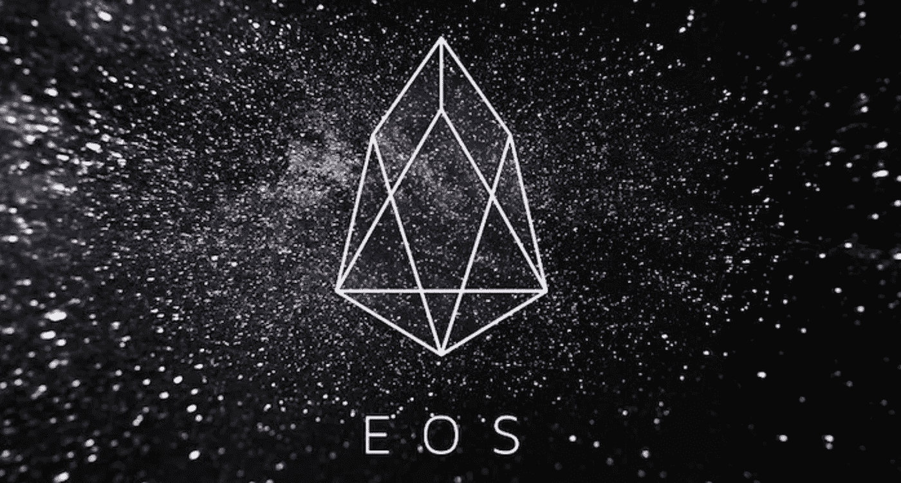

# EOS 过于简化:EOS 初学者指南。IO 加密货币

> 原文：<https://medium.datadriveninvestor.com/eos-oversimplified-a-beginners-guide-to-eos-io-cryptocurrency-4b1ee4465736?source=collection_archive---------9----------------------->

# 什么是 EOS？

EOS 是一个使用区块链技术开发分散应用程序(dapps)的平台，在功能上非常类似于以太坊。事实上，支持者们把它戏称为“*以太坊杀手”*。通过提供一组类似操作系统的服务和特性供 dapp 使用，它使得 dapp 开发变得非常容易。

EOS 背后的整个想法是将现有的许多智能合约技术(例如以太坊的计算支持、比特币的安全性)的最佳功能和承诺结合在一起。简而言之，EOS 团队正致力于为日常用户提供一个大规模可扩展的、简单易用的平台。

# EOS 的创建:

Block.one 是 EOS 产品背后的公司。该公司由 Dan la rimer(stee MIT 和 Bitshares 的联合创始人)和 Brendan Bloomer 领导。他们两个在加密市场都非常有经验，并且是整个技术的巨大支持者，不仅仅是他们自己的 EOS。

EOS 的创建分为三个阶段，第一个阶段是在 2017 年 9 月 14 日的“EOS Dawn 1.0”，第二个阶段是在 2017 年 12 月 4 日的“Dawn 2.0”，其发布带来了资源跟踪和区块链之间的通信，最后一个阶段(项目的正式启动)发生在 2018 年 4 月的“Dawn 3.0 发布”。

# EOS 是如何工作的？

他们的愿景是创建一个区块链 dapp 平台，该平台能够安全平稳地扩展到每秒数千笔交易，同时为企业家、应用程序开发人员和用户提供可访问的体验。他们的目标是通过提供云存储、用户认证和服务器托管，为分散的应用程序提供一个具有完整操作系统的平台。

# EOS 令牌和交易:

EOS 的加密销售是独特的，自成一类。它从 2017 年 6 月 26 日开始，历时一年多，有 350 个分发周期。在每个周期结束后，根据贡献者贡献的乙醚量除以总贡献量，将为该时间量指定的代币总数分配给贡献者。

当这一切发生时，几乎所有的主要交易所都上市了 EOS 代币。因此，主要是市场决定价格。这向所有对令牌感兴趣的人开放，让他们可以购买令牌，并在投稿前有相当多的时间观看 EOS 团队的开发和进展。其结果是迄今为止最有利可图的代币销售之一，同时代币有了很大的增长。

EOS 令牌本身不执行功能。它的唯一用途是供在 EOS 平台上开发应用程序的开发人员使用，他们必须使用令牌来生成他们特定的应用程序令牌。此外，每个应用程序在平台上的接受程度取决于令牌持有者的投票。

**我们，****[bidi tex](https://medium.com/u/69c756317aa9?source=post_page-----4b1ee4465736--------------------------------)团队，每天发布有关其新闻的加密相关文章，每周市场回顾和信息性文章。**

***如果您想了解更多，请访问 BIDITEX 页面并提出您的问题，关注我们的*[*Twitter*](https://twitter.com/biditex_com)*，* [*脸书*](https://www.facebook.com/biditex/) *，* [*中型*](https://medium.com/@biditex) *，* [*电报*](https://t.me/biditex%20%28edited%29) *等。投标变更用* [*投标变更用*](https://medium.com/@biditex/biditex.com) *。***

*****引文:*****

***什么是 EOS？|你应该知道的一切。(2018 年 10 月 31 日)。*[*https://coincentral.com/what-is-eos/*](https://coincentral.com/what-is-eos/)**