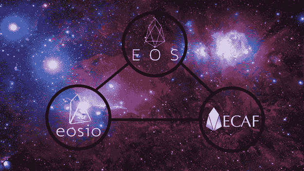
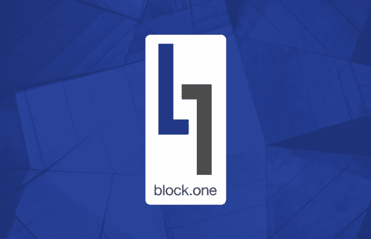

# EOS:麻烦来了？解释了当前治理的状态

> 原文：<https://medium.datadriveninvestor.com/eos-trouble-on-the-horizon-state-of-current-governance-explained-4b4f16bd6a41?source=collection_archive---------2----------------------->

EOS 的未来会有麻烦吗？这很可能是一个问题，因为 ECAF 提到 EOS 核心仲裁论坛，最近宣布冻结据称属于窃贼的 EOS 账户，这些窃贼通过网络钓鱼和诈骗攻击欺骗用户窃取资金。然而，这一行动和 ECAF 的总体立场在 EOS 群体中引起了很大的不适。因此，EOSIO token 的创造者 BlockOne 首席技术官丹·拉里默(Dan Larimer)提议对现行宪法进行彻底改革。然而，这一要求将削弱仲裁员的权力，如 ECAF，对影响网络的决定。这些发展给 EOS 带来了更多的问题，自从他们的官方 mainnet 整合以来，EOS 已经经历了非常动荡的几个星期。

# EOS 概述

EOS 最初基于以太坊网络，是一个用于开发和执行分散式应用程序(DApps)的区块链平台。它旨在通过提供对允许企业和个人创建区块链应用程序(非常类似于基于网络的应用程序)的功能的完整支持，来解决开发这种 Dapps 的困难。EOS 服务的一个主要例子类似于谷歌的 Play Store 和苹果的 App Store。

EOS 的目标是实现即时交易和极大的可伸缩性。

➡️By 强调分散化是其安全的关键点，EOS 旨在解决区块链的“三连胜”问题:安全性、可伸缩性和速度。

➡️This 将对加密货币交易者具有强大的吸引力，因为三连胜的改善可以极大地提高 EOS 令牌的流动性。

# EOSIO 1.0 版本

EOS 最近完成了为期一年的代币众筹，共筹集了 40 亿美元，成为迄今为止最大的 ICO。紧接着，他们的平台——EOS io 1.0 发布了，标志着项目未来的一个重要点。在发布之前，参与基于 EOS 以太坊的令牌销售的用户需要参与令牌交换，以获得本地 EOS 令牌。该项目目前是市值排名第五的最有价值项目，估值为 61 亿美元。[火币平台](https://www.huobi.br.com/en-us/topic/invited/?invite_code=da523)目前允许用户与包括 USDT、BTC、ETH 和 HT 在内的各种配对交易 EOS，供那些想要购买 EOS 令牌的用户使用。

除了这个功能，Huobi 还有他们自己的每周 [YouTube 节目，Huobi Talk](https://www.youtube.com/watch?v=5kXX9WAGiQc) ，其中目前的嘉宾包括 7 位 EOS block 制作人，他们帮助澄清 EOS 目前的事态。

# ECAF 问题

EOS 的治理结构目前分为三个不同的群体——大宗商品生产商、仲裁者和代币持有者。他们代表任何被治理系统的行政部门、选区和司法部门。如果网络出现争议，ECAF 负责解决问题。

治理危机始于努力阻止几起盗窃案；6 月 17 日，21 家 EOS 大宗生产商冻结了 7 个 EOS 账户。虽然这似乎是一个合理的举措，但对宪法和 EOS 当前治理的影响可能是深远的。区块生产商在决定这一行动过程时并没有进行仲裁，而是与他们进行了磋商。这是一个明知违反宪法的决定。EOS 章程第九条规定:

> 由本章程引起的或与本章程有关的所有争议应根据国际商会的仲裁规则，由根据上述规则任命的一名或多名仲裁员最终解决。

最初的问题被委托给 ECAF，该机构最初辩称自己没有管辖权，因此拒绝做出裁决。但是 ECAF 后来在 6 月 19 日发布了一项追溯命令，允许大宗商品生产商冻结账户。

# EOS 纽约拒绝 ECAF 授权

更糟糕的是，6 月 22 日，ECAF 下令冻结另外 27 个账户，并将在晚些时候陈述他们的“逻辑和推理”，但基本上没有为他们的行动提供任何官方理由。随后是另一个命令，似乎要求某些地址的令牌被撤销，但这个命令被证明是假的。这在社区内造成了严重的紧张局势，因为许多人在社交媒体上抱怨 ECAF，有些人发起了彻底消除 ECAF 的运动。

因此，在这一片疯狂中，EOS New York 做出了一个重大决定，即在他们能够确定 ECAF 的真实性之前，它将驳回任何 ECAF 的决定，或任何声称是这样的决定。该小组指出:

> “由于 EOS New York 无法以透明和安全的方式在链上验证 ECAF 的任何后续意见，我们无法放心地执行任何声称是 ECAF 意见的声明。一旦可以在链上建立通信，以便纽约 EOS 和机构群体都能对其进行审核，我们将恢复正常处理。”

EOS New York 声明进一步解释了 EOS 网络内部对 ECAF 的巨大误解，并包括对 ECAF 的建议，例如:

➡️Maintaining 有一套解决争端的规则

➡️Maintaining 有一个独立于 ECDR 且信誉良好的仲裁员数据库

➡️Assisting 索赔人从申请到结案的仲裁行政事务。

# BlockOne 试图建立新宪法

由于 ECAF 的这些行动，BlockOne 的 Dan Larimer 主张制定一部全新的宪法。他提议改变 EOS 章程，通过为砌块生产商建立新的投票系统来结束武断的决定。EOS 提出，Constitution v2.0 将终结协议级仲裁命令，从本质上剥夺 ECAF 的权力，并将其限制在特定的智能合同中:

> “Block.one 建议终止所有协议级仲裁命令，而不是对代码的意图提出不具约束力的意见。我们认为，选出的区块生产商应该是陪审团，必须做出 2/3+1 的决定来改变一份破裂的合同。”

拉里默在他题为“守则的意图是法律”的文章中强调了守则在区块链作为“法律”的重要性，以及这应该如何成为仲裁员的首要重点。BlockOne 提案对区块链接受的交易表明了明确的立场，强调诉诸仲裁的任何关于签名有效性的争议都会引发更多问题，而不是解决更多问题。拉里默继续指出:

> “我们已经看到，如果你给人们专断的权力来解决专断的争端，那么一切都会变成争端，所做的决定也是专断的。仲裁者的权力越大，争端就变得越恶毒、越琐碎，结果也越不可预测。”

拉里默指出，由于某些用户要求包含特定条款，该平台的李嘉图合同，即“自由形式和代码条款”的组合，正在引起争论。他陈述了客观界限的需求，这种客观界限有助于用户感到安全和有保障。

> “如果区块链的一切都受制于暴民统治，那么没有人是安全的。如果社区没有强有力的、客观的、有组织的原则，那么一切都受制于解释，变得不可预测和武断。”

# 未来的智能合同仲裁

在可预见的未来，拉里默建议用户选择智能合同，如果他们希望看到当选的区块生产商和/或 ECAF 保护他们的利益。这将导致区块生产商和/或 ECAF 被赋予权力，合同必须明确规定他们在执行所述合同时拥有的权力。这样做是为了避免进一步的与集中化相关的争议。李嘉图公司的合同必须明确规定仲裁程序，该程序将完全由《守则》强制执行。

# EOS 的未来

**我的**个人意见是，毫无疑问；目前的 EOS 形势是混乱的。本来应该是一个简单的 mainnet 集成，然后价格上涨，但结果并不像预期的那样。这并不是说它不会在不久的将来发生，但是在这种治理情况得到解决之前，该项目在可预见的未来可能会被搁置。

可以理解的是，社区对这些最新发展有着强烈的反应。支持者最初很高兴采取措施根除对 EOS 区块链的不良影响；这是我最初的想法。但是，当一个集团，无论是大宗商品生产商还是 ECAF，拥有单方面行动的权力时，EOS 怎么能成为权力下放的拥护者呢？从本质上讲，这是其核心的集中化，并回避了 EOS 实际上有多分散以及它是否真的不可信的问题。是什么阻止了砌块生产商再次以这种方式行事，尽管宪法没有授权这样做？一位用户将它与 Ripple 等集中式项目进行了比较:

另一位用户评论了这一程序的缺陷:

我真的相信，对于 EOS 的所有意图而言，目前的治理状态过于集中，权力过于集中于区块生产商和 ECAF 等其他参与者。这导致了潜在的滥用和腐败。虽然我觉得丹·拉里默试图重写宪法确实有所帮助，但这将是有问题的，因为它与 EOS 宪法背道而驰。直到 EOS 开发出一个实际上完全去中心化的系统，类似于比特币，最近的争议将会重复，并阻止 EOS 真正以它力所能及的方式爆发。

*如果你觉得这篇文章很有用，并且想看我的其他作品，请一定鼓掌并关注我的* [*中的*！](https://medium.com/@salmanmiah) *😎*