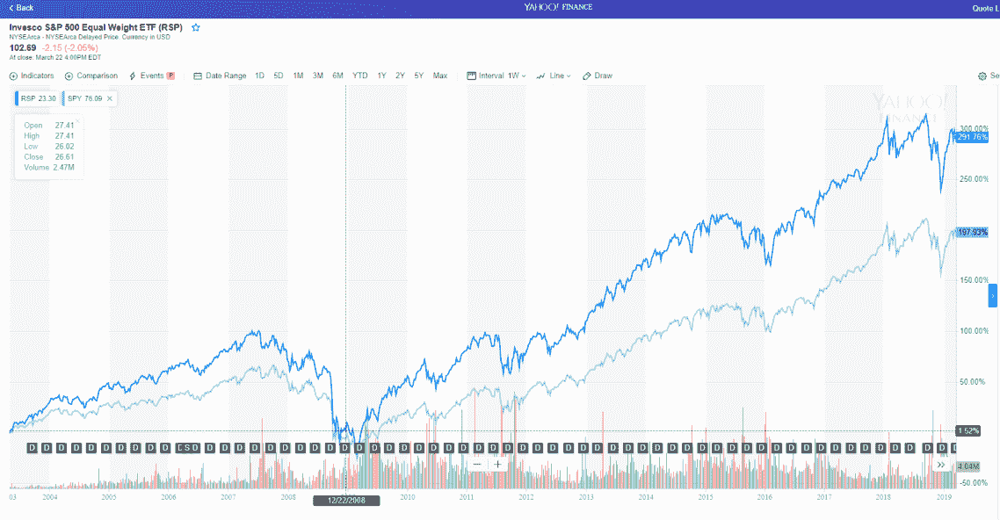

# 等权重 ETF 跑赢？

> 原文：<https://medium.datadriveninvestor.com/equal-weighted-etfs-outperform-1ee52286aac8?source=collection_archive---------12----------------------->

等权重股市指数跟踪基金是否优于常规市值加权基金？

我们中的大多数人都无法在投资中战胜给定的股票市场指数。从长期来看，这包括大多数(如果不是全部)专业基金经理。

如今，我们很幸运地拥有了一条投资指数跟踪基金的廉价而简单的途径，但传统上，大多数指数都是按市值加权的。

这意味着，像标准普尔 500 这样的指数和像 SPY(SPDR 标准普尔 500 交易所交易基金)这样的指数追踪器由美国最大的公司主导，如微软、苹果、脸书、亚马逊和谷歌，它们各自占该指数的 3%至 4%。这些公司目前占标准普尔 500 的 15%以上。

这一切都很好，但最终大公司会停滞不前。他们耗尽了成长的空间。没有什么东西会永远上涨或继续呈指数增长。

在指数的底端，一家公司可能只占指数的 0.02%。该指数的加权中值为 0.086

因此，成长型公司的代表性大大不足，因为它们规模小，但可能比巨人有更大的增长潜力。

当你看等权重指数时，这些指数试图在一个指数中的每家公司投资相同的金额:换句话说，标准普尔 500 的每家公司将获得 0.2%的权重。

上图是景顺标准普尔 500 同等权重 ETF (RSP)与遵循传统市值权重的 ETF——SPDR 标准普尔 500 ETF (SPY)的对比。

请注意，自成立以来，等权重 ETF 的表现明显优于大盘。根据 Yahoo Finance 提供的信息，自 2003 年 4 月以来，每个公司都实现了以下股息再投资复合年增长率:

这种基金或它的算法没有什么特别奇特的地方。但也要意识到，至少从历史上看，你用“同等权重”可能比用“市值权重”做得更好。

在美国交易所交易的等权重 ETF 有 109 只。在英国，有许多等权重 ETF，如 Db X-trackers FTSE 等权重 UC its(xfill)。对于那些想去更远地方冒险的人来说，或许 Ossiam STOXX Europe 600 Equal Weight NR UC its ETF 值得一看。

毫无疑问，你将能够找到覆盖更多市场的许多其它同等权重的 ETF。

*原载于 2019 年 3 月 24 日*[*【http://anthonygarnerinvestments.com】*](https://anthonygarnerinvestments.com/2019/03/24/equal-weighted-etfs-outperform/)*。*