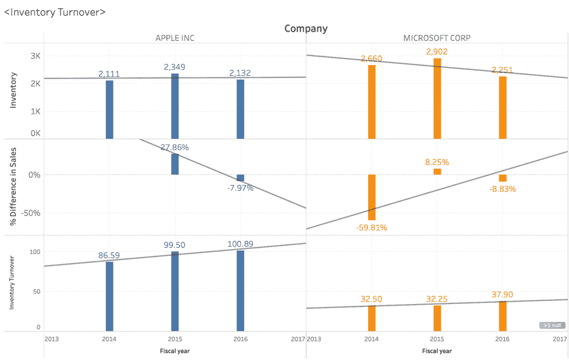
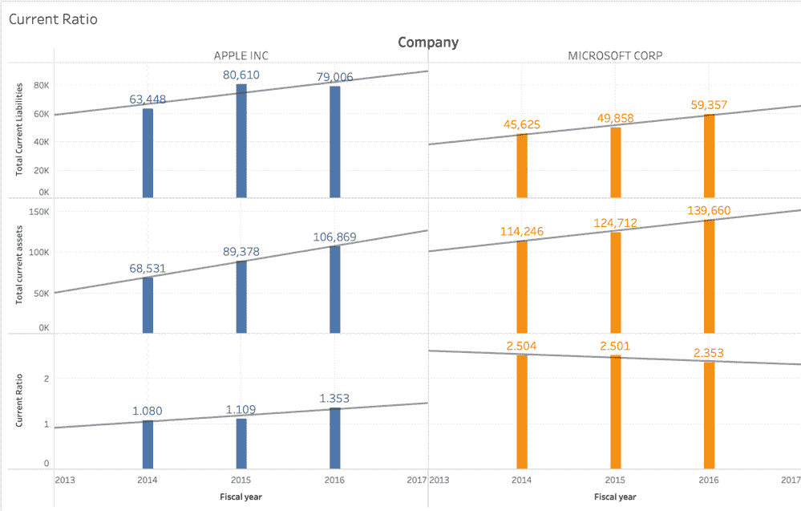
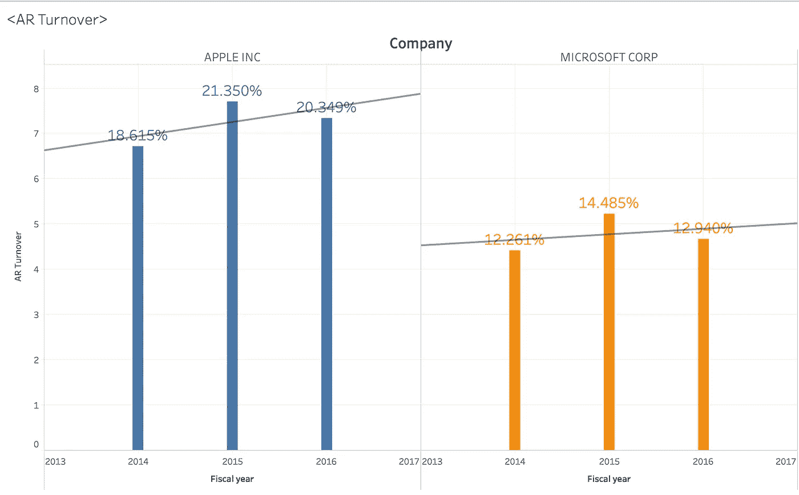

# 对于苹果和微软的股票投资者来说

> 原文：<https://medium.datadriveninvestor.com/equity-investor-for-apple-and-microsoft-15a39bab037d?source=collection_archive---------17----------------------->

根据上面提到的苹果和微软三年的库存周转率，苹果的库存会变得更高。然而，销售额的年度变化可能表明苹果公司的库存可能会减少，以最大限度地降低其固定存储成本。苹果增加了 2015 年研发新产品的费用，2015 年第三季度 Apple Watch 的发布对整体净销售额的增长做出了很大贡献。苹果 iPhone 在中国的大量销售也贡献了其他产品总净销售额的 28%，以抵消其在 iPads 和**外汇波动**方面的损失。2016 年，iPhone 面临客户需求下滑。

至于微软，该公司从诺基亚获得了销售搭载 Windows 系统的 Lumia 的许可，这为其 2015 年的销售增长做出了贡献。然而，在 2016 年，疲软的销售和竞争激烈的市场迫使微软放弃了该产品。至于股权投资者，微软 Surface 和基于云的企业解决方案在市场上仍然保持竞争力和盈利能力。

苹果的**年流动比率**低于微软，因为一个原因是苹果多年来在研发部门花费更多。苹果的每股股息比微软高。苹果和微软在全球开展业务，这给两家公司都带来了更多风险。两家公司都投资衍生工具来对冲外汇风险、利率变化等。两家公司都有足够的现金储备和高流动性投资来偿还当前的到期债务。此外，由于两家公司都有软件开发业务，因此短期内未实现(递延)收入在微软约占 50%，在苹果约占 10%(服务相关)。

企业赊销。至于微软，由于不利的经济条件(如通货膨胀、经济衰退等等)，影响了他们从客户那里收集一些产品的能力。苹果公司的应收账款与它的第三方蜂窝网络运营商、批发商、零售商、教育机构等等都是未付的。这可以解释为苹果和微软在 2014 年至 2015 年期间都经历了赊销的艰难一年，并在 2015 年至 2016 年期间改善了销售增长。然而，由于第一个图表显示 2016 年销售增长下降，这也可以解释为他们开始收取更多的钱或确认以前年度的递延收入。

考虑到竞争激烈和快速变化的技术环境，科技公司将大部分资金投入到新产品创新中，以引领行业发展。微软相对较新的 Surface Pro 发布以及随后几年的盈利抵消了手机业务的亏损。苹果公司年复一年地在软件升级和向学校教育的扩张方面贡献资源，显示了他们适应变化的弹性。