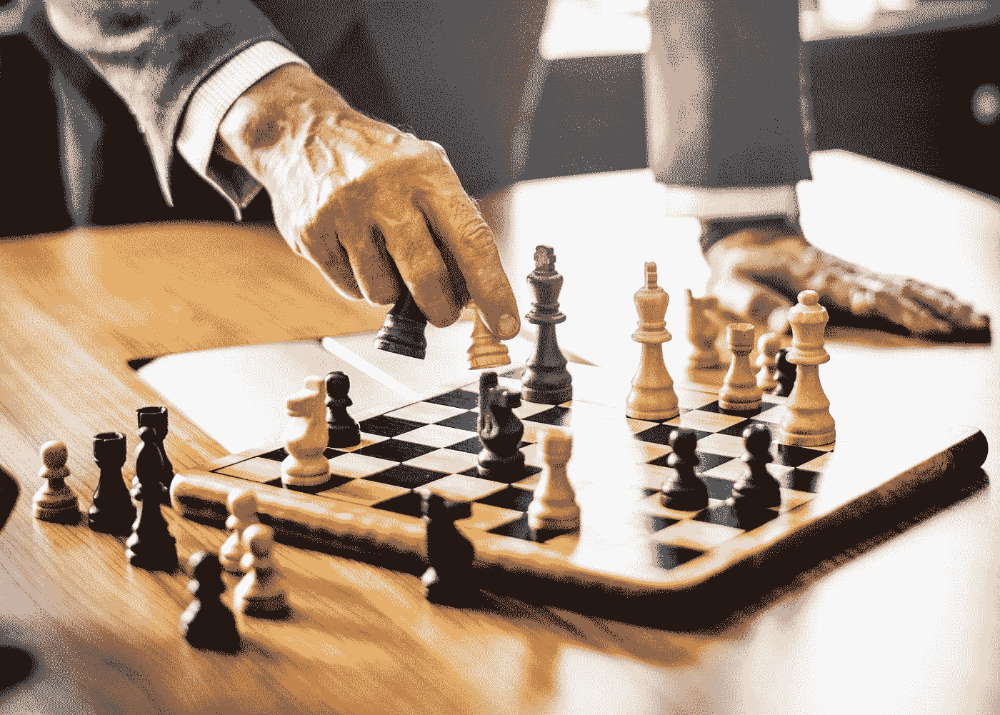

# 逃离朝九晚五的生活。一步接一步。朝着成功继续努力。

> 原文：<https://medium.datadriveninvestor.com/escaping-the-9-to-5-one-step-after-another-continued-action-towards-success-8c8a174fcbfe?source=collection_archive---------13----------------------->

Photo by [Chen Hu](https://unsplash.com/@huchenme?utm_source=medium&utm_medium=referral) on [Unsplash](https://unsplash.com?utm_source=medium&utm_medium=referral)

> "成功的关键在于行动，而行动的关键在于坚持不懈."——孙中山

逃离朝九晚五，对我来说，是唯一的方法。我很确定，在任何普通的工作中，我都不会快乐。在某个我最不喜欢的老板手下，一周工作 40 个小时，却没有足够的钱去过我想要的生活。

这就是人生苦短，不能过别人的生活。如果你想要更多，那就出去买吧。你没有第二次机会。我们都不知道。

所以，如果你对现在的状况不满意，那就改变它。你还在等什么？没有什么会神奇地变得更好。你必须创造改变。你必须成为你所寻找的改变。

你看，我们的时间是有限的，如果我们知道，我们想要别的东西，那么我们应该全力以赴。

在今天的文章中，我将继续写关于离开朝九晚五的生活。我目前正在进行这项工作，我知道已经有很多人成功地做到了。我也知道，有更多的人在考虑这个问题，但是他们还没有准备好迈出这一大步。

这没关系。
我还没有成功。我没有达到我的任何目标。
但我已经把自己放在了那里，我正在烧掉每一座桥，所以回去甚至不再是一个选项。

但我花了一段时间才达到这一点，这将需要我更多的时间，达到我的目标，达到我能够说，我是独立的。
但那一天终将到来，因为我控制了它。我可以决定。如果我投入足够的工作，我会达到我的目标。所以我请客。既恐怖又自由的想法。

我希望你能从这篇文章中得到一些东西，我很想知道你在这个旅程中的位置。

我现在正在做。我知道，这很可怕。另一种方式是，或者至少看起来更容易。但是，如果它最终不会让你快乐，那么简单也没关系。

我知道你可能缺乏一条清晰的通往财富、成功和梦想的道路。但这是可能的。许多人已经证明，一个人可以实现他下定决心的任何事情。很难把别人认为正常的事情抛在脑后。他们可能会对你另眼相看，可能会说你疯了，甚至可能会远离你。

但这只会鼓励你。你看，他们只是害怕发现实现自己的梦想是可能的。他们生活在否认中。他们有从未追求过的梦想。他们通过告诉自己，这是无法实现的，或者他们不够大、不够小、不够聪明或不够笨，来让自己感觉更好。如果他们看到你从他们身边走过，实现你的目标，过着你梦想的生活，他们会受不了的。
这就是为什么他们下意识地破坏你的失败。
不要因此恨他们，但要承认他们错了。
你在生活中走得更远，你正在做对你来说正确的事情。只有你自己知道，你想要什么。所以别人的看法对你来说一点也不重要。因为他们不知道什么能让你快乐。

大多数时候，人们、朋友和家人告诉我们，我们的目标过于雄心勃勃，或者你将无法实现，他们并不具备这方面的专业知识。
他们没有达到他们的目标，否则他们不会这样说话。不要接受不知道自己在说什么的人的建议。

倾听那些已经完成了你正在努力实现的目标的人。

# 一切都会在一瞬间改变。

Photo by [Michael Rogers](https://unsplash.com/@alienaperture?utm_source=medium&utm_medium=referral) on [Unsplash](https://unsplash.com?utm_source=medium&utm_medium=referral)

我知道，我现在说的和写的基本上都是常识。每个人都这么说。你可能以前也听说过。
但是，你们中的许多人可能还没有达到他们的目标。你还没有决定追随你的梦想。所以你必须一遍又一遍地听这些东西，直到有所改变。直到你内心深处产生共鸣，震撼你的内心。直到你最终准备好离开你的工作，开始自己的事业。

或者，那一天可能永远不会到来。
但我真的希望，我能找到一个人，他今天受到激励去追寻他或她的梦想并全力以赴。

我听过关于个人发展的播客已经有一段时间了，也听过不同的人和大师说同样的话，但仍然没有什么改变。尽管如此，我还是没能改变我的行为和习惯。
听了一遍又一遍。有时我听的一个版本引起了我的共鸣，有时它以朋友的形式出现，让我想起我所听到的，只有那时我才真正“明白”。

你不知道它什么时候会袭击你，也不知道谁会是信使。但是如果你想成功，你必须接受所有你能得到的投入并尽情享受。
你周围越多做这件事的人，你越多倾听做过这件事的人，你就越有可能改变你的生活，追求你的梦想。

# 开始做。其他一切随之而来。

Photo by [rawpixel](https://unsplash.com/@rawpixel?utm_source=medium&utm_medium=referral) on [Unsplash](https://unsplash.com?utm_source=medium&utm_medium=referral)

你看，就像在这个象棋游戏中，在现实生活中，你可以有所有的计划，所有你需要的策略，但如果你不玩，你永远不会赢。

在象棋比赛中，这将是荒谬的，因为你没有太多的损失，但在生活中，我们似乎都是这样做的。

好像如果我们冒险，我们会失去很多。我说，我们浪费生命去做我们不喜欢的事情，是在冒更大的风险。对我来说这是一个损失，因为不像下棋，我们不能重做。

一条命！至少就我们所知，这就是我们所得到的全部。因此，为什么要等待，为什么要谨慎行事？尤其是当每个人都追求的安全并不存在的时候？

我也很害怕。我无时无刻不在自我怀疑。但是我每天都在努力变得更加乐观，相信自己，事情终于开始改变了。

我开始写作。
我想成为一名作家。事实上我就是其中之一。我写的东西别人会看。
在这一点上，也许不是很多，但我正在做。
这是唯一可行的方法。我们必须这么做。我们必须采取行动。
这不需要很大的改变。可以小到在网上发表一篇文章。然后决定出版更多。

随着时间的推移，你会变得更好，并建立你的观众群。然后你将通过做一些甚至感觉不像工作的事情来谋生。

它可以小到在街上唱歌寻求改变。但是你正在做。如果你不断努力，不断进步，不断听取前辈的建议。如果你愿意为自己努力，直到达到目标，那么你将会实现任何你曾经梦想过的事情。

所以从今天开始。
拿一件你想做的事，立即行动。为了达到目标，做一件你需要做的事情。贴一个你自己的视频，贴一张你的照片。发表一篇文章。做一些能让你在这条路上更进一步的事情。利用这种势头，然后很快做些别的事情。如此反复，直到你发现自己朝着目标采取了巨大的行动。

现在我每天发表一篇文章。每篇 1500 字左右。我不认为这是大规模的行动，尽管有些人可能这样认为。
但我认识到这是一个步骤。我不断采取措施。所以如果我坚持下去，总有一天我会达到我的目标。如果我学习和提高，它会发生得更快。但是如果我从不停止写作和出版，总有一天我会成为一名作家。

我希望你喜欢这篇文章。你在旅途中的什么地方？你的目标和梦想是什么？我很想和你取得联系，交流我们的故事。

干杯，黑科。