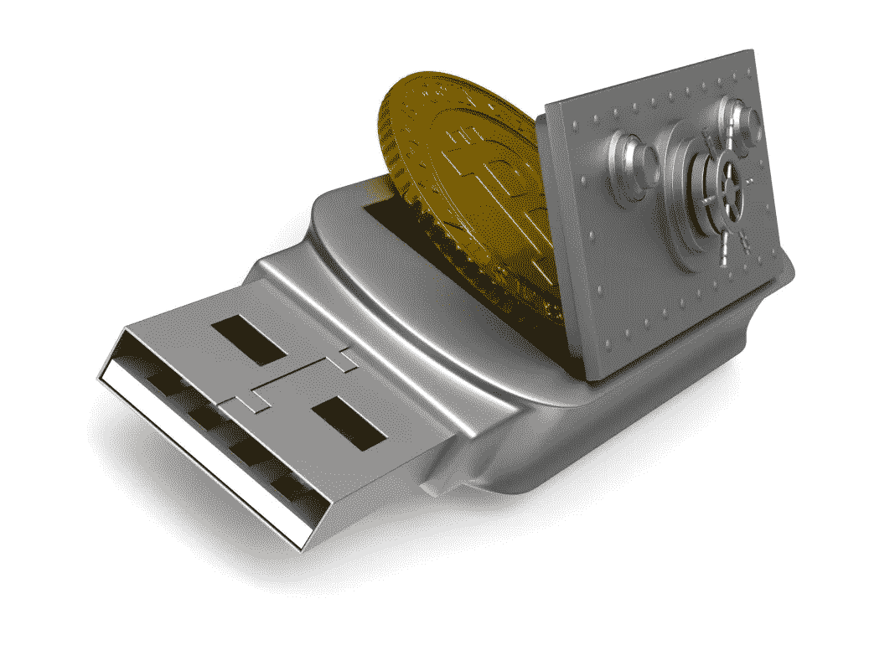
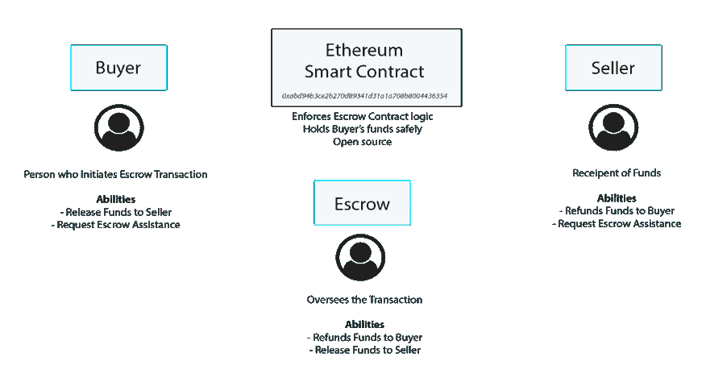

# 数字资产的托管解决方案

> 原文：<https://medium.datadriveninvestor.com/escrow-solutions-for-digital-assets-b68f247008e3?source=collection_archive---------5----------------------->

计算上不切实际的交易可以保护卖家免受欺诈，而常规的托管机制可以很容易地实现以保护买家中本聪在他开创性的[白皮书](https://bitcoin.org/bitcoin.pdf)中描述了比特币的一些可取的安全要求。

加密货币的最大缺点之一是，它使世界上任何地方的双方都能在几分钟内安全地以电子方式发送和接收价值，而不需要昂贵、容易出错的中介。

但是，当你想用加密货币购买实物商品时，会发生什么呢？或者，您可能想从本地卖家(即场外)购买一些加密货币。希望进行此类交易的买方如何能够完全相信卖方将履行其交易义务，反之亦然？

这就是**托管服务**发挥重要作用的地方。提醒一下，托管是一种*工具，它在法律上允许第三方代表正在执行交易的另外两方临时持有资产或资金*。

通常，一旦交易完成，托管方持有的资产/资金将按照合同规定的指示予以释放。或者，如果有争议，托管代理可以介入，审查案件，并做出有利于一方的决定——要么将资产退还给买方，要么将其交给卖方。

通过保证买方有必要的资金，并且卖方可以按照承诺交付产品，托管为许多类型的交易增加了一层信任，也有助于防止潜在的欺诈。

托管长期以来一直被用于房地产和股票市场。现在，它正在成为密码世界中日益重要的安全机制。不同类型的托管服务应运而生，以迎合交易各方的不同偏好。我们来看看一些最受欢迎的。

# 加密货币市场

在 Localbitcoins.com 等加密市场，来自世界各地的人们可以使用各种支付方式，如银行转账、现金存款和贝宝，用当地法定货币购买比特币。

在这种情况下，买方必须相信卖方将在支付后释放比特币，而卖方必须确保买方发送的资金将被收到。

考虑到这一点，市场总是会提供内置的托管服务，以确保他们所有的在线交易得到保护。当买家与卖家开始交易时，比特币的总额会从卖家的钱包中取出，并自动存入托管账户。一旦卖家可以确认付款已经收到，卖家就可以从托管中释放比特币，通常是到买家的市场钱包中。

可以说，在所有主要的加密市场中，Bitify 拥有最全面的托管服务，并为[提供了该服务如何工作的详细描述](https://bitify.com/bitify-escrow-service/)。

# 托管代理

但也许你不相信市场内部的托管系统是可信的。毕竟，你不知道你提议的交易中的另一方是谁——也许是某个与市场本身密切合作的人。这可能意味着托管服务可能会受到损害。

因此，另一个选择是选择独立的托管代理。但是同样，当使用这个选项时，对双方来说最大的挑战是选择一个足够有信誉/可靠的服务。

托管代理经常在网上宣传他们的服务；事实上，寻找可信托管代理的一个流行方法是通过 BitcoinTalk 论坛的[。然而，你应该再次确信你选择的托管公司没有欺骗你。即使是一些最古老的比特币托管服务，如成立于 2011 年的 BTCrow，也存在不少问题。](https://bitcointalk.org/index.php?topic=2439910.0)

所以，明智地选择，否则就去找一个更安全的选择，比如…

# 多重签名托管

随着多签名加密钱包已经被证明是存储加密资产的流行解决方案，由此需要不止一个用户访问钱包和签署交易，这种技术现在越来越多地被应用于托管服务。

不是必须依赖单个实体来监督该过程，而是必须至少有两方在交易上签字，以便于将资金发放给卖方。例如，如果该地址可以被三方(买方、卖方和中立的信托代理)访问，那么如果这三方中的两方提供授权(因此被称为“三分之二服务”)，就可以释放资金。

多签名托管钱包通过减少对第三方完整性的单独依赖，为交易双方提供了额外的安全性。并且考虑到该解决方案需要至少两个签名来进行授权，授权双方都受到损害的可能性要小得多。

Bitrated 提供这样的服务。双方就交易合同达成一致，并在交易发生前指定代理人。然后，买家将付款发送到一个多签名地址，该地址将被锁定。

一旦买方创建了一个新的交易，在买方将款项支付到 multi-sig 地址之前，所有三方——买方、卖方和代理——必须审查并授权他们参与交易。并且卖家验证付款在钱包里之后，她就可以把商品提供给买家了。交易完成后，三方中的两方必须同意从多签名地址付款。

从技术上来说，多签名钱包与托管资金是不一样的*。信托代理人在任何时候都没有收到资金；相反，这个代理人被赋予投票权，以影响最终结果，有利于一方。因此，代理不操作托管账户，而是作为交易的仲裁者。*

[托管我的比特](http://escrowmybits.com/)是另一个独立的托管平台，为用户提供四种不同的定制服务:

1.  定期托管
2.  固定价值(如美元)的定期契约
3.  多重签名托管
4.  固定为固定值的多重签名托管

该公司收取交易成本的 1%来使用这些服务。

# 分散的托管服务

展望未来，加密货币托管的未来很可能会包括更多类似于 [EscrowMyEther](http://escrowmyether.com/) 的服务，这是一款开源、去中心化的应用程序，支持在以太坊区块链上使用智能合约。

该申请允许交易双方选择双方都同意的托管代理。买方的 ETH 首先被锁定在智能合约中。然后，一旦买方确认卖方的义务得到履行，买方就将资金发放给卖方。被选中的托管代理监管交易，并可以介入解决争议、向买方退款或向卖方发放资金，视情况而定:

[*来源*](http://escrowmyether.com/)

仍然需要选择第三方托管代理。但是，虽然其他非分散化的解决方案可能无法提供交易曾经发生过的无可辩驳的证据，但 EscrowMyEther 使资金能够在区块链上持有，这意味着将有实时发生的事情的明确证据。同样，托管代理人从来没有直接接触过资金。

更好的是，智能合同解决方案正在出现，在某些情况下，完全不需要依赖中间人。相反，这种合同可以被编程为将资金转移到第三方托管，然后只在外部事件发生变化时进行特定操作，例如仲裁决定。

例如，总部位于旧金山的全球房地产市场 [Propy](https://propy.com/about) 正在使用智能合同来促进跨国房地产交易。去年 10 月，该公司宣布在区块链完成第一笔房地产交易——在乌克兰基辅购买一套价值 6 万美元的公寓，买家甚至需要踏足乌克兰。

相反，交易是通过以太坊上的智能合约进行的，买家在出售时向智能合约地址发送 212.5 ETH(6 万美元，公寓的成本)，以及 100 PROs (Propy 自己的加密令牌)。[正如 Propy 首席执行官 Natalia karayeva](https://hackernoon.com/how-a-smart-contract-replaced-an-escrow-company-in-a-60k-deal-551ff7839044)解释的那样，这使得智能合同“扮演了托管代理的角色”它以类似于外部托管代理的方式安全地保管资金。

但正如 Propy [白皮书](https://tokensale.propy.com/Propy-White-Paper-17-Jul-2017.pdf)所建议的，一份“智能”的房地产托管合同可以在需要时允许“一个经过验证的托管代理锁定和释放付款”。

*原载于 2018 年 7 月 20 日*[*www.datadriveninvestor.com*](http://www.datadriveninvestor.com/2018/07/20/escrow-solutions-for-digital-assets/)*。*