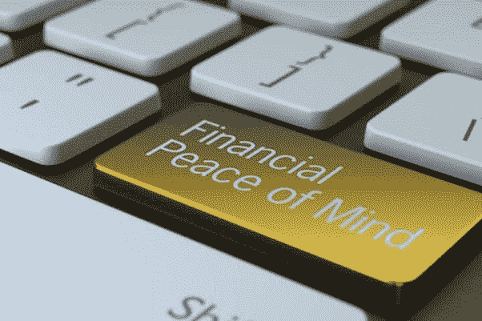
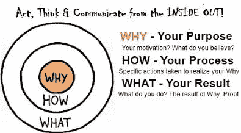
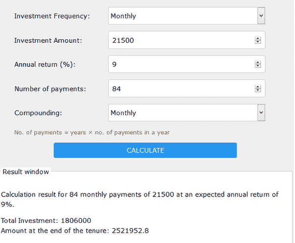

# 金融和平的基本支柱

> 原文：<https://medium.datadriveninvestor.com/essential-fundamental-pillars-for-financial-peace-2d57aca21e00?source=collection_archive---------11----------------------->

**理财师类似于你的家庭医生**。你的家庭医生治疗你所有的健康状况——急性和慢性，包括你的情绪和人际关系问题。理财规划师也是这样。他们只是不规划你的财务，但他们对你的个人理财行为或心理模式更感兴趣。一般来说，财务策划师的工作在他/她交出客户财务计划的最终草案后就结束了，但是一个**好的财务策划师的**真正的工作从这里开始。他/她更关心**个人的财务知识、处理财务的态度、他们的支出模式以及最终他们的财务状况。**不仅仅是制定理财计划。

我还通过邮件、WhatsApp 和 Messenger 收到许多关于不同金融主题的询问。其中一个问题是金融和平。你想知道我们如何实现金融和平，这方面的支柱是什么..今天让我们更深入地探讨这个话题。

**我们先来了解一下什么是和平？**

根据维基百科的说法，“和平是一种没有敌意和暴力的社会友谊与和谐的概念。从社会意义上来说，和平通常意味着个人或群体之间没有冲突，没有暴力恐惧。”这意味着和平给了我们个人或社会的平静和稳定。

 [## 算法交易的机器学习|数据驱动的投资者

### 当你的一个朋友在脸书上传你的新海滩照，平台建议给你的脸加上标签，这是…

www.datadriveninvestor.com](https://www.datadriveninvestor.com/2019/01/30/machine-learning-for-stock-market-investing/) 

同样的概念我们也可以应用到**金融和平**中。当我们的心平静下来，安全了，我们就可以说我们已经获得了财务上的安宁。它是无忧无虑的，不会担心匮乏。当我们的内心深处没有持续的金钱问题时。当我们可以专注于我们的工作，我们的爱好，我们的激情，全心全意享受我们的生活**而不用担心我们的财务状况。**

**获得财务平安的基本支柱或基石。**

**哪些事情会帮助我们在生活中获得财务上的平静？**

***依我看* ***投资方面的知识和纪律会带来财务上的平静……*****

**知识和纪律是两个重要的基本支柱，你的财务和平取决于此。**

**知识如何帮助我们？**

*   **当投资者了解投资的好处、不同的金融产品、投资过程及其利弊等时。他/她更加认真地对待**投资，并将投资作为他/她的习惯，**知识有助于培养对金融的兴趣，从而将习惯转化为纪律。**

****纪律如何帮助我们？****

*   **投资是一种美德，我们需要将它转化为习惯，一旦我们习惯了投资，我们就会变得自律。一旦**投资者变得有见识**，当他/她**对投资有纪律**时，这将自动带来金融和平。**

**几年前，我偶然听到一个非常有趣的 Ted 演讲，演讲者是励志演说家 Simon Sinek。他描述了一种被称为“黄金圈”的东西**

****

**这个概念表明，你应该首先确定你的**为什么**(你为什么要做一件特定的事情)，然后是**如何**(你将采取的步骤)，最后是**什么**(你实际在做什么)。**

**我们也可以将此应用到我们的投资中…让我们来看看如何应用**

*****投资者在投资过程中应用黄金分割时，应重点关注以下两个方面:*****

*   ****知识:**关于个人理财、金融产品、风险和回报理论的知识将使投资者保持在创造财富的正确轨道上。**

1.  ****为什么**是投资者在投资前应该问自己的问题。**
2.  **我为什么要投资？这个投资背后有什么目标吗？这些问题与**基于目标的投资策略**有关。**
3.  ****，**这个问题与实现特定人生目标的目标金额的过程有什么关系**
4.  **你将如何达到我的目标的目标金额？你打算如何投资？为实现特定目标，你的资产组合是怎样的？这些问题与为上述目标选择**对** **资产组合**有关。**
5.  ****什么**，是与投资者在期末将获得的回报有关的问题。**
6.  **如果投资该产品，我将获得什么样的**回报**？上述投资策略的结果会是什么？选择特定的**金融产品**有哪些利弊？**

**关于 ***为什么*** 、 ***如何*** 和 ***什么*** 的知识会让投资者**自信**和**谨慎**让他/她的财务保持在正轨上。**

****2。学科****

****财富创造是一个长期现象。**只有投资者持续不断地投资，并且长期投资，才能实现。**纪律让它持续更长时间。**。投资者的**自律**方法让他/她定期投资，直到实现人生目标。错过了 SIP，错过了 FD/RD 的更新，错过了改变资产组合的机会，从长远来看，代价是巨大的。如果投资者有**自律的**方法，这就不会发生。**

**现在让我们将 ***知识和纪律*** 概念应用到投资领域:**

**杰伊打算买一栋自己的房子:**

*****杰伦的理由:*** 杰伦想在接下来的 7 年里创造 250 万卢比的收入来积累首付**

*****杰伦的方法:*** 杰伦制定了一个计划，其中包括他将如何分配部分可投资盈余来实现这个目标，每年增加收入中的储蓄部分，寻找梦想中的房子等等**

*****杰伊“什么:*** 杰伊决定投资共同基金和定期存款的组合来实现他的目标。**

*****下面是杰伦的计划和目标的暂定单:*****

*   **目标——积累首付款**
*   **实现目标的时间— 7 年**
*   **按 7% %调整通货膨胀后所需的数额**
*   **所需投资-**
*   **共同基金:流动性基金、超短债基金和平衡基金的混合。**
*   **定期存款**
*   **每月所需金额-21500 卢比**
*   **假设投资组合回报率为 9%**
*   **定期存款可以一次存入，也可以每年存入一年到期的定期存款，以此类推，连续 3 年。**

****

**如果你观察的话，Jay 定义了**为什么**他想要像第一步一样的东西，然后制定了一个计划**他将如何**实现它，然后最后他在**上决定当他获得了关于投资的**知识**以实现他的目标时，哪些**产品可以让他达到目标。如果杰伦在这种投资模式下保持自律，他一定能够积累起他梦想中的房子的首付金额！！！**

**我们如何规划我们的投资？**

****最通用的方式是:****

**1.我们开始投资一些东西，只是因为我们的朋友或隔壁邻居在一个月内获得了两位数的回报(什么)。**

**2.我们很少有系统的方法或详细的计划来构建我们的投资(如何)，**

**3.更罕见的是我们对最终目标的定义(为什么)。**

****这种投资方式会让我们一事无成，因为它缺乏远见和方向。仔细想一想，试着找出“什么”、“怎样”和“为什么”的答案。****

**从那以后，我将我所有的投资决定与可量化的目标联系起来，这些目标让我保持动力，因为我对个人理财有着深入的了解和 T2 训练有素的方法。我还帮助许多人确定了他们的**为什么**，从而确定了哪怕是最小投资的目的。**

***保持收集* ***知识*** *关于* ***投资*** *和做* ***守投资纪律*** *过无忧无虑的理财生活！！！***