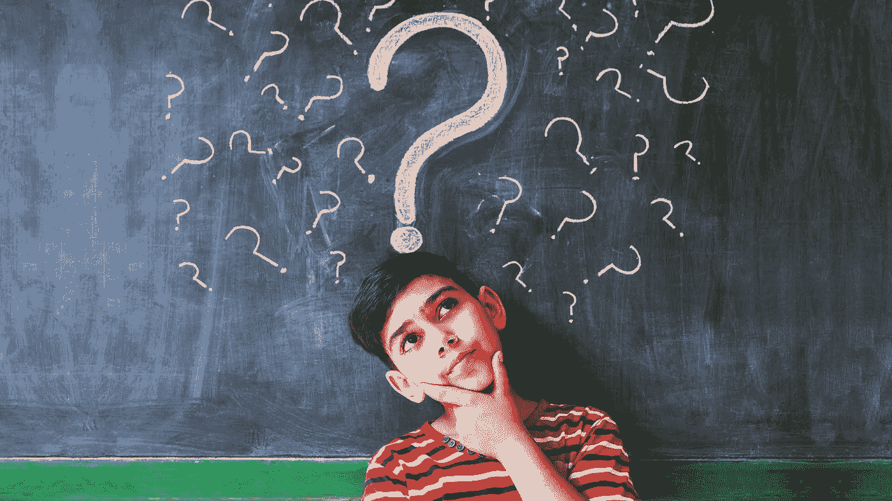

# 做出人生最佳决定的基本素质

> 原文：<https://medium.datadriveninvestor.com/essentials-qualities-to-make-the-best-decisions-in-life-56b1a8dedc00?source=collection_archive---------24----------------------->

Photo by [Joanna Kosinska](https://unsplash.com/@joannakosinska?utm_source=medium&utm_medium=referral) on [Unsplash](https://unsplash.com?utm_source=medium&utm_medium=referral)

当我们做出人生中最重要的决定时，我们倾向于在那些不应该放纵情感的决定中加入情感。

做决定需要你完全准备好一个决定可能带来的后果。它可能是好的，坏的或最坏的。你为自己决定的人生，是你一生中所做的一系列决定(好的或坏的)的集体结果。现在的问题是，你是根据知识、信息和建议做出这个决定的，还是纯属侥幸。做出理性而明智的决定是一种技能。像任何其他技能一样，它可以通过持续和彻底的学习。我们往往会忽略帮助我们组织生活的基本要素，如冷静、理性和清晰。

> [DDI 编辑精选—思维转变:突破学习障碍，发现你隐藏的潜力](http://go.datadriveninvestor.com/mindshift/matf)

Image Courtesy: YouWall.com

> “恐慌会导致视野狭窄。平静地接受危险让我们更容易评估形势，并看到选择。”—西蒙·西内克

让扭曲你思想的想法平静下来，然后开始做决定。挫折或焦虑可能会毁掉我们做出明智决定的能力，从长远来看可能会给我们带来伤害。为了避免这些问题，我们应该首先让自己平静下来，这可以通过冥想、祈祷或早上散步来实现。冷静是必要的，因为它能增强你的自信，提高你的注意力，帮助你成为一个更加平衡的人。

> “如果一个人贬低理性，世界就会分崩离析”——拉斯·冯·提尔

理性是人类最重要的特征之一。这是由于我们的头脑做出的理性和深思熟虑的决定改善了我们的生活方式。为了做出一个理性的决定，我们应该收集具体的信息，并且应该为我们的决定找到合理的选择。我们还必须评估信息，并在短期和长期结果中进行权衡。如果我们通过冷静达到放松，我们通过理性处理我们的思想。

Photo by [Nathan Dumlao](https://unsplash.com/@nate_dumlao?utm_source=medium&utm_medium=referral) on [Unsplash](https://unsplash.com?utm_source=medium&utm_medium=referral)

> "清晰的愿景是实现目标的关键."—汤姆·斯泰尔

最后，清晰，这是一个组成部分，没有它我们就不能在生活中做出好的和健康的决定。清晰提供了查看我们决策的长期和短期结果的视野，这将有助于选择对我们最有利的方案。清晰是在生活中做出正确决定的必要条件。

Photo by [Nghia Le](https://unsplash.com/@lephunghia?utm_source=medium&utm_medium=referral) on [Unsplash](https://unsplash.com?utm_source=medium&utm_medium=referral)

总之，冷静让我们有能力在最紧张的情况下放松，理性让我们有能力处理我们的想法。清晰让我们以一种清晰的方式看透事物。

编辑披露:编辑有时会发布有用资源的链接。如果你发现它们有用并购买，我们会赚很多钱。不，我不是说要把我的薯条做大。我说的是超大披萨上的意大利香肠。感谢您一直以来的支持，我们将继续为 p̶e̶p̶p̶e̶r̶o̶n̶i̶出版而努力。