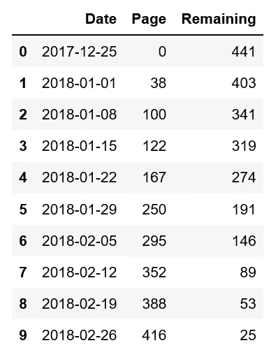
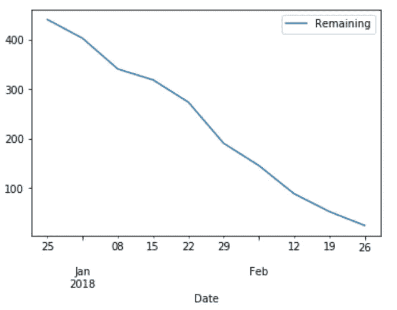
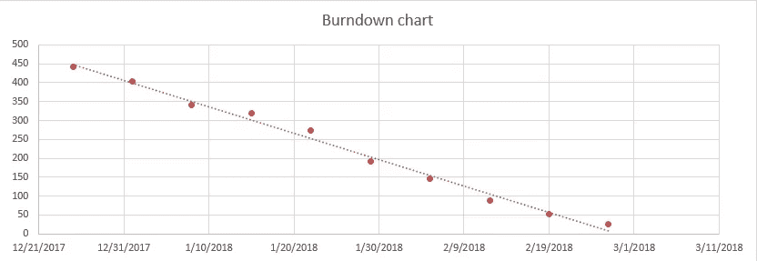
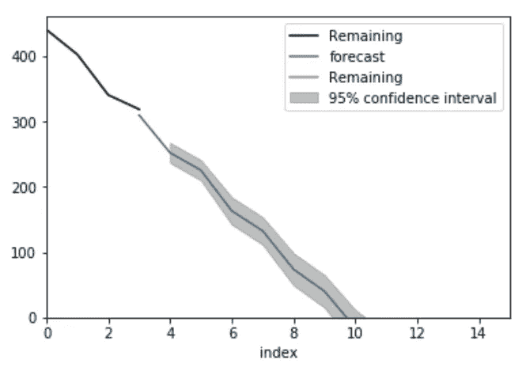
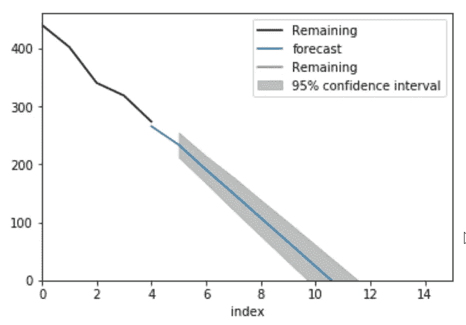
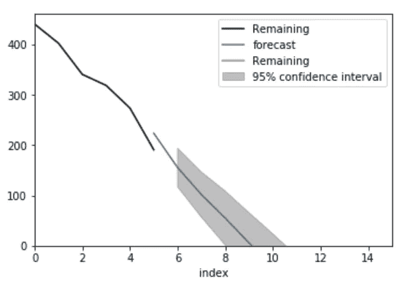
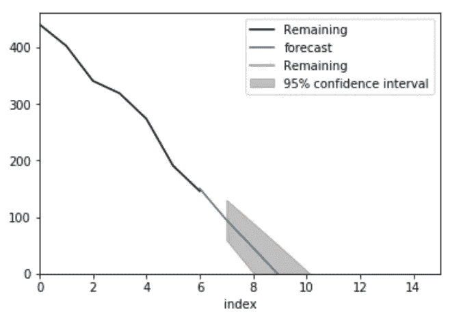
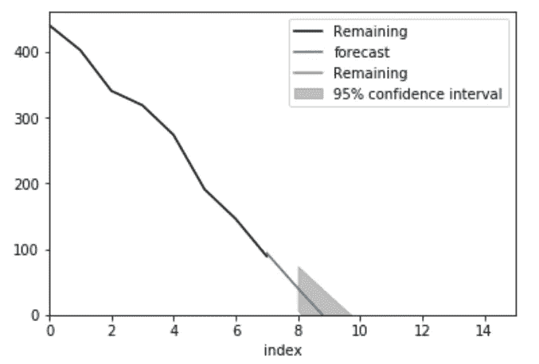
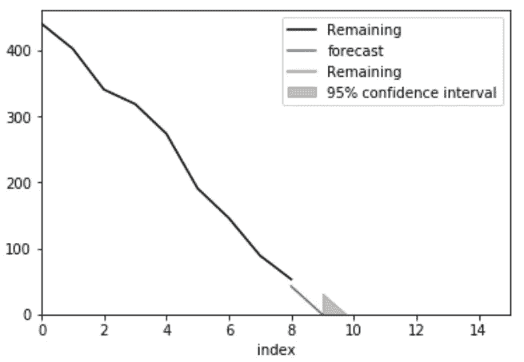
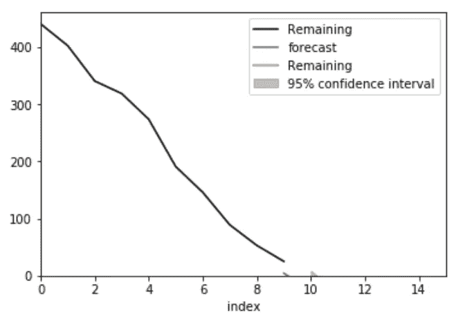

# 使用燃尽图估计完工日期

> 原文：<https://medium.datadriveninvestor.com/estimating-completion-date-using-burn-down-chart-3a40daeb0c25?source=collection_archive---------2----------------------->

[](http://www.track.datadriveninvestor.com/1B9E)

## 使用时间序列建模进行敏捷项目评估

敏捷规划中的一项技术是燃尽图。根据维基百科的说法，这是剩余工作相对于时间的图形表示。这是一个非常简单的图表，但也非常重要，因为它可以回答一个非常重要的问题:我们什么时候能完成。事实上，当这条线穿过 x 轴时，这就是我们完成的日期。

问题是，正如我们在前面的例子中所展示的，这种方法没有考虑到不确定性。项目速度随时间而变化，我们只能以一定的概率来预测我们将要完成的时间。在这里，我将使用 ARIMA 模型的时间序列数据和预测。

# 图书进度

当我学会燃尽图技术时，我开始用它来跟踪进度，包括书籍。我喜欢为自己设定目标，比如什么时候必须读完这本书。否则，我永远也看不完这本书。跟踪书籍进度的自然方法是燃尽图，所以我倾向于用它来阅读所有的技术书籍。

在这个例子中，我分享了一本关于机器学习的非常重要的书的数据，这本书是我在 2018 年读的。每周我都会更新读取的页数，Excel 会为我计算剩余的页数。



```
book_raw_data.plot(x='Date', y='Remaining');
```



我试着每周读 50 页，如果我一周没有达到目标，我会在下一周花更多的时间来弥补。我在 Excel 文档中跟踪数据，并使用一个非常简单的图表，图表上有一条线性趋势线:



线性趋势线起作用…有点。当我的变化增加时，它不能反映现实。我不应该用机器学习的方法来代替吗？

# ARIMA 模型

根据[维基百科](https://en.wikipedia.org/wiki/Autoregressive_integrated_moving_average)，ARIMA 代表自回归综合移动平均线。它有三个重要参数:p、d 和 q。p 负责自回归的程度，即以前的结果如何影响当前的结果。q 代表移动平均的程度，即先前的噪声如何影响当前结果。如果我们假设电流结果只受电流噪声的影响，那么我们可以将 q 设置为零。最后，d 代表不同的程度。这意味着，我们不是拟合实际结果，而是拟合当前结果和先前结果之间的差异。它也等同于时间导数。当 d = 1 时，我们拟合一阶导数，当 d = 2 时，拟合二阶导数，以此类推。

在我们的示例中，我们看到我们可以将数据建模为一条斜率为负的直线，因此我们可以将 d 设置为 1。我们还假设，上周差异的原因对本周没有影响，所以我们将 q 设置为零。最后，在我们的简化模型中，我们假设当前周只直接依赖于前一周的结果，而不依赖于前几周的数据。因此，我们将拟合模型(1，1，0)。

```
ARIMA Model Results                              
==============================================================================
Dep. Variable:            D.Remaining   No. Observations:                    4
Model:                 ARIMA(1, 1, 0)   Log Likelihood                 -15.400
Method:                       css-mle   S.D. of innovations             10.857
Date:                Fri, 01 Mar 2019   AIC                             36.800
Time:                        15:01:36   BIC                             34.959
Sample:                             1   HQIC                            32.760

=====================================================================================
                        coef    std err          z      P>|z|      [0.025      0.975]
-------------------------------------------------------------------------------------
const               -41.8044      3.849    -10.862      0.008     -49.348     -34.261
ar.L1.D.Remaining    -0.5563      0.330     -1.688      0.233      -1.202       0.090
                                    Roots                                    
=============================================================================
                  Real          Imaginary           Modulus         Frequency
-----------------------------------------------------------------------------
AR.1           -1.7975           +0.0000j            1.7975            0.5000
-----------------------------------------------------------------------------
```

根据这个总结，模型并不是很符合，但是我们不应该忘记，我们的时间序列很短。事实上，这是非常典型的包含相对较少数据的时间序列，因此，如果我们应用更复杂的模型，我们要么从`ARIMA.fit()`方法中得到警告，要么模型将过度拟合。

下面我们模拟了预测从第 4 周开始的图书结束日期的情况。

```
forecast(4)
```



我们看到，仅经过 4 周的数据，模型似乎过度拟合，因为预测遵循我们在本书的前 4 周的曲线模式。该预测不到 10 周，95%的置信区间在 9 到 11 周之间。

```
forecast(5)
```



第 5 周后，模型不再过度拟合。现在 95%置信区间的宽度快 2 周了！

```
forecast(6)
```



我想我在第六周有太多的时间，所以我设法赶上了我的阅读。现在预测是 9 周左右，但是看看置信区间:快 3 周了！这意味着我可以在 8 到 11 周内的任何时间完成这本书。

```
forecast(7)
```



第 7 周后，置信区间开始下降。现在的预测是 9 周左右。

```
forecast(8)
```



预测变化不大，但是，置信区间进一步减小

```
forecast(9)
```



这个模型似乎在这里崩溃了。预测在 9 左右，置信区间在 9-10 之间。原因是`ARIMA.plot_predict()`函数估计的是结果的不确定性，而不是曲线碰到 x 轴的点。为了正确地做到后者，我们将不得不更新我们在估计置信区间时使用的统计模型。

```
forecast(10)
```



我们的第 10 周预测没有多大意义。显然，我们还需要一周时间，但是现在天气预报显示是零。也许一个更复杂的模型可以解决这个问题，现在我们有更多的数据来确保模型不会过度拟合。

# 结论和下一步措施

我们已经表明，除了 Excel 中的趋势线，我们可以使用 ARIMA 模型来预测项目的进度，在我们将要完成的过程的每个阶段进行估计，并让模型为我们提供置信区间，以建立估计中的不确定性。将这个模型构建到流行的敏捷开发工具中应该不会太难。我也将开始使用这个工具来跟踪我正在阅读的书籍的进度。

你可以在我的 [github repo](https://github.com/mlarionov/machine_learning_POC/blob/master/agile_estimation/Burndown_chart.ipynb) 中找到这篇文章的代码。