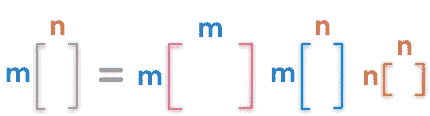
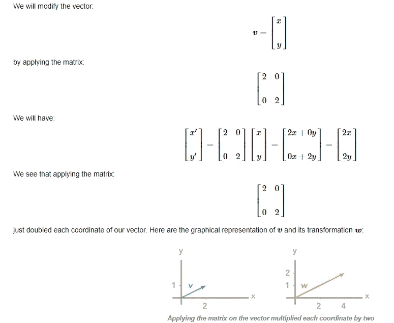
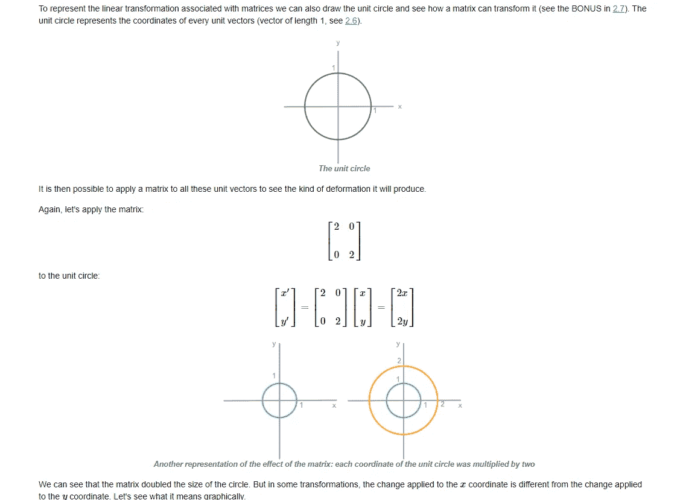
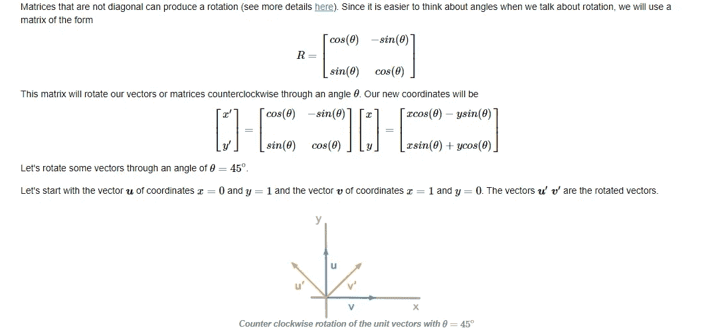

# 估计算法——线性和二次判别分析(22)

> 原文：<https://medium.datadriveninvestor.com/estimation-algorithms-linear-and-quadratic-discriminant-analysis-22-58dfe14e595b?source=collection_archive---------4----------------------->

这是 scikit-learn 指导监督学习的 92 篇系列文章中的第 22 篇，撰写这篇文章的目的是为了能够熟练地将算法应用于生产，并能够解释算法背后的算法逻辑。请在[第一篇文章](https://medium.com/@venali/conventional-guide-to-supervised-learning-with-scikit-learn-getting-started-1-f9abd3f0e6c8?source=post_page---------------------------)中找到所有部分的链接。

估计算法是 sklearn 为分类和转换提供的优化器，不考虑协方差的计算。这一点在我们之前的几篇判别分析文章中已经深入讨论过了。

 [## 机器学习的外汇交易挑战|数据驱动的投资者

### 机器学习是人工智能的一个分支，之前占据了很多头条。人们是…

www.datadriveninvestor.com](https://www.datadriveninvestor.com/2019/02/18/the-challenge-of-forex-trading-for-machine-learning/) 

总而言之，sklearn 有三个主要的评估工具…

1.  SVD 单值分解，用于分解实数或复数，计算齐次线性方程或最小平方最小化或范围、零空间、秩求解器
2.  稀疏线性方程和稀疏最小二乘问题的 LSQR 求解器
3.  线性系统的特征解算器

在这篇文章中，我对深入研究 svd 和 eigens 特别感兴趣:)您可以通读或阅读系列的下一篇文章，因为这是一篇完全独立的文章。

> 让我们设定这个假设，这也是一个事实……
> “矩阵是空间中的线性变换”

假设单值分解(SVD)是将一个矩阵分解成三个其他矩阵。在我们的假设中，这些新矩阵是空间的子变换。为了分解一个给定的矩阵，我们做如下工作:

u 和 v 是正交的，即 U^T = U^-1，d 是对角矩阵。此外，U 和 V 分别是左和右奇异向量。U、V 和 D 的图示如下

对于我们假设的矩阵是空间中的线性变换我想给大家介绍一个精彩简单的 [***视频***](https://www.youtube.com/watch?v=kJIUbtSowRg) :)

在视频中，举了三个例子

1.  变换一个向量并乘以一个因子
2.  单位圆变换和均匀变换
3.  变换单位圆并以非线性方式变换它(如果措词不正确，请改正。我怀疑自己)
4.  旋转矩阵

***变换一个向量并乘以一个因子***

***变换单位圆并均匀变换***

***变换单位圆并以非线性方式变换***

***旋转矩阵***

*然后你可以用 A = UDV^T 逆向重构 a*

让我们直接进入笔记本，因为我想用一段代码展示所有的东西

# 信用

所有学分归入 Scikit-learn 文档，所有参考资料均符合官方用户指南。

也感谢我的朋友，他相信“对我来说，成功就是我创造了足够的影响力，让世界变得更美好”，这激励我从零开始，以便在某个时刻创造不同。

# 关于作者

我是 venali sonone，职业是数据科学家，也是管理专业的学生，希望在金融行业发展自己的事业。