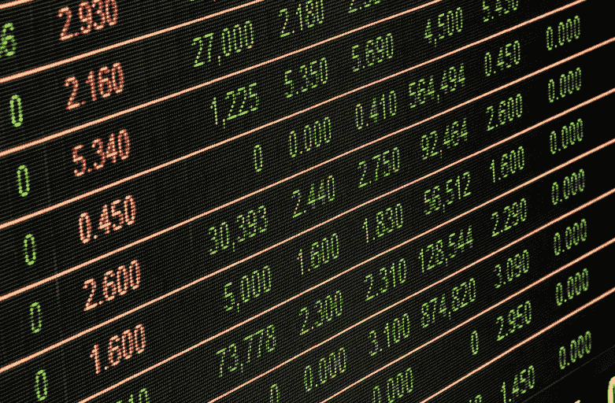
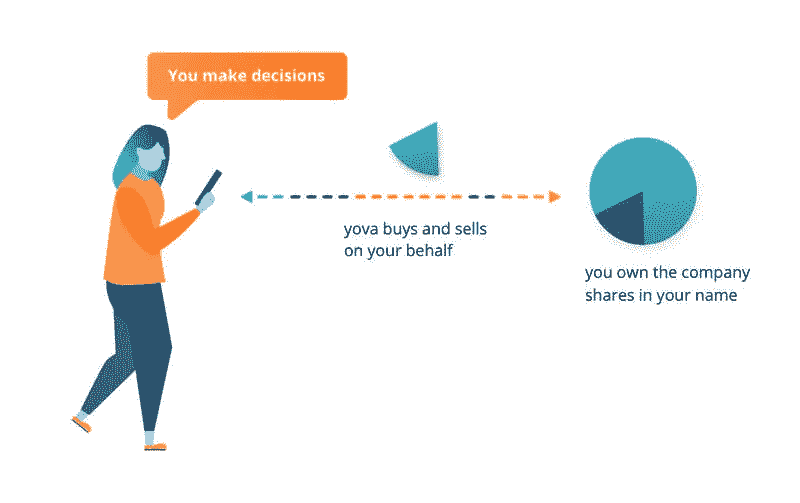

# 交易所交易基金:你需要知道的

> 原文：<https://medium.datadriveninvestor.com/etfs-what-you-need-to-know-1f94ef766253?source=collection_archive---------1----------------------->

近年来，交易所交易基金大受欢迎。但是，当人们把钱投入 ETF 时，他们实际投资的是什么呢？为什么 Yova 走上了不同的方向？这篇文章涵盖了(几乎)你需要知道的关于这一投资热潮的一切…

一般来说，[ETF](https://www.investopedia.com/terms/e/etf.asp)是指数基金，这意味着它们跟踪一个指数，如 [SMI](https://www.six-swiss-exchange.com/indices/data_centre/shares/smi_en.html) ，或 [S & P500](https://www.bloomberg.com/quote/SPX:IND) 。一个常见的误解是，ETF 实际上包括了该指数中的所有股票。情况并非总是如此——有时这只是管理基金的人挑选出来的一个选择；有时，经理会创造合成复制，购买“认股权证”和“股权互换”，而不是股票本身。

ETF 与传统基金的不同之处在于它是在股票市场上交易的。这意味着你可以随时卖掉它。传统基金是私下买卖的，例如由你的银行进行买卖。这种基金在任何时候都不能买卖，通常情况下，当你投资该基金时和当你想要回你的钱时，提供商都会收取费用。

# ETF 投资有什么优势？

简单来说:被动投资。ETF 包含一个特定指数内的许多不同投资，而不是花钱请一个试图优化你投资的昂贵的基金经理(这是一个经常适得其反的策略)。因此，它反映了整体市场的表现——没有失控的利润，但也没有失控的亏损。

在 [Yova](http://yova.ch/) ，我们做类似的事情。在您选择了自己的价值观和兴趣后，我们的专家会运用投资组合理论来创建一个既个性化又符合投资最佳实践的投资组合。我们这样做是因为被动的、多元化的投资组合已被证明是长期增加财富的可靠工具。

# ETF 的缺点是什么？

这归结为个人观点。我们认为，让人们决定，或者至少意识到他们投资的公司是很重要的。我们认为投资者应该拥有这些公司的真正所有权。一只 ETF 错过了这些点。它是一种捆绑的金融产品，被包装成商品出售。作为 ETF 投资者，你拥有一种复杂金融产品的股票。你不拥有其中公司的股份。

在 Yova，我们采取不同的方法。您告诉我们您的兴趣和个人价值观，我们会找到最符合您的偏好和风险状况的公司。我们的金融专家会关注技术细节，并实施您完全定制的投资策略——一种符合您价值观的策略(在此尝试—免费&非约束)。

这给了你，投资者，尽可能多(或尽可能少)的控制权。比方说，你兴奋地投资了一家新兴科技公司，然后发现他们分享了 8700 万用户的私人信息。如果你不想再投资那家公司，我们可以把它从你的投资组合中去掉。

相反的情况也是如此——假设你之前避开了某家公司，因为你不喜欢它将 90%的利润放在低税收国家的做法。如果他们后来改过自新，你可能会决定投资该公司。对我们来说，这不成问题。您拥有做出这些决定的权力，而我们在这里是为了让实施变得没有痛苦。

# 直接投资与间接投资

当你通过 Yova 投资时，你就成为你投资的每家公司的股东。你是在进行直接投资。你以自己的名义持有股票。你会得到分红。你可以选择在公司的年度股东大会上投票——你对公司如何开展业务有发言权，你可以影响公司的战略和活动。

金融界已经脱离了这种直接投资的模式。约瓦想把它带回来。我们希望促进股东参与，并帮助我们的客户感受到作为投资者和世界公民的权利。

正如我们提到的，当你拥有一只 ETF 时，你拥有的是一种金融产品的股票，而不是基础公司的股票。这些额外的层还会让你面临交易对手风险(下一节将详细介绍)。

# 为什么技术正在改变游戏

曾几何时，结构性基金是简化购买多元化股票投资组合这一复杂过程的绝佳方式。但多年来，金融业变得越来越自私。快进到最近，曾经实现的“成本协同效应”已经演变成蚕食客户利润的“成本怪兽”。

幸运的是，现代技术和数字化使得不购买基金就能建立一切成为可能。

当然，一些金融专业知识会有很大帮助——让专业人士确保你的投资组合适当多样化，并针对你能够承担的风险水平进行优化，是有好处的。是的，有一个提供商来处理执行交易中涉及的繁琐的技术细节是非常好的。但是您可以在没有预包装产品的情况下享受这些服务的好处。

下面举例说明通过 Yova 投资公司的流程。没有实体阻挡你和你的投资。有了 Yova，你直接购买股票，你可以随时卖出这些股票。虽然我们随时为您的交易提供便利，并作为您的投资顾问提供服务，但您仍然可以完全控制您的投资组合，甚至可以在没有我们帮助的情况下买卖您的股票。

# 直接投资的表现比 ETF 好吗？

我们希望能保证投资收益，但我们做不到。没有一个资产管理公司可以；没有 ETF 提供商可以。我们能做的是使每个客户的投资组合多样化，这样它就能随股市而动。这样，如果股市整体上涨，你的投资组合价值应该会增加。同样，如果股市崩盘，你投资组合的价值也可能下跌。在这种情况下，你可能会决定继续持有你的股票，直到市场反弹。

在 Yova，我们非常重视风险优化。使用基于“现代投资组合理论”的方法，我们使您的投资多样化，以匹配您对风险的容忍度(和偏好)。你可以在这里阅读更多关于这个获得诺贝尔奖的方法。

从本质上来说，大多数 ETF 也是多元化的。但还记得那些叫做‘认股权证’、‘股权互换’和‘合成复制’的复杂东西吗？对于 ETF 投资者来说，这些会带来风险。因为每一层复杂性都有出错的可能。即使与其他金融产品相比，它的风险较低，我们认为这些层次是不必要的——而且有更好的方法。

# 总结:ETF vs Yova 投资

## 个性化

在 Yova，您的投资策略是为您量身定制的，旨在帮助您实现财务目标并体现您的个人价值。ETF 的投资组合由基金经理打包，以适应广泛的投资组合。

## 直接投资

我们的客户直接拥有股票，成为这些公司的注册股东。ETF 给这个等式增加了几层。

## 透明度

我们的客户非常清楚他们的钱是如何投资的。您投资组合的所有详细信息都在我们安全的在线仪表板上，可以随时访问。

# 有兴趣试试我们吗？

第一步是在线完成我们的五分钟调查问卷[此处](https://inyova.ch/en/create-profile/schwerpunkte)。然后，我们的金融专家将根据您的兴趣、价值观和风险状况，为您量身定制自由投资策略。如果您认为我们不适合您，那么我们没有任何费用或义务。

*最初发表于* [*yova.ch*](https://yova.ch/en/investment-insights/etf-explained) *。在 Yova，我们帮助人们通过符合他们价值观的投资组合来积累财富。*