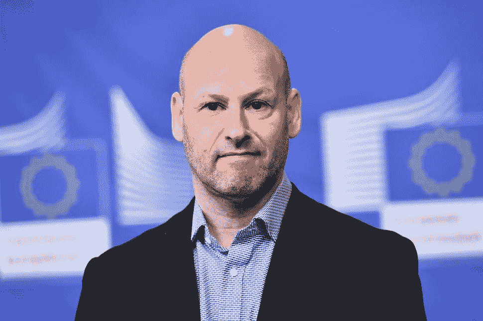
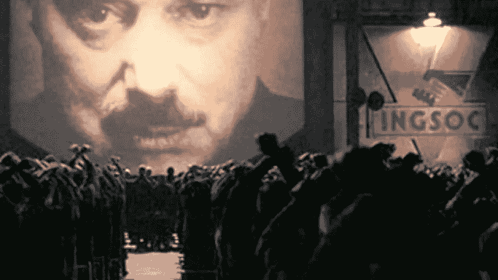
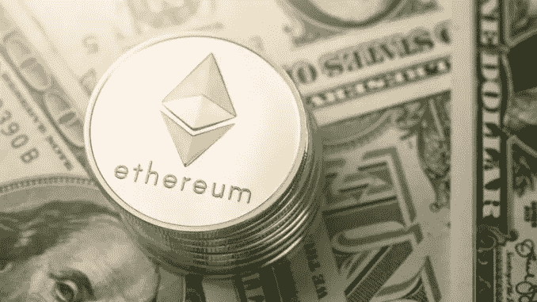

# 以太坊和康森斯——弹性的故事

> 原文：<https://medium.datadriveninvestor.com/ethereum-consensys-a-tale-of-resilience-976620f0ba2?source=collection_archive---------4----------------------->

Not yet quite as good as gold.

我想你有 50 亿美元。作为一个思维实验，想象一下你有 50 亿美元可以随意支配。你会买什么东西？你会辞职吗？去度一次一生的假期？买新房？一架飞机？一艘游艇？一辆车？说真的，闭上眼睛想象几分钟，你会用 50 亿美元做什么。因为去年年底和今年早些时候，Consensys 和以太坊的联合创始人约瑟夫·卢宾(Joseph Lubin)的身价就有这么多。根据*福布斯*的报道，卢宾是加密领域第二富有的人，主要基于他(个人)拥有 5%到 10%的流通以太，当时其市值为 1000 亿美元，交易价格约为 1389 美元。如今，以太坊的价值还不到这个数字的十分之一，在撰写本文时，其交易价格约为 126 美元(根据 CoinMarketCap 的数据)。虽然落井下石可能很有诱惑力，但可以说卢宾在以太坊、加密货币和区块链方面的贡献超过了任何人。想象一下，你有 50 亿美元，你会全力以赴资助一个未来的世界愿景吗？幸运的是，Lubin 做到了，虽然他为推广以太坊区块链而创立的公司 ConsenSys 的结果并不完全成功，但他没有放弃，也不会去任何地方。正因如此，康塞恩斯最近一轮的裁员应该放在鲁宾和康塞恩斯以及以太坊更广泛的目标的背景下来看待。

## 1.卢宾来自哪里

虽然我们中的大多数人(包括我自己)都想靠 50 亿美元的财富退休，但正是由于像鲁宾这样的理想主义者的工作，世界才有了一个更光明的未来。为此，卢宾独特的人生经历可能为他愿意资助更大的善举奠定了基础。

You know he’s smart cause he uses his head for something other than growing hair.

卢宾是加拿大人，自称是电脑呆子，母亲是房地产经纪人，父亲是牙医。他上世纪 80 年代中期就读于普林斯顿大学，在那里打壁球，并与未来的亿万富翁对冲基金经理迈克·诺沃格拉茨(Mike Novogratz)成为室友。诺沃格拉茨和卢宾一样，都在区块链和加密货币上下了全注。1987 年获得电子工程和计算机科学学位后，Lubin 在普林斯顿的机器人实验室工作，但最终被华尔街的诱惑所吸引，在那里他最终为高盛开发软件，并最终经营了自己成功的 quant 对冲基金。鲁宾拥有我们大多数人认为的成功人生——伟大的事业、成功的企业和金钱。但是，2001 年 9 月 11 日给卢宾留下了永远不可磨灭的印记。

911 袭击纽约世贸中心时，卢宾的办公室离世贸中心遗址不远，那次经历让他陷入了生存危机。在接下来的十年里，他对世界的现状深感沮丧，当 2008 年大金融危机袭击华尔街时，这将进一步加剧他的沮丧和对制度结构的信任，而制度结构是他迄今为止存在的支柱。在 2017 年 5 月的 ConsenSys Ethereal 峰会上，Lubin 说，

> “相信所有那些我们认为最符合我们利益的机构是愚蠢的。我觉得我们生活在一个象征性的、字面上的和道德上已经破产的全球社会和经济中。”
> 
> "我确信我们的经济和社会正处于缓慢的、连锁式的崩溃之中。"

根据 Lubin 的说法，央行行长最终会让货币贬值以偿还不断增加的债务，抑制几十年的增长，或者一些“非线性”或黑天鹅类型的事件会造成巨大的困难，并使世界陷入有史以来最严重的经济衰退。虽然很容易将卢宾的世界末日预言视为抑郁症的产物，但越来越多的迹象表明，他的黑暗预言并非虚言。

Not your average dystopia.

随着中国和美国这两个世界上最大的经济体之间贸易战的幽灵日益逼近，人们越来越担心中国再也无法维持其经济增长了。产能严重过剩(想想所有的鬼城)和令人不安的迹象表明，中国正在利用(白象的)生产来维持其社会契约——以有限的自由换取经济商品——有迹象表明，中国保持这一循环的压力越来越大——它的失败或无力可能导致社会不稳定和动荡。中国的工厂已经提前三个月将工人送回农村过农历新年(当然没有工资)。中国共产党还在加大对私营企业的参与，扩大国有企业的影响力，这只会增加不透明性和过度生产的倾向。

卢宾的经历让他去了秘鲁和厄瓜多尔，寻找他可以逃离的地方。2011 年初，他偶然发现了比特币白皮书，并有了自己的“来到耶稣身边”的时刻。

> "权力下放改变了游戏规则。"

## 2.以太坊和 ConsenSys 的诞生

Lubin 阅读了所有关于比特币的资料，最终由 Anthony Di Iorio(以太坊的联合创始人)介绍给以太坊当时 19 岁的创始人 Vitalik Buterin。在 2013 年冬天阅读了 Buterin 的以太坊白皮书后，Lubin 参与了以太坊项目的第一步，并参加了 2014 年初在迈阿密举行的基础会议。

Contract looked very much tamper-proof, lawyers remained unimpressed.

卢宾看到了以太坊的潜力，作为一名计算机科学家，他认识到了图灵完全去中心化区块链协议的潜力。图灵完整系统是指这样一个系统，在该系统中可以编写一个能够找到答案的程序(尽管不保证运行时间或所需的内存)。理论上，一个图灵完全区块链协议应该能够允许程序解决任何计算问题。大多数现代编程语言，包括 Python，C++，C#，Java 都是图灵完全语言的例子。相比之下，比特币脚本不被认为是图灵完整的，有利于提高安全性。实现图灵完整性需要权衡安全性，这超出了本文的讨论范围。尽管如此，Lubin 在以太坊上押下了全部赌注，其 1800 万美元的首次发行(ICO)据传是最大的买家之一，价格远低于每以太 1 美元。

但是就像任何好的背景故事一样，以太坊的创始人争吵不休——去中心化很麻烦——然后分道扬镳。Buterin 继续专注于以太坊的技术，而 Lubin 则着手创建一个商业生态系统来支持以太坊区块链，可以说，正是这两种途径的协同作用导致了以太坊的成功。因为如果没有人在编程语言或区块链协议的基础上构建任何东西，那么它又有什么用呢？想象一下没有应用程序的智能手机——它和砖头一样好。

## 3.理事会生活权力下放

当卢宾着手创建 ConsenSys 时，他不仅想创建最终支持以太坊协议的公司，他还想活出去中心化的精神。说到组织结构——根本没有。ConsenSys 称之为“大屠杀”，没有经理或报告结构。决策权下放，员工选择自己的头衔。

“The door is that way, close it behind you.”

分散的未来意味着个人责任。在工业革命期间，达成了一个心照不宣的协议，即工厂的所有者将为工人提供工资以换取他们的劳动。反过来，通过将决策和责任委托给资本所有者和控制者——风险承担者，工人将获得更少的资本创造和劳动经济回报。但在我们目前所处的信息革命期间，为这种契约提供的旧结构、工会化的劳动力、终身雇佣和其他社会福利结构遭到了破坏。技术和自动化打破了这种契约，工人们越来越多地发现，他们必须自己保护自己，并对自己的行为和决定负责。然而，尽管发生了这一变化，但劳动力在经济中所占的比重在过去三十年中稳步下降，原因是通货膨胀以及资本所有者和控制者获得了不成比例的高额回报。那时，卢宾正在彻底改变传统的工业时代的工作环境。让员工对自己的行为负责。

但是这样一种革命性的管理方式，一种前所未有的方式，需要时间才能产生效果。人们天生不喜欢承担责任，尤其是对自己。想想你认识的有高度个人责任感的人的数量——他们很可能也是最成功的。

然而，不知何故，卢宾设法让它工作(大部分情况下)。ConsenSys 的第一批项目，或称之为辐条(spokes ),包括用于加密货币交易的会计软件 Balanc3 和一个位于区块链的音乐人数字版权平台。据说 Balanc3 有 25 个客户，每年至少支付 25，000 美元，帮助公司实施区块链技术的 Kaleido 有 1，900 个用户，最近开始对这些用户收费。亚马逊网络服务最近宣布，其大规模云计算服务与 Kaleido 的区块链产品兼容。Bounties Network 从 Lubin 获得了 25 万美元，于 2017 年启动，此后已创造了超过 5 万美元的收入。

ConsenSys 的咨询部门主要帮助公司了解区块链，帮助创建了 Komgo，这是一个由 15 家大银行组成的财团，其中包括花旗银行、法国银行巨头巴黎银行和荷兰银行巨头 ABN·AMRO，该财团希望利用区块链技术提高石油等运往世界各地的货物的融资效率。因此，区块链可以取代繁琐的信用证和中介银行，以迄今无法想象的效率促进跨境贸易。在菲律宾，海外汇款占国内生产总值的 10 %, ConsenSys 的顾问正在与 UnionBank 合作加快汇款速度。

Not the line for Hamilton tickets.

对于一个可以说没有层级或组织结构的公司来说，这一点都不坏。但并不是所有 ConsenSys 的项目都如此成功，这是可以理解的。因为不是每个人都有同样高度的个人责任感。然而，鉴于未来一段时期很可能是一个严重的经济不确定时期，个人责任正是我们所需要的。旧工业时代的劳动与管理的概念已经不再适用。越来越多的自动化、人工智能和量子计算意味着，最终，*每个人*都需要明白他们如何才能创造价值，而不是简单地做一份工作来换取薪水。在这一点上，ConsenSys 可能走在了时代的前面。

至少，ConsenSys 的内部人员报告说，他们感到自主性增强了他们的力量，尤其是在项目之间横向移动的机会。

然而，有一种方法可以解释鲁宾的明显疯狂。根据 Lubin 的说法，更广泛的目标是将他的以太坊生态系统变成他所谓的“网状”，其力量来自于 ConsenSys 生态系统内各种辐条(公司)的相互连接。通过在 ConsenSys 内部创建一个由互补公司组成的生态系统，Lubin 在许多方面都创造了一个与以太坊区块链(ether eum Schmidt)一样的价值主张，其价值可能远远超过现在。

## 4.构建以太坊区块链的工具

但也许，也可以说更重要的是，ConsenSys 已经开发了工具，使下一代分散式开发人员能够构建下一代分散式应用程序或 dApps，而且是免费的。

它的 MetaMask 产品可以让用户从网络浏览器登录以太坊，下载量超过一百万次。ConsenSys 的另一个产品 Truffle 帮助开发人员管理和测试他们构建以太坊应用程序的部分代码——它也被下载了超过一百万次。把康塞恩斯想象成区块链以太坊的亚特兰蒂斯。

Word document went out of control. Formatting tools were of little help.

虽然对 ConsenSys 的以太坊工具收费几乎是不可能的，但它们的可用性将大大有助于建立 dApps 的以太坊生态系统。因为区块链是建立在去中心化、开源的理念之上的，所以可以说，也可以理解，ConsenSys 很难对这些工具收费——这对区块链以太坊非常有利，这一点 Lubin 自己也承认，

> “我们的目的不是创建公司，然后把它们送出去赚钱。意图是创建一个生态系统，非常像家庭。”

这听起来像一个真正的区块链企业家，但也是让 GitHub 这样的平台蓬勃发展的精神。在软件中，协作就是一切，因为你不可能知道你不知道的事情。代码是这样的。你看不到你在代码中留下的缺陷和弱点，这就是为什么开发人员会去 GitHub，那里的志愿者(没有报酬)会帮助你改进代码。对某个人来说更好的代码意味着对所有人来说更好的代码。同样，一个更有活力的以太坊生态系统对每个人来说都意味着更好的以太坊生态系统。最终，康瑟斯会得到回报。著名的励志演说家和作家拿破仑·希尔曾经写道:

> “我们并不自称知道大自然的计划是什么，但我们强烈怀疑，在人类能够享受这里和他可以得到的幸福之前，他必须克服贪婪的精神，在没有 T2 给予 T3 的情况下得到 T1 的倾向，并回到蜜蜂为‘蜂巢’工作的习惯上来！"

为此，卢宾正在为以太坊的“蜂巢”工作，而我们也因此变得更加富有。

## 4.能持续多久？

很难说 Lubin 是否已经把他的以太坊大部分或全部换成了基金 ConsenSys。目前，电费、房租以及工资都是用美元支付的，以以太坊今天的价值来看，Lubin 承认他已经卖掉了一些以太来资助运营。但他的情况或许与如今数百家半途而废的 ico 没有什么不同。

Not quite the same, but I’ll take it.

对于早期换成现金的 ico 来说，他们可能有足够的缓冲来维持很长一段时间，以构建他们基于以太坊的 dApps 或其他应用程序。dApps 的用户数量仍然很低，这完全是意料之中的。以太坊勉强 5 岁，大部分 ico 不到 2 岁。很难说这是一个基于以太坊区块链的复杂项目的开发时间。

但是，如果，这是一个非常大的“如果”，即使这些以太坊项目中的一小部分达到自我维持的速度，也会对整个以太坊产生很大的影响。把它想象成苹果的应用商店开始吸引越来越多的开发者为应用商店开发应用的时候。因为应用程序商店有更多的应用程序，它吸引了更多的 iPhone 用户，从而吸引了更多的开发者，这是一个自我延续的循环。为此，这就是以太坊的真正潜力所在。

是的，有很多欺诈和失败的 ico。也有很多骗局。投资者总共损失了数十亿美元。但是尽管有负面的报道，今天仍然有公司继续基于以太坊区块链建造他们的产品。并非所有的 ico 都是骗局，许多去年在 ico 中筹集资金的技术专家和未来学家还没有放弃，因为有太多，他们中的一小部分成功将是振兴以太坊区块链所需的一切。以太坊的核心开发者也没有认输，一点也没有。Buterin 在 Twitter 和其他公共场合相对沉默，据称是因为他正在马不停蹄地改进以太坊协议，该协议将于明年年初发布。

因此，虽然康塞恩斯一直在裁员，而且理所当然，但这并不意味着康塞恩斯或 Ethreum 就此事而言就此结束了。在旧金山 ConsenSys 办公室接受《福布斯》采访时，Lubin 在讨论他的以太坊生态系统时做了最好的总结，

> “我没有退出计划，也从来没有为我做过的任何事情制定退出策略。”

这对区块链以太坊来说是个好消息。