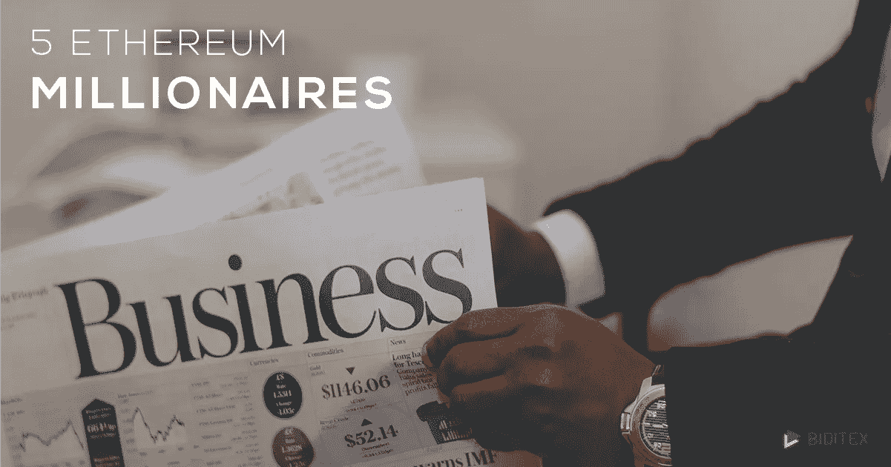

# 以太坊百万富翁讲述他们的故事

> 原文：<https://medium.datadriveninvestor.com/ethereum-millionaires-tell-their-stories-2b2b0a620e1?source=collection_archive---------1----------------------->

Ethereum Millionaires

毫无疑问，你已经听说过或将继续听说加密货币，尤其是以太坊百万富翁。以太币是第二种交易的加密货币，如今，在一些地方，它比比特币更有特权。这就是为什么，随着任何产品随着 IPO 系统的增长，这种货币以缥缈的速度达到了顶峰，许多人从贫民窟中崛起，其他人从豪华的马车中崛起，将他们放在钻石沙发上。

Biditex 区分了一些特别有趣的故事，大多涉及 2017 年病毒性加密贸易。

 [## 2019 年十大区块链课程|数据驱动的投资者

### 渴望在区块链发展吗？你想知道区块链是如何工作的，但不知道在哪里？或者就是太多了…

www.datadriveninvestor.com](https://www.datadriveninvestor.com/2019/03/08/top-10-blockchain-courses/) 

从 2000 美元到 100 万美元排名第一

乔丹·特拉弗斯是一个年轻人，他很幸运地预测到了资产的增长。资产变成了金色以太坊。他买了价值 2000 美元的以太坊，然后就等着。有人说耐心是成功的捷径。实际上，是给这个非常年轻的男人的。

第二名杰弗里·伯恩斯

杰弗里·伯恩斯的故事之所以有趣，不是因为他如何通过以太坊获得了数百万英镑，而是因为他想如何花掉这些钱。在内华达沙漠，他想建造乌托邦，他以 1.7 亿美元现金买下了这块土地。也许，这不是一个乌托邦，因为创建一个高科技园区听起来不像是在大山后面。在这片土地上，人们将控制自己的钱，享受区块链赋予的自由。伯恩斯当然有给予人们财务自由的雄心，尽管事实上他的“自由”之地是由造物主自己集中的，几乎与中央银行管理的系统没有什么不同。

第三名[维塔利克·布特林](https://medium.com/altcoin-magazine/three-cryptocoin-influencers-to-lead-the-smart-investment-race-1711e86feaf2)

[维塔利克·布特林](https://medium.com/altcoin-magazine/three-cryptocoin-influencers-to-lead-the-smart-investment-race-1711e86feaf2)是创造了像以太一样的硬币的人。这位年轻苗条的男子是一名俄裔加拿大程序员和作家，十几岁时选择成为百万富翁。当他的父亲让他意识到什么是比特币，以及这个年轻人的努力和天赋可以解开的可能性时，他只有 17 岁。他是一个真正的神童，因此，仅在 19 岁的两年后，他就能够撰写以太坊白皮书。

好吧，他没有离开写作的热情，创办了《比特币》杂志。现在，Vitalik Buterin 被认为是最成功的“加密领导者”之一，因为以太坊取得了巨大的成功，并成为许多区块链产品的核心。总的来说，他的财富估计在 4 亿到 5 亿美元之间。他从未持有超过 0.9%的流通以太币。

参考资料:

以太坊投资人: [https://themerkle.com/21 岁-以太坊-投资人-四年内从 2000 变成 100 万/](https://themerkle.com/21-year-old-ethereum-investor-turns-2000-into-1-million-in-four-years/)(2019 年 9 月 25 日访问)

杰夫瑞·伯恩斯[https://www . nytimes . com/2018/11/01/technology/Nevada-bit coin-区块链-society . html](https://www.nytimes.com/2018/11/01/technology/nevada-bitcoin-blockchain-society.html)(2019 年 9 月 25 日访问)

vitalik Butterin[https://coinnewdesk . com/who-is-vitalik-buter in-vitalik-butler in-the-life-of-a genius-give-ether eum/5433/](https://coinnewsdesk.com/who-is-vitalik-buterin-vital-and-butlerin-what-is-the-life-of-a-genius-who-gave-ethereum/5433/)(2019 年 8 月 8 日访问)

***如果您想了解更多，请访问 BIDITEX 页面并提出您的问题，关注我们的***[***Twitter***](https://twitter.com/biditex_com)***，*** [***【脸书】***](https://www.facebook.com/biditex/) ***，*** [***中型***](https://medium.com/@biditex) ***用***[***bidi tex***](https://medium.com/@biditex/biditex.com)***投标你的空间。***

免责声明:*本文的内容包含个人观点，不应被解释为包含个人和/或其他投资建议和/或金融工具交易的要约和/或恳求和/或未来表现的保证和/或预测。*