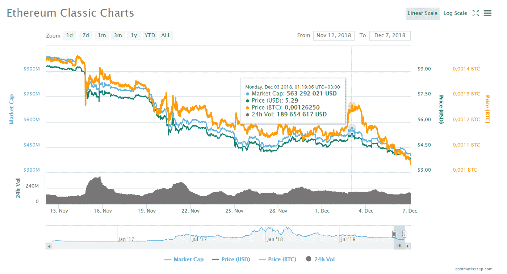
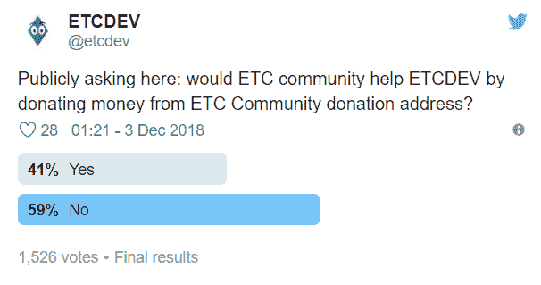

# 以太坊 OGs 出来了:为什么区块链开发者要勒紧裤腰带

> 原文：<https://medium.datadriveninvestor.com/ethereum-ogs-are-out-why-blockchain-devs-tighten-their-belts-2e0470ba4fd3?source=collection_archive---------29----------------------->

加密货币市场继续下跌:其市值本周下跌了 15%。虚拟资产的价格也在下降，以太坊经典也不例外。自周一以来，这枚硬币的价值已经下降了 30%——从 5.3 美元降至 3.7 美元，这种负面的动态只会越来越大。周日，似乎 ETC 开始逐渐找回自己的位置。发生了什么事？

事情是这样的，12 月 3 日，网络 ETCDEV [的开发者之一宣布](https://twitter.com/etcdev/status/1069625401515872256?ref_src=twsrc%5Etfw%7Ctwcamp%5Etweetembed%7Ctwterm%5E1069625401515872256&ref_url=https%3A%2F%2Fwww.rbc.ru%2Fcrypto%2Fnews%2F5c065a949a794716b2964791)停止其活动。公司**的创始人兼首席技术官 Igor ARTAMONOV** 宣称，市场崩盘加上公司现金短缺是公司倒闭的主要原因。吸引生态系统投资者和外部投资者提供资金的所有尝试都没有成功，向 ETC 社区融资的呼吁也没有成功。

这一事件会导致以太祖先即将崩溃吗？不完全是。

首先，作为一个开源项目，Ethereum Classic 有其他组织从事该协议的技术开发，例如 IOHK、ETC Co-op、ETC Labs。是的，ETCDEV 是领先的开发商之一，它成功推出了经典的 Geth 客户端、Emerald 平台和 Emerald Wallet，推出了名为 SputnikVM 的以太坊虚拟机的独立实现，它的关闭是*“这不是一个好迹象，但也不是完全不令人惊讶。这种开发团队通常通过捐赠、广告和自筹资金来运作。因此，市场低迷，投资者不太可能赞助项目，因此在资源有限的情况下，团队将暂停其活动。这并不意味着该项目已经死亡。远非如此，因为它是开源的，而且有更多的团队可以致力于 ETC 代码及其开发”*——澳大利亚密码管理基金**主任叶戈尔·西德斯卡**告诉我们。

其次，与它更著名和受欢迎的 hardfork 不同，ETC 似乎并没有自称是技术最先进的去中心化平台。*“以太坊经典更多代表保守的价值观(在道遇袭后，依然忠于区块链不变的哲学，— ed。注意)和更少的创新，并不一定需要不断的新技术更新*”——我们的另一位专家 **Sandris MURINS** 指出，他是一家公司的联合创始人，正在为分散化的金融衍生品开发区块链协议。

最后，以太坊经典在加密社区中拥有坚定的支持者，其中包括投资基金 Digital Currency Group 的创始人兼首席执行官 Barry SILBERT 和投资公司 gray Investments。顺便说一下，后者通过购买其加密基金的股票提供了投资数字资产的机会，以太坊经典投资信托是继比特币投资信托之后推出的第二个信托。此外，DFG 资助了另一个开发人员 ETC 实验室，[据](https://medium.com/@splix/on-the-attempt-to-take-over-ethereum-classic-etc-64d19a70eb6e) Igor ARTAMONOV 称，他们一起寻求征服网络并控制它。

这位商人自己成为了首批 ETC 投资者之一。他在 2016 年 7 月 25 日通知了他的 Twitter 社区关于购买硬币的事情——紧接着前一天举行的硬分叉，然后反复发布关于 ETC 货币的帖子。此类活动引起了美国证券交易委员会(SEC)的注意，该委员会怀疑投资者参与了市场操纵和与 ETC 一起组织抽水和抽水。在区块链提供咨询服务的中国公司的创始人兼首席执行官**夏羽·洛朗** : *表示，在未来，这枚硬币将继续成为这些欺诈操作的对象。“以太坊经典很可能会成为一枚幽灵硬币，它的价格每隔一段时间就会上涨和下跌。”*

**叶戈尔·塞德尔斯卡**指出，关于 ETCDEV 关闭的消息只会在短期内影响虚拟货币的价格:*“除非有雪球效应，否则不太可能对 ETC 产生重大影响。”*事实证明，除了 Barry SILBERT**可能会接管项目之外，ETC 的未来不会发生重大变化。但是这种开发团队的解散是最近唯一的先例吗？可惜没有。**

上周五，软件制作工作室 ConsenSys 的员工收到了首席执行官约瑟夫·卢宾(Joseph LUBIN)关于公司战略变化的一封信:“我们必须保留，在某些情况下，恢复让我们成为现在这样的人的精益和坚韧不拔的创业心态，”信中说，这意味着工作优化、成本降低和可能的裁员。

由于 2017 年的繁荣，ConsenSys 接手了大量项目，目前已超过 50 个。在这方面，自 2 月份以来，该公司的员工人数已经翻了一番，达到 1100 多人，分布在 29 个国家。权力下放、工人自治和项目多样化已经压倒了效率。Joseph LUBIN 对 ConsenSys 的投资使得这种前所未有的增长成为可能，他承认公司作为一个整体已经变得非常笨拙，尽管 ConsenSys 内部的单个项目仍然很敏捷。发出这封信的同时，以太网再次下跌，今天更新了年度最低价格，跌破每枚硬币 90 美元。

*“自然，在衰退时期有削减脂肪的趋势。在我们所能看到的 2050 个项目中，超过 90%的项目会因为让开发人员提交他们的代码而无法获得任何动力“*”—**叶戈尔·塞德斯卡**认为。专家注意到在与分散的开放源码网络合作时慈善商业模式的局限性，在这种网络中，来自社区的捐款仍然是主要的收入来源，除非像 Barry SILBERT 这样的大型投资者个人对该团队感兴趣。

在长期熊市趋势的条件下，社区本身变得更穷，其武库中的最后一个工具变成了用硬币进行投机操作:“除非受到积极激励，否则许多开发团队将无法继续运营。他们仍在贡献的主要原因是经验、品牌、庄严和信仰。还有一种可能性是，他们持有大量这种硬币，并在经济上自我激励，让加密者做得更好，”——专家建议。

至于 ICO 项目，他们应该对冲筹集的资金，这些资金可能是*“足够支付 8 年的成本，足以度过熊市”*，专家继续说道:*“但可以肯定地说，80%的人没有这样做，现在他们的钱快用完了”。*反过来， **Sandris MURINS** 提出降低成本的项目，显然是以 **Joseph LUBIN** 为例，并询问那些在去年年底和今年年初成功持有 ICO 的项目，以及那些有财务机会与其他项目进行并购或投资有助于实现其战略目标的新区块链创业公司的项目。

总而言之，应该注意的是，市场的技术发展取决于数字资产的价格。因此，所有这些来自最大的开发者孵化器创始人约瑟夫·卢宾的呼吁听起来有点荒谬，因为他正在考虑减少他公司的员工。ETCDEV 的关闭敲响了警钟，可能标志着另一个新的或已经存在的负面趋势。市场危机正在考验分散项目理念的力度，没有大型投资者的资金，这些项目似乎不会做得很好。

在这里阅读最好的加密新闻分析！bitnewstoday.com[比特币、投资、监管和其他加密货币](https://bitnewstoday.com/)

【bitnewstoday.com】最初发表于**。**