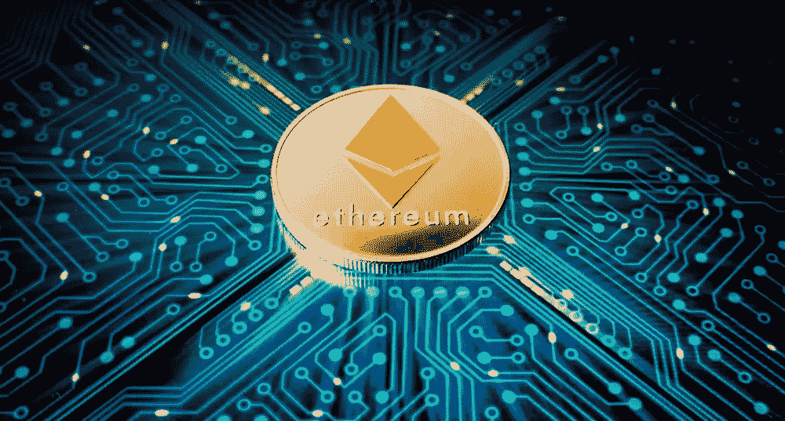
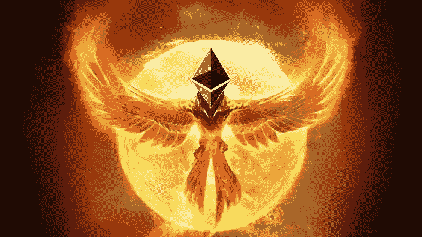
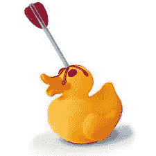

# 以太坊——稳健投资还是死鸭子？

> 原文：<https://medium.datadriveninvestor.com/ethereum-sound-investment-or-dead-duck-ad60bfd67e02?source=collection_archive---------2----------------------->

在这篇文章中，我着眼于以太坊未来的两个可能的场景。一个是积极的，另一个是消极的。这不是理财建议，而是我个人的看法。

2018 年的熊市中，所有加密投资都出现了大幅下滑。一些人认为这是加密技术的消亡，而另一些人认为加密技术变得更加稳定，并找到了它的真正价值，有观点认为加密货币将再次崛起，比特币(和其他货币)将在不久的将来达到新的历史高点。

操纵、FUD(害怕不确定性和怀疑)、Mt Gox、假新闻以及像 Bitmex 这样允许甚至不拥有密码的投资者做空市场的渠道的出现，都压低了价格，特别是比特币的价格。作为主导货币，所有其他货币都倾向于跟随比特币的价格趋势。

一次又一次，我们看到了绿芽和新希望的诞生，但随后不久就出现了红色蜡烛，因为我们仍处于长期熊市/下跌趋势中。

最近几个月最大的受害者之一是以太坊。然而，它的消亡似乎还有其他因素，而不仅仅是熊市。

今年 1 月，以太坊的价格达到了 1425 美元，目前(在撰写本文时)仅值 225 美元。ICOs(首次发行硬币)被认为在最近几个月陷入恐慌，出售了大量以太坊，进一步压低了价格。

***###有点背景****……由于以太坊能够创建和管理智能合同以及作为加密货币，它已经成为大多数 ico 的加密货币选择。这些项目使用 ETH 作为价值储存手段，允许投资者购买等量的 ERC-20(以太坊区块链代币)。在大多数情况下，这些 ERC-20 代币被转换成项目的本地货币。ERC-20 代币可以被视为权宜之计，直到该项目在他们的主网(他们自己的区块链)上线。一旦他们的 mainnet 上线，就会执行令牌交换，将所有 ERC-20 令牌替换为其本地令牌的等值。###*

今年早些时候开始收集投资的许多 ico 积累了大量以太币，并在建设项目时持有这些以太币。这是他们的主要收入来源，用于支付项目费用、支付员工工资和搭建平台。

随着熊市的持续，我们看到以太坊的价格在 8 月至 9 月间下跌了近一半。看来 ICOs 的恐慌性抛售是原因；试图在以太坊价格触底之前从投资的资金中获取价值。

与此同时，大多数 ico 决定推迟在交易所上市，因为它们在熊市中有价格倾销的风险。尽管这让一些投资者非常失望，但这很可能是一个明智的决定。

# 稳健投资？

快进到今天…我们现在处于 2018 年第 4 季度。传统上，第四季度是加密货币日历中最繁荣的时期。

以太坊正在建立技术来提高其可扩展性，如分片，casper 和等离子体，这将大大提高其性能和吸引力。

不管以太坊未来有什么计划，ico 现在已经开始在交易所上市，或者至少宣布他们计划上市的日期。

考虑到投资者购买他们选择的项目时以太坊的价格要高得多，他们不太可能出售除以太坊本身以外的任何其他加密货币。因此，当 ico 在交易所上市时，投资者很可能会回售给以太坊。这样做有它的好处。与最初投资时相比，以太坊的价格如此之低，以太坊的收益可能会更高。虽然这对美元价值没有好处，但以太坊数量的增加将有利于那些持有令牌的人，他们相信以太坊会再次崛起。

在这个简单的例子中，当 ETH 值 1425 美元时，我们在 ExampleToken ICO 中投资了 1 个 ETH。

*   *ExampleToken 的价值是每个 token 0.10 美元，因此您购买了 14，250 个 ExampleToken。*

***1425/0.10 = 14250***

*   *1 个 ETH 现在价值 225 美元，你以 0.12 美元的价格出售你的 14，250 个示例令牌*

***14250 x 0.12 = 1710 美元***

*   1 个 ETH 值 225 美元，现在你有 7.6 个 ETH

***【1710 美元/225 美元= 7.6ETH***

默认情况下，你已经增加了以太币的持有量，如果未来以太币价格上涨，你将获得可观的利润。

所以总而言之:

*   *我们已经进入 2018 年第四季度(传统上是一年中更繁荣的时期)*
*   *ico 现在开始上市*
*   *投资者将寻求回购 ETH，因为使用任何其他货币，他们的损失可能会更高*
*   *由于与投资时相比的价格差异，这些投资者可能会倾向于持有而不出售他们的 ETH 减少的卖单意味着更少的价格倾销和更高的价格上涨概率*
*   *如果市场回暖，我们可以期待更多的 ico 出现，其中许多将使用以太坊*

因此，以太坊“可能”是一项不错的投资，但前提是它收复了失地，并且长期来看价格大幅上涨。

# 死鸭子？

现在是反方论点…

以太坊，虽然主要是作为一种加密货币创建的，但由于其使用智能合同的能力，已经成为其他项目、Dapps 和 ico 的推动者。如果 ICO 市场没有恢复到以前的水平，或者 ICO 使用 NEO 和其他区块链等替代解决方案，以太坊的用处可能会减少。

其他加密货币正在接近以太坊的市值，在过去几天里，XRP 在短时间内超过了它。也许我们已经为以太坊的价格水平找到了一个新的“标准”,而不是市值第二高的密码，最近的秩序变化只是以太坊衰落的开始。

似乎新的区块链和项目在技术能力和稳定性方面已经超过了以太坊。以太坊团队似乎已经坐以待毙太久了，让其他技术超越了他们。

******************************************************************

只有时间能证明一切。没有人真正知道密码技术的发展方向。我们只能推测。