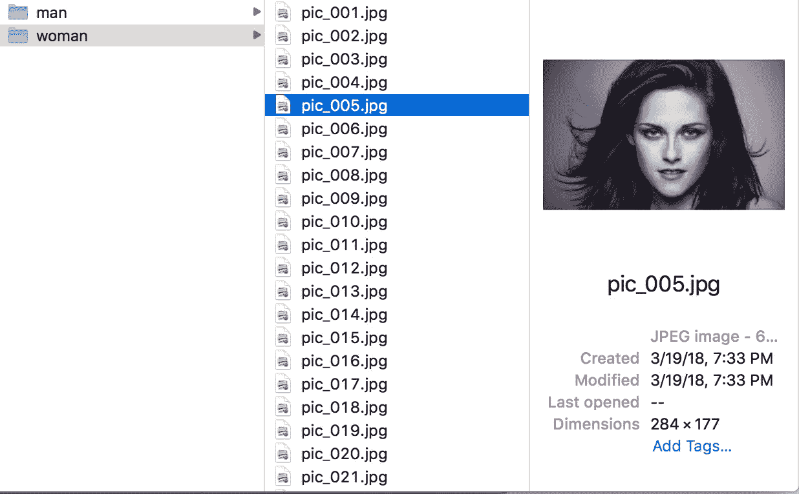

# 人工智能的伦理——我在建造性别探测器中学到的

> 原文：<https://medium.datadriveninvestor.com/ethics-of-a-i-what-i-learned-building-a-gender-detector-1917e2d3c63d?source=collection_archive---------3----------------------->

我公司的[机器学习模型生成器](https://goo.gl/L3SqXf)的一个简单测试很快变成了一个道德困境。

最初，这篇文章旨在一步一步地指导你使用可以从谷歌上轻松下载的图像来构建自己的机器学习分类器。

首先找到 100 张男人的照片，然后是 100 张女人的照片，运行[这个便捷的工具](https://github.com/machinebox/toys/tree/master/imgclass)，自动建立和训练机器学习模型，然后发布结果。对吗？

我如何在不冒犯或错报规范的情况下，写一篇关于使用机器学习进行性别分类的技术帖子？根据哥伦比亚广播公司[的这篇文章](https://www.cbsnews.com/news/transgender-gender-identity-terms-glossary/)，我可以用性这个词来形容

> 一个人出生时的性别分类。婴儿被指定性别，通常是基于他们外部解剖的外观

好——这是一个开始。在图像中检测某人的性别的价值适用于市场营销。营销人员用不同的广告瞄准男性和女性，因此如果他们能够察觉到走向售货亭的人的性别，他们就可以向这些人展示更相关的广告。脸书允许任何人在他们的个人资料中锁定某人的性别或声明的性别，以及其他许多东西，因此他们受到激励，继续帮助营销人员追逐他们的目标。并且[广告客户没有显示出减缓他们目标方法的迹象](https://money.howstuffworks.com/gender-targeted-advertising.htm)

这意味着它是正确的、公平的还是道德的吗？我不确定。

另一个对快速确定尽可能多的信息感兴趣的垂直行业是安全机构。如果你曾经听过警方的扫描仪，你肯定听过执法部门称人们为男性或女性。自动标记监控录像中检测到的人脸如今已被使用，并且[是对计算机视觉和视觉识别的*改进*](https://ieeexplore.ieee.org/document/7791189/?reload=true)的持续研究课题。

再说一次，我不知道这在伦理上意味着什么。

我所知道的是，即使只是简单地为这个帖子建立这个模型，我也了解到了一些潜在的有趣挑战，我们所有技术和商业人士都面临着人工智能偏见的问题。

正如我之前提到的，我的第一步是从谷歌下载 100 张*女性*的照片。

Screen shot of searching to “women” on Google Images

我立刻觉得我的分类器会工作的很有信心。我能看出女人被拍照的方式；发型，化妆，姿势等等。会与男人被拍照的方式如此不同，以至于训练一个神经网络将是小菜一碟。

> 我将在这里附带说明一些数据清理的良好实践。建立训练集时，确保一致性。选择只有一张脸的照片，尽量避免前景或背景中有除了主体以外的任何东西的照片。

但是我真的在建造一个性别探测器吗？或者，我只是简单地建立了一个辨别两种最受文化接受的拍照性别的模型？这是道德的还是正确的？

这是*男*的搜索结果截图。

Google Images search results for “men”

我们可以从这个数据集中直观地看出，这些男人被拍摄的方式非常不同(有一些例外)。

当我训练这个模型的时候，我期望得到好的结果，但是并没有期望达到 97%的准确率。诚然，这个模型可能有点[过度拟合](https://en.wikipedia.org/wiki/Overfitting)，但是这两个类别的差异非常显著，图像识别系统只需要 100 个例子就可以分辨出差异(实际上是 80 个例子，因为它使用剩下的 20 个进行验证)。

我不知道这意味着什么。人工智能中是否存在偏见和道德问题的联系，或者仅仅是训练数据的问题？决定训练数据是什么的人可能是必须解决任何与道德或偏见相关的问题的人，或者可能是**I在写关于使用机器学习构建性别分类器的帖子时必须解决它。**

无论哪种方式，把它拿出来讨论都是好的，因为 AI 不会去任何地方。