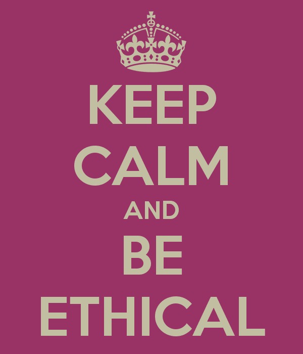

# 在金融/银行业使用人工智能的道德规范

> 原文：<https://medium.datadriveninvestor.com/ethics-of-using-ai-in-the-financial-banking-industry-fa93203f6f25?source=collection_archive---------0----------------------->

我最近在[多伦多机器学习系列](https://www.eventbrite.ca/e/toronto-machine-learning-micro-summit-series-tmls-focus-finance-tickets-47820342933#)上做了一个关于在银行/金融行业使用人工智能的道德问题的演讲。

我曾经在一家数据智能初创公司工作，该公司为企业客户提供非结构化数据的见解，如银行、金融机构、保险、会计公司等。

即使在今天的加拿大皇家银行，我们也在尝试使用客户数据——个人、社交、商业和金融数据——为我们的最终用户提供个性化的推荐。

在 Klood，我们没有大量的风险合规法律(RCL)合作伙伴来让我们思考我们业务的道德本质。但在我目前的公司，我们有许多合作伙伴，他们定期与我们的产品团队开会，以保护客户。它们帮助我们跳出框框思考，不是从传统的为客户“解决问题”的方式，而是从“我们如何为客户做好事”的方式，并指导我们在解决这些棘手问题的同时对最终客户更加透明。他们就像我们产品团队的一面镜子。

这让我思考，我们能为最终客户提供什么切实的价值？

我们在日常生活中使用人工智能，甚至没有想到它——例如，在我们的 gmail 收件箱中检测垃圾邮件，在谷歌或 facebook 上获得相关搜索结果甚至相关广告，或者在网飞或亚马逊上获得个性化推荐。即使作为客户，我们也不会停下来思考公司如何使用我们的数据。

# 人工智能的金融科技应用

在金融科技行业，我们已经看到了 **ROBO 顾问**的崛起，他们旨在通过为你提供投资建议、为你投资或为你提供股票投资建议，来取代银行家、财务规划师、财务顾问等金融专业人士。

我们也看到了旨在用自助服务平台取代客户服务的**聊天机器人**的崛起。

# 金融科技自动化/创新的类别

金融自动化可以分为两大类

1.  金融机构内金融专业人员的内部活动
2.  金融机构与提出请求的客户的互动点

**#1 金融机构内部金融专业人员的内部活动**

*   这些活动主要包括银行和客户之间的金融合同，如抵押申请、贷款申请、信用卡申请、共同基金申请或简单的开户。
*   现在，这些活动或合同可以通过人工智能成倍加速，以决定谁可以签订合同，计算合同条款，执行合同，评估合同的价值并转让合同。
*   一个信用评分系统可以接收关于一个人的数据输入——比如他们的消费行为、地点和年龄——并输出一个分数，然后拒绝或接受信用卡或贷款申请。
*   另一个例子是自动交易算法。
*   因此，基本上人工智能正在取代许多传统上由金融专业人士完成的活动——股票经纪人、金融服务提供商、金融分析师、股票和交易分析师。

**#2 金融机构与客户的互动点**

*   我们的第二个类别是与金融机构交互的客户点。
*   这些可以采取聊天机器人的形式，这些机器人配备了自然语言处理(NLP)能力，允许它们翻译人类的语音或文字。
*   因此，客户走进分行向经理或财务顾问咨询的“旧”模式——经理或财务顾问查看他们的商业计划，做出贷款决定，或为他们提供投资建议和退休计划——可能会被客户通过智能手机向机器学习模型输入一些数据所取代，该模型可以批准或拒绝你的申请，或为你提供一些关于如何在 50 岁退休的个性化建议。
*   简而言之，人工智能正在取代客户与银行和金融机构沟通和互动的传统方式。

# 在银行/金融行业使用人工智能的伦理挑战

我想带我们看几个当我们在饮食中使用人工智能时出现的问题-

## #1 自动化会导致财务监控吗？

*   谁拥有对 AI 至关重要的数据？我们拥有它吗？因为我们已经生产了它？或者通过在那些冗长的条款和条件中提供我们的同意，我们允许这些公司以他们喜欢的任何方式拥有和使用我们的数据？
*   我们正在向组织移交越来越丰富的数据集——我们的个人和财务数据、我们的社交数据、我们的位置数据，例如，我为某样东西付款的确切时间和我去哪里买的。尽管我们很天真，但我们通常不知道这些数据正在被收集，从哪里获取，用于哪里。
*   通常情况下，我们被迫同意使用我们的数据，以此作为获得基本服务的条件。
*   通常我们更关心公司是否在用我们的数据监视我们，然而真正的担心应该是我们的数据被用来控制我们自己的行为。一个人的数字行为可以被银行用来给客户一种“风险”评分。这个分数可以用来评估和确定商品的种类和向他们提供的服务水平。
*   财务、个人和社交数据结合在一起，可以让公司比我们自己更了解我们。我们已经在在线推荐空间中感觉到了这一点，我们过去的搜索历史和浏览历史被用来向我们推荐产品和服务。这种方式越来越准确地触及到你的行为领域。
*   对于我们这些公司来说，利用客户的数据来操纵他们的消费习惯是否道德？去哄他们买更多的金融产品？
*   归根结底，我们为客户提供了哪些切实的价值？还是我们只是利用他们的数据为自己服务？

## **#2 自动化是否降低了金融专业人士的道德意识和责任？**

*   谁负责人工智能的决策和行动？
*   因为人工智能模型本质上是一个黑箱，模型越成熟，你就越无法解释它。因此，如果你作为一家公司无法解释你自己的人工智能模型，你会支持你的人工智能算法做出的决定吗？
*   我们固有地认为，金融专业人士的道德意识已经非常低，因此引入一个基于人工智能的第三方平台来为他们做决定，或多或少会让这些专业人士觉得对这些决定不那么负责。

## #3 自动化是否减少了对金融客户的责任？

*   如果你的贷款申请被分行经理拒绝，这将影响你的经济状况。在人工智能出现之前的世界里，金融机构在拒绝申请时能够承担责任。
*   即使他们使用一些统计分析来分析贷款申请，
    他们仍然可以提供关于为什么你的申请被拒绝的反馈，以及在分析你的申请时考虑了什么。
*   然而，人工智能系统是无动于衷的——它们会做出一个决定，而不必解释它们是如何做出这个决定的。
*   在一般情况下，拒绝的原因可以被识别并反馈给客户。然而，机器学习设计者不一定能解释为什么一个客户会被放在某个特定的类别中。
*   因此，如果你不知道你的人工智能算法是如何做出特定决定的，
    你如何向客户解释并为此负责？

## **#4 人工智能对网络安全意味着什么？**

*   一方面，人工智能在打击网络犯罪和黑客的战争中迈出了一大步，例如，通过强大的密码保护和用户认证，发现网络钓鱼和垃圾邮件企图，识别假新闻等。
*   但另一方面，人工智能也可能被用于恶意目的。例如，针对我们的金融应用和数据库的大规模、精准、高效的攻击。

## #5 自动化是否会降低客户的道德意识？

*   “摩擦”在数字世界中有负面含义。网上购物比在商店里买香水感觉“不那么麻烦”。同样，与 robo 顾问在线互动比与分支机构顾问面对面互动感觉更顺畅。
*   金融科技公司对数字金融的速度、易用性和无摩擦性给予了积极评价。
*   然而，这些无摩擦的经历带走了道德停顿的时刻。
*   当我们点击一个按钮看到一个多元化投资组合的推荐时，我们不会停下来思考。我们认为这是理所当然的，我们认为这是神奇地发生的，我们不会因为这是由这个神奇的界面提供的，就去考虑对那个决定采取行动的含义。

## #6 自动化是否降低了客户自主权？

*   它始于电子邮件——它最初被吹捧为这种令人兴奋的新通信选择，然而它变得如此普遍，以至于不使用它的人被排除在外。超市的自动自助结账柜台是另一个例子——它为超市提供了减少收银员数量的理由。
*   拥有人工智能是否会让我们作为公司向最终客户提供的选择越来越少？

# 使用人工智能时的伦理考虑

> 我们能做些什么来改善？

## #1 消费者隐私/同意、数据安全和隐私

每个人都有权保护自己的个人数据(这导致了欧盟委员会执行 GDPR 标准)。

我们同意。我们同意接受各种数字应用和平台中长达 10 多页的条款和条件。我们也同意了脸书。但是当剑桥分析丑闻爆发时，我们被冒犯了。另一个例子是 Unroll.me，这是一种电子邮件退订服务，他们通过这种服务收集/挖掘并向优步和优步出售电子邮件数据，然后利用这些数据获取 Lyft 的情报。

即使在这种情况下，我们也同意了，但是这些条款和条件对用户来说并不明确。我们中的大多数人可能从来没有费心去阅读隐私政策，也没有认真思考过这些数据除了通常的“改善我们的服务”之外还会有什么用途

## #2 可解释性

可解释性和可解释性将有助于消费者理解、信任和管理这些人工智能机器/系统。能够解释算法如何得出特定的结果，做出了什么假设，使用了什么数据，模型检测到了什么模式，特定建议背后的推理是什么——所有这些都将能够帮助我们理解机器学习模型如何工作，从而让我们信任人工智能应用。

可解释人工智能(XAI)项目是试图破解人工智能“黑匣子”的首批正式研究计划之一。它由国防高级研究计划局(DARPA)运营，该机构从事大量美国军事研究。

## #3 人工智能技术的透明度

由于专利原因，公司不允许公众审查他们的人工智能算法。然而，对于人工智能算法如何工作、使用什么样的数据来驱动这些算法保持透明，是消除不必要的恐惧、从而增加消费者信任的重要一步。

## #4 公平/偏见/平等对待所有市场参与者

人工智能系统在理想情况下应该没有偏见——这些偏见大多来自于少数群体在用于训练算法的数据集中表现不佳，或者人类的判断和偏见被编码到训练数据本身中。

人工智能应该是理性、公平和冷静的，我们希望它可以为我们提供一个机会均等的世界:在未来，算法取代法官、公司领导层、信贷员、抵押贷款经纪人和招聘人员，消除人类偏见，实现纯粹由统计数据驱动的公平结果。

## #5 劳动力影响

由于人工智能将会并且正在自动化许多常规任务，并以更有效和可靠的方式执行它们，工作场所中的角色和职责将会发生转变。我们需要留意哪些角色正在被人工智能淘汰，并制定一个替代行动计划，通过培训和教育提升这些员工的技能。

## #6 问责制

谁对人工智能体决策过程的结果负责？谁应该对人工智能算法的错误结果负责？理想情况下，产生算法的各方/公司/组织应该对人工智能模型做出的所有决定负责。

## #7 准确性

人工智能系统应该能够产生精确可靠的结果。至关重要的是，驱动人工智能决策的机器学习算法要在不同的数据集上进行训练，以防止偏差。同样重要的是，组织设置适当的准确性水平，以清楚地确定他们的期望以及对他们来说什么是可接受的标准。

# 最后的想法

1.  目前，人工智能需要父母的监督——人工智能技术将有助于黑白决策，但灰色的深浅将由人类决定，至少在短期内是如此。应该有一个人类副驾驶可以纠正算法正在做的事情。
2.  使用人工智能技术的应用程序应该有某种回滚或覆盖，作为它们学习过程的一部分。
3.  我们还需要确保我们安排好数据和算法的责任、职责和所有权，简而言之，我们只需要让我们的数据/数字治理正确。
4.  企业应该依靠供应商来指导如何将人工智能用于金融服务，但他们也需要自己学习如何审计软件，以了解其工作原理，并了解其决策的影响。
5.  最后，也许作为消费者，我们也应该更加宽容，给市场一些时间和空间，以便让人工智能变得正确。